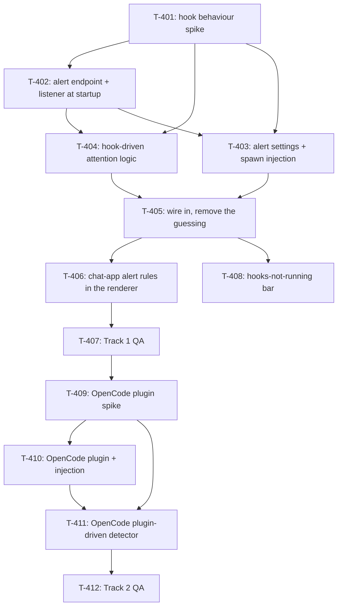

# Kanban: Attention Alerts

**Generated:** 2026-10-06 · **Revised:** 2026-10-06 (cold-read review before handoff)
**Source:** `docs/specs/attention-alerts/prd.md` v1.7 · `docs/specs/attention-alerts/gaps.md`
**Evidence:** `docs/timeline/2026-10-06_attention-alerts-investigation.md`
**Total Tasks:** 12 (T-401..T-412)
**Milestones:** M1 (Claude alerts you can trust) · M2 (degraded warning) · M3 (OpenCode on its plugin)

Task ids start at T-401 so they never collide with the diff-view epic's T-3xx. Only M1 is
committed; M2 and M3 are re-planned when M1 ships. The builder runs this as **one line of
work, one task at a time** (no parallel worktrees), so the order below is the order to
take them in.

## Task Overview

**Order:** T-401 → T-402 → T-404 → T-403 → T-405 → T-406 → T-407.

**Critical path:** the whole of that order. The spike decides which hooks exist and what
they carry; T-402 defines the delivery shape T-404 consumes; T-403 can only register the
events T-404 turned out to need; the old detector goes in T-405; T-406 waits for T-405 so
the new chime rules never run on the old guesses.

**Why T-406 is not earlier:** it has no code dependency on the hooks, but shipped alone it
would make today's guessed "finished" chime while the builder is watching. Sequenced, not
blocked by code.

**Shared files to watch:** T-402 and T-403 both edit `workspace/app/src/main/manager-mcp/index.ts`; T-405 and T-406 both edit `README.md` (different sections).

---

## Milestone 1: Claude alerts you can trust

**Goal:** a Claude agent in Multi-Code chimes once when it is truly done or truly stuck on
you, never in the middle of work, and the alert stays until you act on it.

**Tasks:** T-401, T-402, T-403, T-404, T-405, T-406, T-407

**Done when:**
- A long Bash command, a foreground subagent, and a background subagent each run to the end with exactly one chime, at the end
- A permission dialog, an AskUserQuestion, and a plan approval each chime within a second of appearing
- Pressing Esc mid-turn does not chime; a turn that dies on an API error does
- The chime plays while you are looking at the session; typing or clicking in it stops the chime and clears the red dot; ignored, the red dot stays and the Dock keeps bouncing
- `claude` started in an ordinary terminal behaves exactly as before, with Multi-Code running or not, and no file outside Multi-Code's data folder was written
- The manager's `wait_for_idle`, the write-safety gate, context usage, and a paired phone all work as before

### T-401: Hook behaviour spike on the real CLI
- **Type:** qa
- **Status:** done (2026-10-07)
- **Outcome:** all 13 items measured on CLI 2.1.291, in `docs/timeline/2026-10-06_attention-alerts-investigation.md#hook-spike-cli-21291`; 31 scrubbed fixtures in `workspace/app/src/main/backends/__fixtures__/claude-hooks/`. What the next tasks need:
  - `Stop.background_tasks` lists running work by `type` (`subagent` / `shell`): hold Finished only for a running `subagent`. Every Agent call is async in 2.1.291, so the early `Stop` is the common case.
  - A user's slow (not blocking) Stop hook keeps the registry `busy` with no second `Stop` to follow, so T-404 must re-read the registry until it leaves `busy`, not wait for "the next Stop".
  - `PermissionRequest` fired for every dialog in every mode (default, plan, auto, bypass) and carries no `tool_use_id`; one dialog → one delivery. `Elicitation` covers MCP input. T-403 can drop the `PreToolUse` `AskUserQuestion|ExitPlanMode` hook.
  - A denied dialog (Esc or No) sends no hook and ends the turn without `Stop`; only the PTY write and the registry show it. `StopFailure` comes without `Stop`. `/compact` ends with `PostCompact`, not `Stop`.
  - Two `--settings` flags: the last wins outright, so the manager needs one merged file (T-403).
  - The CLI waits for sync tool hooks (~19ms per curl hook) and for sync Stop hooks; `"async": true` is accepted, delivers in order, and costs nothing measurable.
  - Hook commands see `MULTICODE_INSTANCE_ID` from the `claude` env. `SessionStart` arrives within ±200ms of the registry entry (T-408's N can be small).
- **Handed back to `prd`:** Story 2 (G-003: the turn after a background shell exits chimes; `/compact` ends at `PostCompact`), Story 6 (registry `waiting` with `waitingFor: "dialog open"` is a slash-command panel such as `/status`, not Needs you).

### T-402: Alert endpoint, started with the app
- **Type:** feature
- **Status:** done (2026-10-07)
- **Outcome:** `ManagerMcpServer` (`workspace/app/src/main/manager-mcp/server.ts`) starts in `app.whenReady` before the window (`startManagerMcpServer` in `manager-mcp/index.ts`) and stays up for the app's life. `POST /alert` is routed before the manager-token check and checked against its own token (`getAlertToken`, minted per start); body = the CLI's hook stdin, instance from `X-Multicode-Instance`. Parsed by `parseAlertDelivery` into `AlertDelivery` (`backends/types.ts`) and handed to the one listener set with `managerMcpServer.onAlertDelivery(cb)` after the 204 is sent; nobody registers it yet (T-405). Answers 204 / 400 (malformed JSON, no `hook_event_name`, no instance header) / 401 / 405 / 413. `getAlertTarget()` in `manager-mcp/index.ts` returns `{ endpoint, token }` or null for T-403. Traces `[alert-hook] …` under `MULTICODE_DEBUG`. 14 tests in `server.test.ts`; README step 8 (both languages) updated.

### T-404: Hook-driven attention logic
- **Type:** feature
- **Status:** done (2026-10-07)
- **Outcome:** `ClaudeHookAttention` in `workspace/app/src/main/backends/claudeHooks.ts`, constructed with `(onActivity, readRegistryStatus, timers?)`, fed with `handle(delivery)`, stopped with `stop()`. Finished: main-agent `Stop` → 300ms → registry `idle`/`shell`/unreadable → `waiting`; `busy` → re-read every 250ms (10 min cap); `waiting` → stand down. A `Stop` listing running subagents holds until each id sends `SubagentStop`, then 3s for the wake-up before confirming. `StopFailure` and manual `PostCompact` → `waiting` at once. Needs you: every `PermissionRequest` (subagents too) and `Elicitation` → `prompt`; detail from `extractPromptDetail`, with "don't ask again" dropped when the request has no `permission_suggestions`. Cleared once by PostToolUse/Failure, ElicitationResult, PermissionDenied, UserPromptSubmit, Stop, StopFailure. 52 tests in `claudeHooks.test.ts` replay all 31 fixtures plus synthetic cases. **T-403 needs these events registered:** `UserPromptSubmit`, `Stop`, `StopFailure`, `SubagentStop`, `PermissionRequest`, `Elicitation`, `ElicitationResult`, `PostCompact`, `SessionStart` (T-408), and optionally `PostToolUse` (faster prompt-cleared; async only).

### T-403: Alert settings file and spawn injection for every Claude instance
- **Type:** feature
- **Status:** done (2026-10-07)
- **Outcome:** `startManagerMcpServer` writes `<userData>/alert-settings.json` and `alert-hook.curl` (both 0600, `writeAlertSettings` in `manager-mcp/config.ts`) and hands `{ settingsPath }` to `processManager.setSessionSpawnOptions`. Hooks: `ALERT_HOOK_EVENTS` (SessionStart, UserPromptSubmit, Stop, StopFailure, SubagentStop, PermissionRequest, Elicitation, ElicitationResult, PostCompact), each `curl -K '<alert-hook.curl>' -H "X-Multicode-Instance: $MULTICODE_INSTANCE_ID" || true`, `timeout: 5`, `async: true`, no permissions block. The manager gets activity + alert hooks in one `manager-settings.json` (now 0600). `spawnProcess` sets `MULTICODE_INSTANCE_ID=<id>` on every agent's env; Claude, OpenCode and shell-manager envs strip an inherited one (`backends/instance-env.ts`). `removeSpawnFiles` deletes all five files on shutdown. Tests: `config.test.ts`, `spawnOptions.test.ts`, `process-manager.spawn-env.test.ts`. Real-app check in T-405's outcome.

### T-405: Wire the hook logic in and remove the guessing
- **Type:** refactor
- **Status:** done (2026-10-07)
- **Outcome:** `Backend.createHookAttention(pid, onActivity)` (Claude: `ClaudeHookAttention` + `readClaudeRegistryStatus(pid)`) created per process in `spawnProcess`; `createCompletionDetector` is optional (OpenCode only) and lost `isPtyIdle`. Both feed `ProcessManager.reportActivity` (run state, lastActivityAt, context refresh, renderer, phone, waiters). `handleAlertDelivery` routes by instance id, wired from `startManagerMcpServer`. `ClaudeCompletionDetector` and `claude.test.ts` deleted; the grep for `end_turn|PTY_IDLE_MS|PROMPT_PENDING_MS` in `src/main` is empty. Docs: README/README.zh-CN detection, CLAUDE.md Session monitoring and Data Storage. **Real app, dev build over CDP:** a session created through the UI reported SessionStart; a plain reply → one `waiting` 306ms after `Stop`; AskUserQuestion → `prompt` at the PermissionRequest, run state `blocked`, then `prompt-cleared` + `waiting`; a background subagent → nothing at the early `Stop`, one `waiting` after the wake-up turn; Esc → nothing. Known: after Esc or a denial run state stays `busy`, as before.

### T-406: Chat-app alert rules in the renderer
- **Type:** feature
- **Status:** done (2026-10-07)
- **Outcome:** `App.tsx`: every `instance-activity` → `playMessageSound(id)`, `bounceDock()`, red dot; suppress-while-watching, urgent override, cooldown and the 1.5s auto-clear removed. Acknowledge: capture-phase `keydown`/`pointerdown` on the window → `stopMessageSound` + `markRead` for the selected instance, unless the target is in `.sidebar` or a `.dialog-overlay` (`acknowledgesShownInstance` in `audio/attentionPolicy.ts`); `handleSelect` acknowledges the contact clicked. `sounds.ts`: `playMessageSound(instanceId)` restarts that instance's chime, `stopMessageSound(instanceId)`. README sections updated in both languages. Verified over CDP: dot stays on the selected instance, a keydown in the terminal clears it. Left for T-407 by a person: hearing the chime stop, Dock bounce behind another app, ⌘Tab back, clicking another contact.

### Cross-model review (2026-10-07)
GPT (`gpt-6.1-sol` through `cross-model-review:gpt-review`) reviewed T-402..T-408. Fixed: a StopFailure while another subagent still runs no longer chimes (`knownRunning` in `claudeHooks.ts`); a slash panel opened during the Stop settle window no longer swallows the finish; a late delivery from a restarted instance's previous process is dropped (`MULTICODE_SPAWN_ID` / `X-Multicode-Spawn`). Two UI-race claims rejected (see `.omt/judgment-calls-T-405.md`). Endpoint security: no findings.

### T-407: Track 1 QA pass
- **Type:** qa
- **Status:** ready
- **Requirement:** `docs/specs/attention-alerts/prd.md#success-metrics`
- **Code:** read-only; scenarios run in the app under `MULTICODE_DEBUG=1` (trace at `$TMPDIR/multicode-debug.log`)
- **Description:** Run every M1 "Done when" line in the real app against real sessions, plus: two instances on the same `cwd` (each alert lands on its own contact); `/clear` mid-session (alerts keep working on the new session); the manager running alongside project sessions; Multi-Code quit while a session is busy (no orphaned hooks, files removed); Multi-Code force-killed (leftover files inert, plain `claude` unaffected). Never run two Multi-Code builds at once: they share one `userData` and would overwrite each other's alert files. Then a week of normal use against the success metrics. Bugs become T-4xx tasks below.
- **Acceptance:** a test plan with each scenario's result recorded in this file's task outcome; the trace shows exactly one event per finished request and per dialog; no open bug blocks M1.
- **Blocks:** T-409 · **Blocked by:** T-406

---

## Milestone 2: Know when alerts are degraded

**Goal:** when a user's settings stop hooks from running, the session's page says so
plainly instead of going quiet.

**Tasks:** T-408

**Done when:**
- With `"disableAllHooks": true` in a session's settings, its page shows the bar within ~10s of the CLI starting, with the causes on hover
- A session whose hooks work never shows it; a late delivery clears it

### T-408: "Hooks aren't running" bar
- **Type:** feature
- **Status:** done (2026-10-07)
- **Outcome:** `ClaudeHookAttention` watches hook health from construction: once `readRegistryStatus` is non-null, 10s with no delivery → `onHooksHealth(false)`; any later delivery → `true`. `createHookAttention(pid, onActivity, onHooksHealth)`. process-manager keeps `alertsDegraded` (also set from the start for a Claude instance spawned without alert settings), exposes it on `InstanceInfo` while running, and pushes `instance-alerts-degraded` to the renderer (`onInstanceAlertsDegraded` in preload). `App.tsx` shows `.alerts-degraded-bar` under the selected instance's header, causes in the tooltip. Tests: 5 in `claudeHooks.test.ts`, 2 in `process-manager.alert.test.ts`. Real app over CDP: a session in a dir whose `.claude/settings.json` has `"disableAllHooks": true` showed the bar ~10.6s after the CLI registered; a normal session didn't.

---

## Milestone 3: OpenCode on its own plugin (Track 2)

**Goal:** OpenCode agents alert exactly like Claude ones, from OpenCode's own plugin
events instead of database polling and screen parsing.

**Tasks:** T-409, T-410, T-411, T-412 — sketched, detailed when M1 ships.

**Done when:** Story 7's acceptance criteria hold.

### T-409: OpenCode plugin spike
- **Type:** qa
- **Status:** done (2026-10-07)
- **Outcome:** measured on OpenCode 1.18.35 with the plugin injected through `OPENCODE_CONFIG_CONTENT`: `docs/timeline/2026-10-06_attention-alerts-investigation.md#opencode-plugin-spike-opencode-11835`; 15 fixtures in `workspace/app/src/main/backends/__fixtures__/opencode-plugin/`. What T-410/T-411 need:
  - Loading is robust: one init per process, `MULTICODE_INSTANCE_ID` visible, a project `opencode.json` plugin coexists with ours, a broken sibling plugin doesn't stop OpenCode or ours. `--pure` loads no plugin (the Story 6 bar case).
  - Finished = the root session's busy → idle. `busy` repeats 3–5 times per turn and idle arrives twice after errors and aborts: dedupe both. Child sessions (`info.parentID`) never finish the instance.
  - **No chime when the builder ended the turn**: `permission.replied {reply:"reject"}` (Reject *or* Esc), `question.rejected`, and `session.error MessageAbortedError` are each followed by idle. An `APIError` followed by idle does chime (G-002).
  - `session.status {type:"retry"}` (rate limit) repeats ~2s apart before the final `APIError`; it is neither busy nor idle.
  - Needs you: `permission.asked` (child sessionID for a subagent) and `question.asked` (same `questions` shape as Claude's AskUserQuestion). Cleared by `permission.replied` / `question.replied` / `question.rejected`.
  - "Allow always" needs a second Confirm screen (Enter) before `permission.replied {reply:"always"}`: check the phone's `keystrokeForChoice` for OpenCode.

### T-410: OpenCode plugin and `OPENCODE_CONFIG_CONTENT` injection
- **Type:** feature
- **Status:** done (2026-10-07)
- **Outcome:** `backends/opencodePlugin.ts`: `opencodePluginSource()` (the plugin, export `MulticodeAlerts`), `OPENCODE_PLUGIN_EVENTS`, `withMulticodePlugin()`. `startManagerMcpServer` writes `<userData>/opencode/multicode-plugin.js` and `opencode/alert.json` (`{endpoint, token}`), both 0600 (`writeOpencodePlugin` in `manager-mcp/config.ts`), and passes `SpawnOptions.opencodePlugin`; `removeSpawnFiles` deletes them and the folder. `opencodeBackend.spawn` merges the plugin's file URL into the inherited `OPENCODE_CONFIG_CONTENT` (only an identical entry is dropped, so no entry of the user's is ever removed; a value that isn't a JSON object with a list `plugin` is left alone and the instance spawns without the plugin) and sets `MULTICODE_ALERT_FILE`; OpenCode's env strips an inherited one. The plugin: inert without all three `MULTICODE_*` vars, deletes them from its process env after reading, newest init in a process wins (also across two copies of the file, e.g. a parent Multi-Code's entry), one FIFO per process shared by every init, 2s post timeout, 200-post cap, errors swallowed. Tests: 16 in `opencodePlugin.test.ts` (the generated file imported as OpenCode does, posting into the real `/alert`; fixture replay; each rule broken once and seen red), 5 in `spawnOptions.test.ts`, 5 in `config.test.ts`. Real OpenCode 1.18.35 check in the investigation record ("Production plugin"). **For T-411:**
  - A delivery is `{hook_event_name: <OpenCode event type>, session_id, pid, properties}`, so `parseAlertDelivery` is unchanged: `delivery.event` is e.g. `session.status`, `delivery.sessionId` is `properties.sessionID ?? properties.info.id`, the event's properties are `delivery.payload.properties`.
  - Forwarded: exactly `OPENCODE_PLUGIN_EVENTS` (`session.idle` is not among them), plus one `multicode.init` (`OPENCODE_INIT_EVENT`) per plugin init: the Story 6 bar's signal.
  - Today these reach `handleAlertDelivery` and are dropped there ("no running instance with hooks"), since OpenCode has no `createHookAttention` yet; the old detector still runs.
  - `payload.pid` is the TUI's pid when opencode is spawned directly, but a wrapper (e.g. the npm `opencode` shim) would make it differ from the pty pid: don't filter on it. Nested `opencode` runs are already silent.
- **Cross-model review (2026-10-07):** GPT (`gpt-6.1-sol`) found two defects, both fixed with a test each: an old init's queued posts could arrive after a newer init's (now one FIFO per process), and the parent-entry match by file name could remove a user's same-named plugin (now only an identical entry is dropped). A follow-up round confirmed the queue fix and caught that a narrower path suffix still matched `~/.config/opencode/multicode-plugin.js`, hence the exact match.
- **Blocked by:** T-409

### T-411: OpenCode plugin-driven detector, old detection removed
- **Type:** refactor
- **Status:** done (2026-10-07)
- **Outcome:** `OpencodePluginAttention` in `backends/opencodeAttention.ts`, behind `opencodeBackend.createHookAttention`; both backends now implement only that seam, so `CompletionDetector`, `createCompletionDetector` and `onPtyData` are gone from `types.ts` and `process-manager.ts`. Finished = a root session's busy→idle, once (`busyRoots`); a child (`info.parentID` on `session.created`/`updated`) never finishes; `retry` is neither. The builder ending the turn (`permission.replied {reply:"reject"}`, `question.rejected`, `MessageAbortedError`) suppresses the next root idle, unless a root goes busy first. Needs you = `permission.asked`/`question.asked` (and the v2 names) from any session, raised at once; cleared when every open request is answered, or by its session idling or erroring, or by the root idling. No timers except plugin health: 10s from spawn with no delivery → the Story 6 bar, worded for the plugin (`App.tsx`); `spawnedWithoutAlertHooks` is per backend. Removed: SQLite completion polling, the screen-parsed permission dialog, `opencodeDetect.test.ts`, `__fixtures__/opencode-permission.txt`; kept: session discovery, transcript and context reads. Phone: details from the events (`permissionDetail`, `questionDetail` in `opencodePrompt.ts`; a box with several questions is read-only like multi-select), "Allow always" now sends the Confirm screen's Enter too. Tests: 42 in `opencodeAttention.test.ts` (all 15 fixtures replayed through the plugin's allowlist and the real parser, then synthetic rules; each of 17 rules broken once and seen red), `opencodePrompt.test.ts` rewritten, process-manager mocks moved to `createHookAttention`. Real OpenCode check in the investigation record ("Phone keystrokes and end to end"). Docs: both READMEs, `CLAUDE.md`, tech-conventions.
- **Real app (2026-10-07):** dev build over CDP with its own `--user-data-dir`, so the installed app kept running; instances made through the New dialog; phone left out (builder: the phone side is to be redone). Plugin init 2.2s after spawn, no bar. Plain reply → one `waiting`, one chime, red dot and blink on the selected contact, a keydown in the terminal cleared both, context usage refreshed. Permission allowed / question answered → `prompt` (run state `blocked`, chime, red dot after the renderer's 500ms debounce), `prompt-cleared`, `waiting`; rejected → `prompt`, `prompt-cleared`, nothing more; Esc interrupt → nothing; subagent → one `waiting` at the end. Two instances on one cwd: only the one that worked heard anything. `/new` and a restart: alerts kept working, nothing dropped. `opencode debug config`: plain `opencode` has `plugin: []`; Multi-Code's keeps the user's MCP servers and skills plus the inherited `OPENCODE_CONFIG_CONTENT`, ours appended; `~/.config/opencode/` byte-identical before and after, no `.opencode/` written. Quit while busy: no OpenCode left, plugin files removed. Force-kill: no orphans, leftover files inert. A JSONC `OPENCODE_CONFIG_CONTENT` was passed through untouched and showed the OpenCode bar after 10s. Not checked here: Dock bounce (same renderer path as Claude, T-406), an API error (fixtures only), the manager's `wait_for_idle` (same activity events).
- **Cross-model review (2026-10-07):** GPT (`gpt-6.1-sol`), three rounds, all about several root sessions running at once in one OpenCode. Fixed, with a test each: the builder-ended mark is per root (one root's Esc silenced another's finish); a root's idle clears only its own dialogs; a root finishing while another root's dialog is open raises that dialog's `prompt` again, so run state goes back to `blocked` and the write gate stays shut. Rejected: that re-raise "duplicating" the alert (same tick: `playMessageSound` restarts one chime, the red dot is debounced 500ms) and a manager waiter resolving on that finish (it did finish; the next write is gated). **Deferred to the phone rework:** with two dialogs open, answering the newest leaves its buttons on the phone, which would then answer the other dialog.
- **Known, as for Claude since T-405:** after a turn the builder ended (reject, Esc) run state stays `busy`, so a manager `wait_for_idle` on it runs to its timeout; writes still queue.
- **Not measured:** whether OpenCode carries on after a subagent's dialog is rejected (handled either way: a root busy cancels the suppress); the v2 events' payloads.
- **Blocked by:** T-409, T-410

### T-412: Track 2 QA pass
- **Type:** qa
- **Status:** ready
- **Blocked by:** T-411
