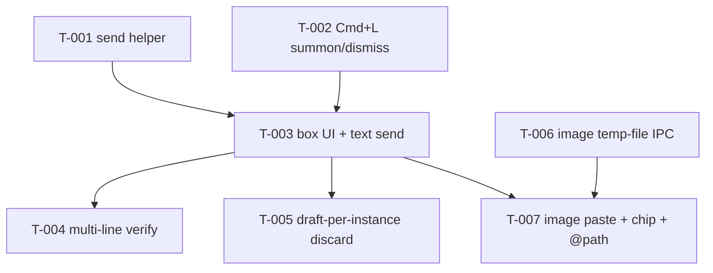

# Kanban: Compose Box

**Generated:** 2026-06-09
**PRD Version:** 1.0 (docs/specs/compose-box/prd.md)
**Total Tasks:** 8 (7 in M1, all done; 1 post-M1 enhancement)
**Milestones:** M1 — Compose Box MVP (complete)

## Task Overview

**Critical path:** T-001 → T-003 → T-007 (text plumbing → box → image attach). T-006 can be
built in parallel with T-001/T-002/T-003 since it is a standalone main-process IPC. T-002 is
independent of T-001 and can go in parallel.

**MVP boundary:** M1 is all of T-001 … T-007. After M1 you can summon a compose box with Cmd+L,
type/paste/proofread/mouse-edit a multi-line message, paste an image (saved as a temp file, shown
as a chip), and press Enter to send it to the selected claude instance as a single turn — with
normal terminal behavior fully intact when the box is closed.

---

## Milestone 1: Compose Box MVP

### T-001: Compose-send helper — wrap payload in bracketed paste + separate `\r`
- **Type:** integration
- **Status:** done
- **Story:** Story 3 (multi-line content sends intact)
- **Description:** Add a small renderer-side helper that takes a composed message string (and
  optionally a list of `@<path>` image refs) and sends it to an instance using the existing
  `window.electronAPI.writeToInstance(id, data)` path (channel `pty-input`). The send sequence,
  validated against claude 2.1.165, is: write `\x1b[200~` + payload + `\x1b[201~`, then write
  `\r` **as a separate call** to submit. Do NOT put `\r` inside the bracketed-paste markers.
  Newlines inside the payload must be `\n` (0x0A) — they insert line breaks and never submit.
  When image refs exist, splice them into the payload as ` @<path>` tokens (see T-007 for where
  the refs come from; this task just defines the splice + send contract). Put the helper next to
  the terminal send code, e.g. a `sendComposed(instanceId, text, imagePaths)` function exported
  from a new `workspace/app/src/renderer/components/composeSend.ts` (or inline in the box
  component if cleaner — keep it small).
- **Acceptance:**
  - Calling the helper with a 3-line string results in exactly two `writeToInstance` calls:
    `\x1b[200~...\x1b[201~` then `\r`.
  - No `\r` appears inside the paste markers.
  - Helper is a pure function of (text, imagePaths) → emits the IPC calls; unit-testable with a
    mocked `writeToInstance`.
- **Blocks:** T-003
- **Blocked by:** none
- **Parallel with:** T-002, T-006
- **Notes:** Reuses `pty-input` exactly as `TerminalView.onData` does — PRD says no changes to the
  main-process send path. The existing API is `ipcRenderer.send` (fire-and-forget), so order is
  preserved by call order.

### T-002: Cmd+L summon / Esc dismiss, focus management, no key leak
- **Type:** feature
- **Status:** done
- **Story:** Story 1 (summon and dismiss)
- **Description:** Wire a Cmd+L hotkey (when an instance is selected and running) that toggles a
  `composeOpen` boolean state for the selected instance, and Esc to close. Decide the owner of the
  state: lift `composeOpen` + draft into `App.tsx` (it already owns `selectedId`), OR keep it in a
  new `ComposeBox` host that App renders inside `.content-terminal`. Cmd+L must NOT reach the PTY:
  follow the existing pattern in `TerminalView.tsx` (`terminal.attachCustomKeyEventHandler`,
  lines 55-65) where Cmd+Backspace is intercepted and the handler returns `false` to swallow it —
  add a branch that swallows `metaKey && e.key === 'l'` and instead fires an app-level event/
  callback to open the box (return `false` so xterm never forwards it). Esc/close must return
  keyboard focus to the terminal (`getTerminal(instanceId)?.focus()` from TerminalView's exported
  `getTerminal`).
- **Acceptance:**
  - Cmd+L with a running instance selected opens the box; focus lands in its textarea.
  - No stray `l` or escape sequence is sent to the PTY when pressing Cmd+L (verify token counter
    / input box stays clean in claude). **This closes gap G8 — confirm no clash with existing
    App-level key handling.**
  - Esc closes the box and focus returns to the terminal.
  - When the box is closed, terminal/TUI key handling is byte-for-byte unchanged.
- **Blocks:** T-003
- **Blocked by:** none
- **Parallel with:** T-001, T-006
- **Notes:** Cmd+L chosen to avoid terminal Ctrl+L (clear). The box only renders for the selected
  instance; one at a time. Gate on `selectedInstance.backend === "claude"` (claude-only MVP) and
  `status === "running"`.

### T-003: Compose box UI — textarea, hint line, Enter-to-send, empty no-op
- **Type:** feature
- **Status:** done
- **Story:** Story 1 + Story 2
- **Description:** Build the `ComposeBox` React component: an overlay anchored to the bottom of the
  active terminal area (inside/over `.content-terminal`, see `global.css:361`), QQ-input-bar feel,
  compact and information-dense, themed via the existing CSS-variable theme system (light/dark/
  sepia). Contains a multi-line `<textarea>` (auto-grow within a max height, scroll past that)
  showing every character with no collapsing, and a small hint line:
  "Enter to send · Shift+Enter newline · Esc cancel". Behavior: **Enter** calls the T-001 send
  helper with the current text then closes the box and refocuses the terminal; **Shift+Enter**
  inserts a newline; **Esc** discards and closes (handled with T-002). If text is empty AND no
  image attached, Enter is a **no-op** (box stays open, nothing sent). Mouse click-to-position and
  edit is just native textarea behavior — make sure clicks inside the box don't bubble to the
  terminal `onClick` scroll handler. Add the box styles to `global.css`.
- **Acceptance:**
  - Box renders anchored at the bottom of the terminal area, matching app theme, focus auto in
    textarea on open.
  - Typed multi-line text is fully visible (no truncation); mouse can position the cursor.
  - Enter sends via T-001 helper and closes; Shift+Enter adds a newline; empty content Enter does
    nothing.
  - Hint line is visible.
  - Sending a real 1-line and 3-line message to a running claude instance lands the content in its
    input box.
- **Blocks:** T-004, T-005, T-007
- **Blocked by:** T-001, T-002
- **Parallel with:** none
- **Notes:** Mount inside `App.tsx`'s `.content-terminal` block so it overlays the active
  `TerminalView`. "Empty" = no text and no attached image (image attachment lands in T-007; until
  then, empty = no text).

### T-004: Verify multi-line send against a running claude instance
- **Type:** qa
- **Status:** done (verified 2026-06-09 against real claude 2.1.168 via node-pty probe)
- **Story:** Story 3 (multi-line content sends intact)
- **Description:** Manual/observed verification (not just unit) that a 3+ line message composed in
  the box arrives at a live claude instance as a SINGLE turn: all line breaks preserved as
  newlines in the input box, only the trailing separate `\r` submits, long content folds into the
  native `[Pasted text #N +M lines]` placeholder (acceptable). Record the observed result (token
  counter behavior, fold placeholder) in the gaps/PRD validation notes if anything differs from
  the ideation findings.
- **Acceptance:**
  - 3+ line composed message → one agent turn (not N turns), newlines preserved.
  - Long content folds to `[Pasted text #N]` natively.
  - Behavior matches the validated mechanism (G2/G3); any deviation noted.
- **Blocks:** none
- **Blocked by:** T-003
- **Parallel with:** T-005
- **Notes:** This is the acceptance gate on Story 3's "Verified behavior against a running claude
  instance" checkbox. Use the `/verify` or `/run` skill to drive the real app.

### T-005: Draft is per-selected-instance and discarded on switch
- **Type:** feature
- **Status:** done
- **Story:** Story 5 (one box per instance, draft discarded on switch)
- **Description:** Ensure the compose box belongs to the currently selected instance and that
  switching `selectedId` (in `App.tsx`) **discards** the in-progress draft: clear textarea text
  AND trigger cleanup of any attached image temp files (cleanup hook from T-007). Returning to the
  original instance shows an empty box. No persistence across switches or app restarts. Simplest
  implementation: tie `composeOpen` + draft state to `selectedId` so changing selection resets it
  (e.g. `useEffect` on `selectedId` that closes the box and runs image cleanup).
- **Acceptance:**
  - Open box, type a draft, switch instance → draft gone, image temp files cleaned up.
  - Return to original instance → empty box (no restore).
  - No draft survives an app restart.
- **Blocks:** none
- **Blocked by:** T-003
- **Parallel with:** T-004
- **Notes:** Deliberately transient — no per-instance draft map. Image cleanup call is a no-op
  until T-007 lands; wire the hook so T-007 only has to supply the temp-path list.

### T-006: Main-process IPC — save clipboard image to a temp file
- **Type:** integration
- **Status:** done
- **Story:** Story 4 (paste an image)
- **Description:** Add a main-process IPC that reads the current OS clipboard image via Electron's
  built-in `clipboard.readImage()`, and if non-empty, writes it as a PNG to the OS temp dir
  (`os.tmpdir()`, unique filename) and returns the absolute path; if the clipboard has no image,
  return `null` (graceful no-op, no throw). Also add a cleanup IPC that deletes a given temp path
  (used on cancel / instance switch). Register handlers in
  `workspace/app/src/main/ipc-handlers.ts` (e.g. `save-clipboard-image` →
  `clipboard.readImage()` / `nativeImage.toPNG()` / `fs.writeFileSync`; and `delete-temp-image`),
  expose them in `preload.ts` (`saveClipboardImage(): Promise<string|null>`,
  `deleteTempImage(path): Promise<void>`), and add the signatures to the `ElectronAPI` interface in
  `shared/types.ts`. Use only built-in `electron` `clipboard`/`nativeImage` + node `os`/`fs` — no
  new deps.
- **Acceptance:**
  - With an image on the clipboard, the IPC returns an absolute path to a real PNG in the OS temp
    dir that exists on disk.
  - With no image on the clipboard, it returns `null` and does not throw.
  - Cleanup IPC deletes the given file and is safe if the file is already gone.
  - New methods present in preload bridge and `ElectronAPI` type.
- **Blocks:** T-007
- **Blocked by:** none
- **Parallel with:** T-001, T-002, T-003
- **Notes:** Renderer has no fs/clipboard-image access — that's why this must be main-process.
  Zero-residue: temp files live only in OS temp dir, deleted on cancel; they must SURVIVE a
  successful send so the CLI can read them (per G7). MVP saves PNG only (CLI supports
  png/jpeg/gif/webp/bmp).

### T-007: Image paste in box — chip, `@path` splice on send, cleanup on cancel
- **Type:** feature
- **Status:** done
- **Story:** Story 4 (paste an image)
- **Description:** In the `ComposeBox`, intercept paste (`onPaste`): if the clipboard event
  carries an image (`e.clipboardData` has an image item), prevent the default textarea insert and
  call the T-006 `saveClipboardImage()` IPC; on a returned path, push it to a per-draft
  `attachedImages: string[]` and render a visible **chip** per image (filename indicator; a
  thumbnail is a deferred nice-to-have per G9) with a remove (×) button. Plain-text paste falls
  through to the textarea normally. On **send** (Enter), pass `attachedImages` to the T-001 helper
  so each is spliced as ` @<abs-path>` into the message; an attached image makes the draft
  **non-empty** even with no text. Temp files must SURVIVE send. On **Esc / cancel** and on
  **instance switch** (T-005), call `deleteTempImage(path)` for each attached image to clean up.
  Graceful no-op if `saveClipboardImage()` returns null (clipboard had no image — e.g. a normal
  text paste path).
- **Acceptance:**
  - Paste an image → no raw bytes dumped in textarea; a chip appears; temp file saved.
  - Enter with only an image (no text) sends `@<path>` and the box closes (non-empty).
  - After send, the temp file still exists (CLI reads it); real claude submit of an image returns
    `Read <file>` and a vision answer (per validated G4).
  - Esc / instance-switch deletes the attached temp files.
  - Pasting plain text still goes into the textarea; image-less paste is a no-op for attachments.
  - Remove (×) on a chip deletes that temp file and drops it from the draft.
- **Blocks:** none
- **Blocked by:** T-003, T-006
- **Parallel with:** none
- **Notes:** Final task on the critical path. `@<abs-path>` validated (G4) as a real vision
  attachment, not text. This wires the cleanup hook stubbed in T-005.

---

## Post-M1 Enhancements

These are deferred nice-to-haves carried out of the MVP scope. M1 must be complete (it is) before
picking these up. Each is independent of the others.

### T-008: Image chip shows a thumbnail instead of just a filename
- **Type:** feature
- **Status:** todo
- **Story:** Story 4 (paste an image) — polish
- **Gap:** Closes G9 (deferred in `gaps.md`: "MVP: filename/indicator chip is enough; thumbnail is a
  nice-to-have").
- **Description:** Upgrade the attached-image chip in `ComposeBox` from the current `🖼 <filename>`
  text indicator to a small visible **thumbnail** of the pasted image, so the builder can confirm
  at a glance *which* screenshot is attached (not just the temp filename, which is opaque, e.g.
  `multicode-paste-1718000000000.png`). The renderer has no fs access, so the image bytes must come
  through the main process — the cleanest path is to have `save-clipboard-image` *also* return the
  PNG as a `data:image/png;base64,…` URL alongside the temp path, OR add a separate
  `read-temp-image(path) → dataUrl` IPC. Prefer extending the existing save call to return both in
  one round-trip (avoids a second IPC and a second disk read):
  - `ipc-handlers.ts:165` `save-clipboard-image` currently returns `string | null` (the temp path).
    Change it to return `{ path: string; dataUrl: string } | null`, where `dataUrl` is built from
    the same `image.toPNG()` buffer already in hand (`` `data:image/png;base64,${png.toString("base64")}` ``)
    — no extra disk read.
  - Update `preload.ts:30` `saveClipboardImage` and the `ElectronAPI` signature in
    `shared/types.ts:66` to the new return shape.
  - In `ComposeBox.tsx`: change `images` state from `string[]` to an array of
    `{ path: string; dataUrl: string }` (the `path` is still what gets cleaned up and what gets
    spliced as `@<path>` on send — `composeSend` / `sendComposed` still takes the paths only, so map
    `images.map(i => i.path)` at the send call site, `handleSend` line ~69, and the unmount-cleanup
    effect line ~58, and `handleRemoveImage` line ~101). Render an `` inside the
    chip in place of (or alongside) the filename.
  - Add thumbnail styles to `global.css` near the existing `.compose-chip*` block (`global.css:860`):
    a fixed small box (e.g. ~32–40px square), `object-fit: cover`, rounded corners, keep the remove
    (×) button. Keep it compact / information-dense per the QQ aesthetic and themed via the existing
    `--compose-chip-*` CSS variables.
- **Acceptance:**
  - Pasting an image into the box shows a real thumbnail of that image in the chip (not just a
    filename), with the remove (×) button still working (deletes the temp file + drops it from the
    draft, as today).
  - The `@<abs-path>` splice on send is unchanged — sending still references the temp file by path,
    and the temp file still survives a successful send (G7).
  - Esc / instance-switch still cleans up the temp files (unmount cleanup unchanged in behavior).
  - No second disk read introduced: the data URL is derived from the same PNG buffer the save IPC
    already produces.
  - `pnpm type`, `pnpm lint`, `pnpm test` (composeSend tests still pass — its contract is paths-only
    and unchanged), renderer + main both build.
- **Blocks:** none
- **Blocked by:** T-006, T-007 (both done)
- **Parallel with:** —
- **Notes:** Deliberately small. The temp-file + `@path` send contract from T-001/T-006/T-007 does
  NOT change — this is purely a chip-rendering upgrade plus widening the save IPC's return value to
  carry preview bytes. Do not base64 the file from disk again; reuse the in-memory `toPNG()` buffer.

---

## Legend

- **Blocks:** This task must complete before the listed tasks can start
- **Blocked by:** This task cannot start until the listed tasks complete
- **Parallel with:** These tasks have no dependency and can be worked simultaneously

## Changelog

- 2026-06-09: Initial kanban generated from PRD v1.0. 7 tasks, single MVP milestone. Critical path
  T-001 → T-003 → T-007. Task WHERE-pointers verified against current source (TerminalView.tsx
  send path & key handler, App.tsx selectedId, ipc-handlers.ts/preload.ts/shared/types.ts IPC
  pattern, global.css:361 .content-terminal). G8 (Cmd+L conflict) folded into T-002 acceptance.
- 2026-06-09: Implemented T-001, T-002, T-003, T-005, T-006, T-007. Code-level acceptance met;
  type-check, lint (oxlint+eslint), and unit tests (composeSend, 7 tests) all pass; renderer +
  main both build. New files: `renderer/components/composeSend.ts` (+ `.test.ts`),
  `renderer/components/ComposeBox.tsx`. Edited: `TerminalView.tsx` (Cmd+L swallow → `compose-open`
  CustomEvent), `App.tsx` (composeOpen state, gated open listener, discard-on-switch, render),
  `ipc-handlers.ts` + `preload.ts` + `shared/types.ts` (save-clipboard-image / delete-temp-image),
  `styles/global.css` (compose-* vars across light/dark/sepia + `.compose-*` styles).
  **T-004 (manual verify against a live claude instance) NOT yet run** — needs the app launched
  with a running claude instance; that's the only remaining MVP task.
- 2026-06-09: T-004 verified against real claude **2.1.168** (node-pty probe driving the exact
  byte sequence `sendComposed` emits). All 3 acceptance criteria pass: (1) a 3-line message lands
  as a SINGLE user record in the session JSONL (`…ALPHA\n…BRAVO\n…CHARLIE`, 2 newlines preserved,
  assistant `stop_reason: end_turn`) — one turn, not three; (2) newlines preserved as `\n`;
  (3) a 10-line payload folds to the native `[Pasted text #1 +9 lines]` placeholder with zero
  lines splattered. Behavior matches the validated G2/G3 mechanism. **M1 (Compose Box MVP) is now
  complete — all 7 tasks done.**
- 2026-06-09: Added **T-008** (post-M1 enhancement): upgrade the image chip from a filename
  indicator to a thumbnail (closes deferred G9). Scope is chip-rendering + widening
  `save-clipboard-image` to return `{ path, dataUrl }` from the same in-memory PNG buffer; the
  temp-file + `@path` send contract is unchanged. Status: todo.
