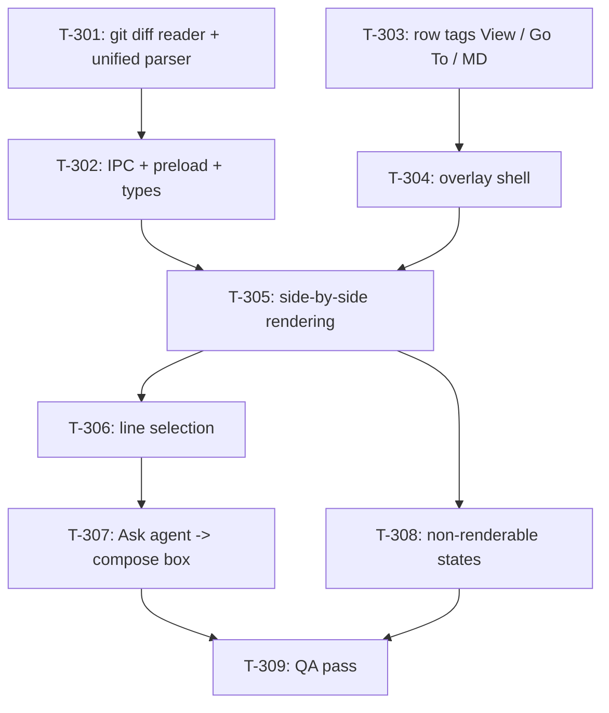

# Kanban: Diff View

**Generated:** 2026-09-18
**Source:** `docs/specs/diff-view/prd.md` v1.0 · `docs/specs/diff-view/gaps.md`
**Total Tasks:** 9 (T-301..T-309)
**Milestones:** M1 (read a diff) · M2 (reference it to the agent) · M3 (QA)

Task ids start at T-301 so they never collide with the manager-agent epic's T-2xx.

## Task Overview



**Critical path:** T-301 → T-302 → T-305 → T-306 → T-307 → T-309. The parser is first
because every rendering decision depends on the shape it produces.

**Parallelizable:**
- T-301 (main process, pure logic) and T-303 (Git section tags) touch different files — do them in parallel.
- T-304 (overlay shell) only needs T-303's callback, not T-301/T-302.
- After T-305: T-306 (selection) and T-308 (error states) are independent.

**Only looks parallel:** T-306 and T-308 both edit the overlay component. They are
independent in logic but adjacent in the file — sequence them if one agent runs both.

---

## Milestone 1: Read a diff

**Goal:** clicking `View` on any Git row shows a side-by-side diff of that file, and
closes cleanly.

**Tasks:** T-301, T-302, T-303, T-304, T-305, T-308

**Done when:**
- Every file row has `View` and `Go To`; `.md` rows also have `MD`, and `MD` still opens the Markdown View
- `View` on a modified file shows old-left / new-right with real line numbers, whole file, synced scroll
- `View` on an untracked file shows the whole file as added; on a staged file, index vs HEAD
- A binary file, an over-large diff, an unchanged file and a missing file each show a message rather than a broken view
- `×`, `Esc` and a backdrop click all close it, and focus returns to the terminal
- Nothing in the overlay can write to the repo

### T-301: git diff reader + unified-diff parser
- **Type:** feature
- **Status:** done
- **Outcome:** `workspace/app/src/main/git-diff.ts` + 24 unit tests. Kept the detail below because T-302/T-305 build on these types. Fixtures are real git output; `replace` pairing, per-hunk line numbering, rename headers, the no-newline note and the binary marker are all covered. Verified end to end against a scratch repo: all three sides, a binary file, a missing file, an unchanged file and a directory each land on the expected result, and the repo was untouched afterwards.
- **Requirement:** `docs/specs/diff-view/prd.md#story-3-side-by-side-diff-of-the-working-change`, `#story-4-the-right-diff-for-each-file-state`
- **Code:** `workspace/app/src/main/git-diff.ts` (new), `workspace/app/src/main/git-diff.test.ts` (new)
- **Description:** New main-process module `git-diff.ts` that produces the aligned line pairs the renderer draws. Export `getFileDiff(cwd, relPath, side)` where `side` is `"unstaged" | "staged" | "untracked"`, returning a discriminated union:

  ```ts
  export type DiffLineKind = "context" | "add" | "del" | "replace";
  export interface DiffRow {
    kind: DiffLineKind;
    oldLine: number | null;   // line number in the old version, null for an add
    newLine: number | null;   // line number in the new version, null for a del
    oldText: string | null;
    newText: string | null;
  }
  export type FileDiff =
    | { ok: true; rows: DiffRow[]; oldPath: string; newPath: string; comparison: string; truncated: boolean }
    | { ok: false; reason: "binary" | "too-large" | "no-changes" | "not-found" | "failed"; detail?: string };
  ```

  `comparison` is the human string for the header: `"working tree vs index"` for unstaged, `"index vs HEAD"` for staged, `"new file"` for untracked.

  How each side is produced:
  - `unstaged` → `git -C <cwd> diff --unified=100000 --no-color -M -- <relPath>`
  - `staged` → same with `--cached`
  - `untracked` → do **not** shell out. Read the file with `fs.readFileSync` and emit one `add` row per line (`oldLine: null`, `oldText: null`). `git diff --no-index` was rejected: it exits 1 when there is a difference, which `execFile` turns into a rejection.

  Parsing: skip the `diff --git` / `index` / `---` / `+++` preamble, but read `rename from` / `rename to` out of it to fill `oldPath` / `newPath` (both are `relPath` when there is no rename). For each `@@ -a,b +c,d @@` hunk header, seed the old and new counters from `a` and `c`, then walk the body: `' '` → a `context` row on both sides incrementing both counters; `'-'` → a `del` row (`newLine: null`); `'+'` → an `add` row (`oldLine: null`). Drop `\ No newline at end of file` lines. **Pair adjacent runs of `-` then `+` into single rows** so a replaced line shows old-left / new-right on one visual row: when a run of N deletions is immediately followed by a run of M additions, zip them index-wise into `min(N,M)` rows of kind `"replace"`, each carrying all four fields non-null. Leftover unpaired lines stay as plain `del` / `add` rows.

  Guards: `timeout: 5000`, `maxBuffer: 16 * 1024 * 1024`. Empty stdout → `{ ok: false, reason: "no-changes" }`. A stdout line matching `/^Binary files .* differ$/m` or (for untracked) a NUL byte in the first 8 KB → `reason: "binary"`. More than `5000` rows → keep the first 5000 and set `truncated: true`; more than `20000` → `reason: "too-large"` with `detail` carrying the row count. A missing file for `untracked` → `reason: "not-found"`. Any throw (including maxBuffer overflow) → `reason: "failed"` with the error message in `detail`; nothing escapes.
- **Acceptance:**
  - Unit tests parse fixture unified-diff text into the expected rows: a pure addition, a pure deletion, a replaced line (one `replace` row, both sides populated), a hunk starting mid-file (line numbers match the `@@` header), two hunks in one file, a rename header
  - A file with 3 changed lines out of 400 yields ~400 rows (whole-file context), not ~15
  - Binary marker → `reason: "binary"`; empty diff → `"no-changes"`
  - A row's `newLine` values, read top to bottom ignoring `del` rows, are 1..N with no gaps
  - No test reads the developer's real HOME (see `docs/knowledge/tech-conventions.md#tests-must-not-read-the-real-home`)
- **Blocks:** T-302 · **Blocked by:** none · **Parallel with:** T-303
- **Notes:** Mirror `git-status.ts`'s `run()` helper (`execFile` + `promisify`, `git -C <cwd>`) rather than inventing a second git invocation style; consider exporting the helper from `git-status.ts` or duplicating the four lines — do not add a git library. The parser must be a pure exported function taking the raw stdout string so the tests never spawn git. `--unified=100000` is how whole-file context is obtained; that number, not `-U999999`, to keep the output bounded on very large files.

---

### T-302: `get-file-diff` IPC + preload + shared types
- **Type:** integration
- **Status:** done
- **Outcome:** `get-file-diff` handler in `ipc-handlers.ts`, bridged in `preload.ts`, types in `shared/types.ts` (and re-exported from `git-diff.ts` rather than duplicated the way `GitStatus` is). Path escapes are refused by `isInsideCwd`, unit-tested against `..`, absolute, `~` and `C:\` inputs. Full suite green: 608 tests, type-check and both linters clean.
- **Requirement:** `docs/specs/diff-view/prd.md#story-4-the-right-diff-for-each-file-state`
- **Code:** `workspace/app/src/main/ipc-handlers.ts`, `workspace/app/src/main/preload.ts`, `workspace/app/src/shared/types.ts`
- **Description:** Expose T-301 to the renderer. Add `ipcMain.handle("get-file-diff", async (_e, id: string, relPath: string, side: DiffSide) => …)` in `registerIpcHandlers()`, resolving the instance's `cwd` exactly the way `get-git-status` does (`processManager.listInstances().find(i => i.id === id)`; unknown instance → `{ ok: false, reason: "failed" }`). **Reject any `relPath` that escapes the cwd**: `path.resolve(cwd, relPath)` must stay inside `cwd` (compare with `path.relative` — not starting with `..` and not absolute), and reject absolute inputs outright; PRD puts files outside the cwd out of scope. Bridge in `preload.ts` as `getFileDiff: (id, relPath, side) => ipcRenderer.invoke("get-file-diff", id, relPath, side)`. Move `DiffRow` / `FileDiff` / `DiffSide` into `shared/types.ts` (or re-export them there) and add `getFileDiff` to the `ElectronAPI` interface, following how `readFile` / `ReadFileResult` are declared.
- **Acceptance:**
  - `window.electronAPI.getFileDiff(id, "src/main/git-status.ts", "unstaged")` returns rows for a real modified file
  - `getFileDiff(id, "../../../etc/passwd", "unstaged")` and an absolute path both return `{ ok: false }` and never invoke git
  - An unknown instance id returns `{ ok: false }` without throwing
  - `pnpm type` passes; the renderer sees the types without importing from `main/`
- **Blocks:** T-305 · **Blocked by:** T-301 · **Parallel with:** T-303, T-304
- **Notes:** `GitStatus` / `GitFileEntry` are already re-exported through `shared/types.ts` — follow the same arrangement so the renderer never imports a main-process module.

---

### T-303: Row tags — `View`, `Go To`, and renaming markdown's `View` to `MD`
- **Type:** feature
- **Status:** done
- **Outcome:** Rows are now a `div` with `MD` / `View` / `Go To` tags, each a real `<button>` (the nested-interactive `role="button"` workaround is gone). Verified over CDP: rows render as `DIV` with both tags, and the filename shrinks rather than pushing tags out.
- **Requirement:** `docs/specs/diff-view/prd.md#story-1-two-buttons-per-file-row`
- **Code:** `workspace/app/src/renderer/components/GitSection.tsx`, `workspace/app/src/renderer/styles/global.css`, `workspace/app/src/renderer/components/Toolbox.tsx`, `workspace/app/src/renderer/App.tsx`
- **Description:** Rework `FileRow` in `GitSection.tsx`. Today the whole row is a `<button>` whose click calls `openInVSCode(absPath, cwd)`, and markdown files carry a `git-file-view` span that calls `onPreviewInView`. After this task the row is a plain `<div className="git-file-row">` (no longer a button, so the nested-interactive workaround in the current comment goes away) containing, in order: name, dir, then the tags — `MD` (markdown only, calls `onPreviewInView(absPath)`, class `git-file-tag git-file-tag-md`), `View` (calls a new `onViewDiff(relPath, side)`, class `git-file-tag git-file-tag-view`), `Go To` (calls `openInVSCode(absPath, cwd)`, class `git-file-tag git-file-tag-goto`), then the status letter. Each tag is a real `<button type="button">` now that the row isn't one. `side` comes from the `FileGroup`'s existing `kind` prop: `new` → `"untracked"`, `modified` → `"unstaged"`, `staged` → `"staged"`. Thread a new `onViewDiff: (relPath: string, side: DiffSide, code: string) => void` prop down `GitSection` → `FileGroup` → `FileRow`, and through `Toolbox.tsx` from `App.tsx` (mirror how `onPreviewInView` is threaded, including the `isOffline ? () => {} : …` guard at the `Toolbox` call site). Pass the **repo-relative** `file.path` to `onViewDiff`, not `absPath`. In `App.tsx` this task only needs a stub that stores the request in state — the overlay lands in T-304. Style: reuse the existing `git-file-view` visual treatment as the shared `.git-file-tag` base, keep the row on one line, let the filename truncate (`min-width: 0` + `text-overflow: ellipsis`) so three tags never push out of view.
- **Acceptance:**
  - Every row shows `View` and `Go To`; `.md` rows show `MD` first
  - `Go To` opens the file in VS Code in the project window, as the row click used to
  - `MD` opens the file in the Markdown View and expands that section — unchanged behaviour under a new name
  - Clicking the row background does nothing
  - Each tag is reachable by Tab and fires on Enter and Space
  - A very long path truncates; the three tags and the status letter stay visible at the narrowest toolbox width (280px)
  - Deleted files (code `D`) still render, with `View` present
- **Blocks:** T-304 · **Blocked by:** none · **Parallel with:** T-301, T-302
- **Notes:** Keeping `MD` first preserves muscle memory for the tag that already existed at that end of the row. Native `<button>`s remove the `role="button"` + keydown mirror the current code needs; delete that comment with it.

---

### T-304: Diff overlay shell — modal, header, close paths
- **Type:** feature
- **Status:** done
- **Outcome:** `DiffOverlay.tsx` — 94vw × 92vh panel, path + comparison + `×` in the header, closes on `×` / Esc / backdrop. A backdrop click only closes when the press also landed there, so a text drag released outside the panel doesn't close it mid-copy. Esc verified over CDP.
- **Requirement:** `docs/specs/diff-view/prd.md#story-2-the-overlay-is-read-only-and-easy-to-dismiss`
- **Code:** `workspace/app/src/renderer/components/DiffOverlay.tsx` (new), `workspace/app/src/renderer/App.tsx`, `workspace/app/src/renderer/styles/global.css`
- **Description:** New `DiffOverlay` component and the state that drives it. In `App.tsx` hold `const [diffTarget, setDiffTarget] = useState<{ relPath: string; side: DiffSide } | null>(null)`, set by T-303's `onViewDiff`, cleared on close **and** in the existing `useEffect` keyed on `selectedId` (switching instances closes it, per PRD). Render `<DiffOverlay …/>` as a sibling of `NewInstanceDialog` at the end of `App`'s tree, only when `diffTarget && selectedInstance`. Props: `instanceId`, `cwd`, `relPath`, `side`, `onClose`. The component renders a full-window backdrop (`.diff-overlay-backdrop`) plus a panel (`.diff-overlay`) with a header showing the repo-relative path, the comparison string, and an `×` button on the right; the body is a placeholder until T-305. Close on `×`, on `Escape` (keydown listener on the panel plus a `document` listener, matching how the dialogs do it), and on a backdrop click (only when the click target *is* the backdrop, so a drag-select inside the panel that ends outside doesn't close it). On close, call `onClose`, and have `App` return focus to the terminal via the existing `getTerminal(selectedId)?.focus()` pattern used by `closeCompose`. Keydown inside the overlay must not reach the terminal — the overlay is not inside the terminal's DOM, but stop propagation on the panel anyway.
- **Acceptance:**
  - `View` on any row opens a full-window overlay with that file's path in the header
  - `×`, `Esc`, and a backdrop click each close it; a drag that starts inside the panel and releases on the backdrop does not
  - Focus is back on the terminal after close (typing goes to the CLI)
  - Switching the selected instance closes it
  - Typing while the overlay is open sends nothing to the PTY
  - The overlay contains no control that writes anything — verified by inspection
- **Blocks:** T-305 · **Blocked by:** T-303 · **Parallel with:** T-301, T-302
- **Notes:** Follow `NewInstanceDialog.tsx` for the modal conventions already in the app (backdrop class names, Esc handling, focus management) instead of introducing a second modal idiom. QQ aesthetic: thin border, flat title bar, no rounded-corner drop-shadow modern look.

---

### T-305: Side-by-side rendering with synced scroll
- **Type:** feature
- **Status:** done
- **Outcome:** One grid, four cells per row. Columns are `max-content` with a 45vw floor per side. Line numbers are CSS generated content so a selection can never pick them up — `user-select: none` was measured to be insufficient. Verified: 641 rows for App.tsx with the new side numbered 1..N, whole-file context, synced scroll, matching row tops, code-only copy.
- **Requirement:** `docs/specs/diff-view/prd.md#story-3-side-by-side-diff-of-the-working-change`
- **Code:** `workspace/app/src/renderer/components/DiffOverlay.tsx`, `workspace/app/src/renderer/styles/global.css`
- **Description:** Fetch and draw the diff. On mount and whenever `relPath` / `side` change, call `window.electronAPI.getFileDiff(instanceId, relPath, side)` once, into local state, with a loading line while it is in flight (a stale response for a previous path must be ignored — the usual `cancelled` flag). Do **not** re-fetch on git polling; the overlay is a snapshot. Render one DOM row per `DiffRow` in a single grid (`display: grid; grid-template-columns: auto 1fr auto 1fr`: old line number, old text, new line number, new text) so both sides share one scroll container and alignment is structural rather than two containers kept in sync by script. Per kind: `context` → both texts, no tint; `del` → left text with the remove tint, right cell empty; `add` → right text with the add tint, left cell empty; `replace` → left with remove tint, right with add tint. Line-number cells are `user-select: none` so a text selection copies code without the numbers. Text cells are `white-space: pre` with the container scrolling horizontally — a long line must not wrap, because wrapping would break the row-per-line alignment the reference depends on. Font: the terminal's monospace family and size, tight line-height. Add/remove tints must be legible in both themes — define them as CSS variables next to the existing theme variables in `global.css`, one pair per theme. Show `truncated` as a footer line: "Showing first 5000 lines".
- **Acceptance:**
  - A modified file shows old-left / new-right, changed lines tinted, unchanged lines plain
  - Line numbers on each side match the real file (spot-check the last line number on the right against the file's line count)
  - The whole file is present, not just hunks
  - One vertical scroll moves both sides; they cannot drift
  - A 300-character line scrolls horizontally without wrapping and without breaking alignment
  - Selecting text across several lines and copying yields the code without line numbers
  - Colours are legible in both light and dark themes
  - Opening a 3000-line file feels immediate; the terminal keeps printing output while the overlay is open
- **Blocks:** T-306, T-308 · **Blocked by:** T-302, T-304 · **Parallel with:** none
- **Notes:** One grid, not two panes plus a scroll-sync handler — the sync bug class disappears. If 5000 rows of DOM turns out to be visibly slow, note it and stop; virtualization is a follow-up task, not something to smuggle in here.

---

### T-308: Non-renderable states
- **Type:** feature
- **Status:** done
- **Outcome:** `diffErrors.ts` maps each reason to one line, with 5 unit tests. `binary` also offers the `Go To` fallback, not just `too-large` — the file is fine either way, we just can't show it here. Verified in the app: a binary file shows the message with no columns and a working `Go To`, an unchanged file reports "No changes", a missing one "File not found", a 25000-line file "Diff too large to show (25000 lines)", and an 8000-line one truncates to 5000 with the footer.
- **Requirement:** `docs/specs/diff-view/prd.md#story-7-files-that-cant-be-shown`
- **Code:** `workspace/app/src/renderer/components/DiffOverlay.tsx`
- **Description:** Map every `{ ok: false }` reason from T-301 to a compact message in the overlay body, in the style `MarkdownSection` uses for its read-file errors: `binary` → "Binary file — no diff to show"; `too-large` → "Diff too large to show (<n> lines) — open it in your editor", with a `Go To` button next to it that calls `openInVSCode(cwd + "/" + relPath, cwd)`; `no-changes` → "No changes"; `not-found` → "File not found"; `failed` → "Could not read the diff: <detail>" on one line. A previous file's rows must be cleared before an error renders — no old content showing under a message. Every state keeps the header, the `×`, and the Esc path working.
- **Acceptance:**
  - Each of the five reasons renders its own message and no columns
  - The `too-large` state offers `Go To` and it opens VS Code
  - Opening a good file, then a binary one, leaves no rows from the first
  - Every state closes with `×` and `Esc`
  - A git failure shows a message; the renderer console has no uncaught error and the app keeps running
- **Blocks:** T-309 · **Blocked by:** T-305 · **Parallel with:** T-306
- **Notes:** Adjacent to T-306 in the same file — if one agent does both, land this first; it is smaller and it makes T-306's manual testing less annoying. Reuse `markdownErrors.ts`'s message-mapping shape if it fits; do not force it.

---

## Milestone 2: Reference it to the agent

**Goal:** lines selected in the diff become an `@path:start-end` reference in the compose
box, so the agent can be challenged about them.

**Tasks:** T-306, T-307

**Done when:**
- Clicking a line selects it; shift-click and drag select a range; the header shows the reference that would be inserted
- Ordinary text selection and copy still work
- "Ask agent" closes the overlay, opens the compose box, and appends `@path:start-end ` to whatever draft is there
- A removed-lines-only selection resolves to the nearest new-version line and says so
- The action is disabled with a reason when the instance is not running

### T-306: Line selection
- **Type:** feature
- **Status:** backlog
- **Requirement:** `docs/specs/diff-view/prd.md#story-5-selecting-lines`
- **Code:** `workspace/app/src/renderer/components/DiffOverlay.tsx`, `workspace/app/src/renderer/components/diffRef.ts` (new), `workspace/app/src/renderer/components/diffRef.test.ts` (new), `workspace/app/src/renderer/styles/global.css`
- **Description:** Add line selection over T-305's grid, keyed on **row index** (not line number, since `del` rows have no new-line number). State: `{ anchor: number; head: number } | null`; the selected range is `[min, max]`. Gestures: `mousedown` on a row sets anchor and head and starts a drag (`mousemove` while the button is held extends `head`, `mouseup` ends it — listeners on the grid, not on `document`, so a release outside just ends the drag); `shift+click` moves `head` only; a plain click on the single already-selected row clears the selection. Mark selected rows with a class and a left edge marker; do not change their add/remove tint. **Do not `preventDefault` on mousedown** — native text selection must keep working (G-108), so line selection rides along with it rather than replacing it. Extract the reference computation into `diffRef.ts` as a pure function `refForRange(rows, start, end, relPath): { ref: string; fellBack: boolean }`: take the new-version line numbers of the rows in range; if at least one exists, use its min and max, emitting `@<relPath>:<n>` for a single line and `@<relPath>:<a>-<b>` otherwise; if none exists (a deletion-only selection), walk outwards from the range for the nearest row with a `newLine`, use that single line, and set `fellBack: true`. Show the resulting reference in a bar under the header, with "nearest line — the selected lines were removed" when `fellBack`.
- **Acceptance:**
  - Click selects one row; shift-click extends; drag selects a range; clicking the only selected row clears it
  - The reference bar shows `@<path>:<n>` for one line and `@<path>:<a>-<b>` for a range, with the new-version numbers
  - Selecting only removed lines shows the nearest-line reference and the fallback note
  - Dragging across text still selects text and ⌘C still copies it
  - Selection survives scrolling; it is gone after close and reopen
  - `diffRef.test.ts` covers: single line, multi-line, deletion-only near the top of the file, deletion-only near the bottom, a range whose first row is a deletion
- **Blocks:** T-307 · **Blocked by:** T-305 · **Parallel with:** T-308
- **Notes:** The pure `refForRange` is the part worth testing, so keep every line-number decision inside it and leave the component with the mouse state only. This mirrors how `composeSend.ts`, `markdownLinks.ts`, and `mdPathMatch.ts` sit next to their components as tested pure helpers.

---

### T-307: "Ask agent" — reference into the compose box
- **Type:** integration
- **Status:** backlog
- **Requirement:** `docs/specs/diff-view/prd.md#story-6-asking-the-agent-about-the-selection`
- **Code:** `workspace/app/src/renderer/components/DiffOverlay.tsx`, `workspace/app/src/renderer/components/ComposeBox.tsx`, `workspace/app/src/renderer/App.tsx`
- **Description:** Wire the selection to the existing compose box. `ComposeBox` currently owns its draft in local state with no way in; give it a `seed?: { text: string; nonce: number }` prop and an effect keyed on `seed?.nonce` that **appends** `seed.text` to the current draft (inserting a space first when the draft is non-empty and doesn't end in whitespace) and then focuses the textarea with the cursor at the end. Appending — not replacing — is what makes asking twice accumulate two references and preserves a draft in progress. In `App.tsx` hold `const [composeSeed, setComposeSeed] = useState<{ text: string; nonce: number } | null>(null)`, pass it to `ComposeBox`, and add `handleAskAgent(ref: string)`: bump the seed with `ref + " "`, `setComposeOpen(true)`, and `setDiffTarget(null)` to close the overlay. Clear the seed alongside the existing `setComposeOpen(false)` on instance switch so a stale reference can't reappear in another instance's box. In `DiffOverlay`, add an "Ask agent" button next to the reference bar, enabled only when a selection exists **and** the instance is running; when the instance is stopped, render it disabled with `title="Instance is offline — start it to ask"` (the compose box only targets a running instance, which `App`'s existing render guard already enforces). Pass `running` into the overlay from `App` (`selectedInstance.status === "running"`).
- **Acceptance:**
  - Select lines → "Ask agent" → the overlay closes, the compose box opens with `@<path>:<a>-<b> ` in it and the cursor after it
  - Typing a question and pressing Enter sends both the reference and the question to the CLI (verify against a running instance)
  - A single-line selection sends `@<path>:<line>`
  - With a draft already typed, the reference is appended and the draft survives
  - Doing it twice yields two references
  - Offline instance: the button is disabled with the tooltip; no overlay-to-compose path exists
  - Switching instances after an ask leaves the other instance's box empty
- **Blocks:** T-309 · **Blocked by:** T-306 · **Parallel with:** none
- **Notes:** `ComposeBox` is mounted with `key={selectedInstance.id}`, so it remounts per instance and the seed effect must be safe on first mount (a seed present at mount should still be inserted). The paths the compose box sends are CLI `@`-refs; `:<a>-<b>` is not part of the CLI's own path syntax — it rides along as text the agent reads, which is the intent recorded in G-103.

---

## Milestone 3: QA

**Goal:** the feature is verified against a real repo and a running agent, and the
read-only property is proven rather than assumed.

**Tasks:** T-309

### T-309: QA pass — real repo, real agent, read-only proof
- **Type:** qa
- **Status:** backlog
- **Requirement:** `docs/specs/diff-view/prd.md`
- **Code:** `workspace/app/src/`
- **Description:** Drive the built app over CDP (`docs/knowledge/tech-conventions.md#verifying-ui-changes-without-a-human`) against this repo, which will have real modified / new / staged files. Walk every story: both tags on every row kind, `MD` still working on a `.md` row, each of the three comparisons, a deleted file, a renamed file, a binary file (add a small PNG), an unchanged file, whole-file context, synced scroll, a long line, text copy, line selection by click / shift-click / drag, a deletion-only selection, "Ask agent" against a live claude instance with an existing draft, and every close path. Then prove read-only: `git status --porcelain` and `git stash list` before and after the whole pass must be identical, and `grep -rn "git add\|checkout\|restore\|stash\|apply" workspace/app/src/main/git-diff.ts workspace/app/src/main/ipc-handlers.ts` must show no write command reachable from the diff path. Run `pnpm lint`, `pnpm type`, `pnpm test`. File anything broken as a `bug` task in this file rather than fixing it inline.
- **Acceptance:**
  - Every acceptance criterion in T-301..T-308 confirmed against the running app, with the CDP probe or observation recorded per story
  - `git status --porcelain` identical before and after; no new stash entries
  - No write-capable git command exists in the diff path
  - `pnpm lint`, `pnpm type`, `pnpm test` all pass
  - Findings recorded as `bug` tasks with reproduction steps
- **Blocks:** none · **Blocked by:** T-307, T-308 · **Parallel with:** none
- **Notes:** Read terminal contents via `.xterm-rows`' `innerText`, and check `exceptionDetails` on every CDP evaluate — both are recorded failure modes in tech-conventions. Kill the dev app with `pkill -f "node_modules/electron"`.
