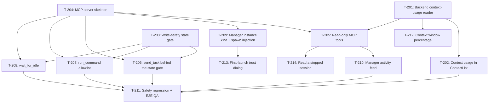

# Kanban: Manager Agent

**Generated:** 2026-09-02
**PRD Version:** 1.0
**Total Tasks:** 17 (T-215, T-216 and T-217 added 2026-09-15 to 09-17, all from real use)
**Milestones:** M1 (See who's full), M2 (Manager can look), M3 (Manager can dispatch), M4 (Handoff + safety regression)

## Task Overview



**Critical path:** T-204 → T-205 → T-210 → T-211 (MCP skeleton gates every manager
capability, and it carries the only undecided technical question — Q6, whether to take an
MCP SDK dependency or hand-roll JSON-RPC. Nothing the manager does can be demoed until
T-204 lands, so start it early even though M1 doesn't need it.)

**Three roots, all startable immediately, all in different files:**
- **T-201** — `backends/` (context usage reader)
- **T-203** — `process-manager.ts` (write-safety gate)
- **T-204** — new `manager-mcp/` directory (server skeleton)

**Only looks parallel, actually sequenced:** T-206, T-207 and T-208 all wrap the same
gate from T-203 and register into the same server from T-204. Do T-203 and T-204 first,
then these three can genuinely run in parallel — they touch separate tool modules.

**Safety ordering, non-negotiable.** T-203 must be done and tested before T-206 or T-207
merges. Measured 2026-09-02: a PTY write to a session parked on a plan-approval dialog
approved the plan, granted auto mode, and let the session edit a real file. See the PRD's
[Verification log](prd.md#verification-log). A write tool shipped without the gate is a
path for the manager to grant edit authority the user never gave.

---

## Milestone 1: See who's full

By the end of M1: the contact list shows each instance's context usage, so the user can
tell at a glance which session is close to full — today that information exists nowhere in
the UI. No manager involved, nothing writes to any terminal.

### T-201: Backend context-usage reader
- **Type:** data
- **Status:** done (2026-09-15 — `readContextUsage` on both backends, 22 tests)
- **Requirement:** `prd.md#r7--context-usage-in-the-ui`
- **Knowledge:** `../../knowledge/tech-conventions.md#multi-backend-pattern-added-2026-05-18`
- **Code:** `workspace/app/src/main/backends/`
- **Description:** Add `readContextUsage(sessionId): ContextUsage | null` to the `Backend`
  interface in `backends/types.ts`, implemented in both `claude.ts` and `opencode.ts`.
  `ContextUsage` goes in `shared/types.ts` as `{ inputTokens: number; updatedAt: number }`,
  where `inputTokens` is the **input side only** — it represents how full the window is, so
  output tokens are excluded on both backends to keep the number comparable.
  - **Claude:** read the session JSONL, take the newest record with
    `type === "assistant"` and a `message.usage`, and sum
    `input_tokens + cache_creation_input_tokens + cache_read_input_tokens`. Verified shape:
    a live session showed `cache_read_input_tokens: 452559`.
  - **OpenCode:** read the newest `message` row for the session whose `data` JSON has
    `role === "assistant"` and a `tokens` object, and sum
    `tokens.input + tokens.cache.read + tokens.cache.write`. The JSON also carries a
    pre-summed `tokens.total`, but that **includes output**, so don't use it directly.
  - **Do not** use OpenCode's `session` table `tokens_*` columns. They are lifetime totals
    (one real session showed `tokens_cache_read` of 17.1M against a 200k–1M window) and are
    meaningless as a fullness signal. That table's `cost` column is genuinely useful but is
    a separate feature; leave it out of this task.
  Return `null` when the session has no assistant message yet, rather than `0` — the UI must
  distinguish "unknown" from "empty".
- **Acceptance:**
  - Unit tests in `backends/` cover both backends using fixtures under `__fixtures__/`,
    including the no-assistant-message case returning `null`
  - No `if (backend === ...)` branch appears outside `backends/` — the caller asks the
    registry, per the multi-backend convention
  - `pnpm type`, `pnpm lint`, `pnpm test` pass
- **Blocks:** T-202, T-205 · **Blocked by:** none · **Parallel with:** T-203, T-204
- **Notes:**
  - `readTranscript` right next to it is the model to copy for structure: read-only, returns
    empty/null on any failure rather than throwing, since a locked sqlite or a
    mid-write JSONL is normal.
  - OpenCode's db must be opened read-only, the way `openDb` already does it in
    `opencode.ts` — never take a write lock on a db the CLI owns.
- **Outcome (2026-09-15):** `Backend.readContextUsage(sessionId)` with
  `readClaudeContextUsage(jsonlPath)` and `readOpencodeContextUsage(sessionId, dbPath?)`
  behind it; `ContextUsage` in `shared/types.ts`. 22 tests in
  `backends/contextUsage.test.ts`.
  **`ContextUsage` also carries `model?: string`**, beyond what this task specified —
  the window size is in neither transcript, so T-202 needs the model name to map to
  one, and it sits in the record this reader already parses. Both readers walk
  backwards to the newest assistant turn that reported non-zero usage, skipping
  the trailing user message (opencode) and errored all-zero turns (both).

---

### T-202: Context usage in ContactList
- **Type:** feature
- **Status:** done (2026-09-15 — count shipped, percentage split out to T-212; visual acceptance verified via CDP)
- **Requirement:** `prd.md#r7--context-usage-in-the-ui`
- **Code:** `workspace/app/src/renderer/components/ContactList.tsx`, `workspace/app/src/main/ipc-handlers.ts`, `workspace/app/src/main/preload.ts`, `workspace/app/src/shared/types.ts`
- **Description:** Surface T-201's number per contact. Add `contextUsage?: ContextUsage` to
  `Instance`, populate it in `ProcessManager.toInfo`, and render it in the contact row.
  Poll rather than watch — the number changes only when a turn completes, so refreshing on
  the existing instance-activity event plus a slow interval (30s) is enough; do not add a
  file watcher.
  Display is compact per the QQ aesthetic: the token count abbreviated (`452k`), and a
  percentage only when the window size is known. **The window size is not in the
  transcript** — keep a small model→window map in the main process, and show the bare count
  with no percentage for an unrecognised model rather than guessing a denominator.
- **Acceptance:**
  - A running claude instance and a running opencode instance both show a usage figure
  - An instance with no assistant turn yet shows nothing, not `0`
  - An unrecognised model shows the count without a percentage
  - The row stays single-line at the current contact-list width
  - `pnpm type`, `pnpm lint` pass
- **Blocks:** T-211 · **Blocked by:** T-201 · **Parallel with:** T-203, T-204
- **Notes:** This is the one M1 deliverable the user sees, and it is useful on its own
  regardless of whether the manager ships.
- **Outcome (2026-09-15):** `Instance.contextUsage` populated from a cache on
  `ManagedInstance`, refreshed in `listInstances()` behind a 20s TTL and immediately
  on the `waiting` activity. Rendered right-aligned on the contact row via
  `formatTokens`, with the exact figure, model and age in the tooltip.
  **The percentage was split out to T-212**: the window size is in neither
  transcript, and the two backends expose it in completely different places (see
  that task). A wrong denominator is worse than none.
  **Visual criteria verified 2026-09-15** by driving the running app over CDP
  (`--remote-debugging-port`, then `Runtime.evaluate` in the renderer — osascript's
  `click at` does not reach Electron's web content). A running OpenCode instance
  showed `12k` on a single line; stopped contacts showed nothing rather than `0`.
  Also verified the compiled reader against the four largest real transcripts on this
  machine (8–10.8MB): 413k–719k tokens with the correct model, 18–24ms each.

---

### T-212: Context window percentage
- **Type:** feature
- **Status:** done (2026-09-15 — 29 tests; verified against both real config files)
- **Requirement:** `prd.md#r7--context-usage-in-the-ui`
- **Code:** `workspace/app/src/main/`, `workspace/app/src/renderer/components/ContactList.tsx`
- **Description:** Turn T-202's absolute count into "how full is it", which is the
  question the user actually has. Needs a window size, which **neither CLI records in
  its transcript**, and the two backends keep it in different places:
  - **OpenCode: exact and reliable.** `~/.config/opencode/opencode.json` has
    `provider.<providerID>.models.<modelID>.limit.context` (observed 1000000 for the
    Bedrock 1M models). `ContextUsage.model` from T-201 is the `modelID`; the
    `providerID` is in the same transcript record if needed to disambiguate.
  - **Claude: inferred, and fragile.** The transcript records the family name only
    (`claude-opus-5`). The window shows up via the `[1m]` suffix on
    `env.ANTHROPIC_DEFAULT_<FAMILY>_MODEL` in `~/.claude/settings.json` — observed
    `au.anthropic.claude-opus-5[1m]` on this machine. That goes stale if the user
    switches model with `/model` mid-session, so the mapping must be able to say
    "don't know".
  Show a percentage only where the window is known. Where it isn't, keep T-202's
  bare count — do not fall back to a default window. Showing 45% for a session
  actually at 226% is worse than showing no percentage at all.
- **Acceptance:**
  - An OpenCode instance whose model is in `opencode.json` shows a percentage
    matching `limit.context`
  - A claude instance on a `[1m]` model shows a percentage against 1M, not 200k
  - A model absent from both sources shows the bare count, no percentage
  - The row still fits on one line with the percentage present
  - Unit tests cover both lookups plus the unknown case
- **Blocks:** none · **Blocked by:** T-201 (done) · **Parallel with:** everything in M2/M3
- **Notes:** Optional polish on M1, not a prerequisite for the manager. Do it when
  the absolute number proves not to be enough in daily use.
- **Outcome (2026-09-15):** `contextWindow?: number` added to `ContextUsage`, filled
  in by each backend's own `readContextUsage` — **not by a helper outside
  `backends/`**, which would have meant an `if (backend === …)` branch the project
  forbids. `formatContextPercent` in the renderer, `formatContext` in the manager's
  `list_sessions`. 29 tests.
  - **opencode is exact**: `provider.<providerID>.models.<modelID>.limit.context`.
    Falls back to searching other providers when the transcript's providerID doesn't
    match, since the same model id carries the same limit either way.
  - **claude is inferred and returns null readily**: family from the transcript
    (`claude-opus-5` → `OPUS`), then `env.ANTHROPIC_DEFAULT_OPUS_MODEL` in
    `~/.claude/settings.json`. `[1m]` → 1M; no suffix but the id names the family →
    200k; **anything else → null.** An override pointing at something that isn't that
    family tells us nothing about the window and must not be read as 200k.
  - **The row shows the percentage *instead of* the count, not alongside it.** Both
    together ("275k · 27%") pushed the project name down to two characters at the
    current sidebar width — verified by screenshot and then changed. The exact count
    and the window are in the tooltip. `list_sessions` keeps both, since a model
    comparing sessions wants the absolute number and has no width limit.
  - Sessions with no resolvable window keep the bare count and get no `data-fill`
    tint, so an unknown denominator can never *look* like a comfortable one.
  **Verified 2026-09-15 against the real config files on this machine**, not just
  fixtures: `au.anthropic.claude-opus-4-8` → 1000000 and
  `au.anthropic.claude-haiku-4-5-20251001-v1:0` → 200000 from the user's
  `opencode.json`; `claude-opus-5` → 1000000 from the `[1m]` suffix,
  `claude-fable-5-1` → 200000, `claude-haiku-4-5` → null (no entry). In the running
  app all 7 claude contacts showed a percentage against 1M (27%, 51%, 36%…) while the
  3 opencode contacts on `gpt-5.6-sol` — a model the config doesn't mention — kept
  their bare counts, which is acceptance criteria 1–3 in one screenshot.
  **Fixed a latent test-environment bug found on the way:** `contextUsage.test.ts`
  was reading the developer's own `~/.claude/settings.json` through the new default
  parameter, so its assertions passed or failed depending on whose machine ran them.
  Both readers are now pinned to nonexistent config paths there.

---

## Milestone 2: Manager can look

By the end of M2: the user can create a manager instance, talk to it, and ask it what the
other sessions are doing — "how far did MSK get on that thing?" — and get an answer without
the target session spending a token or losing a turn. The manager can only read. Nothing in
this milestone writes to another session's terminal.

### T-204: MCP server skeleton
- **Type:** setup
- **Status:** done (2026-09-02 — hand-rolled, no MCP SDK; 42 tests; verified end-to-end against the real CLI)
- **Requirement:** `prd.md#r4--a-manager-mcp-server-scoped-to-the-manager-alone`
- **Code:** `workspace/app/src/main/manager-mcp/`
- **Description:** Stand up the local MCP server the manager connects to, with no tools yet
  beyond a trivial health tool, plus the tool-registration seam T-205 to T-208 plug into.
  - Transport HTTP, bound to `127.0.0.1` on an ephemeral port. **Not** port 6768: that one
    is reachable over Tailscale for the phone, and these tools drive work in every one of
    the user's repos.
  - Require a per-run bearer token in an `Authorization` header, generated at startup and
    passed to the manager instance through its `--mcp-config`. `claude mcp add
    --transport http` documents header support, so the config can carry it.
  - Resolve **Q6**: either add `@modelcontextprotocol/sdk` or hand-roll JSON-RPC over
    the HTTP transport. The project currently has no MCP dependency (`ws` is present,
    nothing from `@modelcontextprotocol`). Write the decision and its reason into the PRD's
    open-questions section as part of this task.
  - Follow `remote/ws-server.ts` for lifecycle: start/stop, the busy-port handling that
    already exists there, and injecting what it needs from the rest of the app rather than
    importing `processManager` directly.
- **Acceptance:**
  - Server starts on app launch only when a manager instance exists, and stops with the app
  - A request without the bearer token is rejected
  - A request from a non-loopback address cannot connect (verify the bind, not just a check)
  - `claude` launched with the generated `--mcp-config` lists the health tool
  - Unit tests cover token rejection and the tool-registration seam
- **Blocks:** T-205, T-206, T-207, T-208, T-209 · **Blocked by:** none · **Parallel with:** T-201, T-203
- **Notes:** On the critical path and it carries the only open technical decision — start it
  first even though M1 ships without it.
- **Outcome (2026-09-02):** `manager-mcp/{server,config,index}.ts` plus 42 tests.
  **Q6 resolved: hand-rolled, no SDK dependency added** — see `prd.md#still-open` for
  the reasoning. Shipped surface: `registerTool()`, `ensureManagerMcpStarted()`,
  `getManagerMcpInfo()`, `shutdownManagerMcp()` (wired into `before-quit` in
  `main/index.ts`). Startup is lazy rather than at app launch, because the spawn
  needs the OS-assigned port to write its `--mcp-config`. Verified against the real
  CLI: connect → `tools/list` → `tools/call` → handler ran.

---

### T-205: Read-only MCP tools — `list_sessions`, `read_session`
- **Type:** feature
- **Status:** done (2026-09-15 — 33 tests, verified end-to-end against a real CLI on real data)
- **Requirement:** `prd.md#requirements` (R1)
- **Code:** `workspace/app/src/main/manager-mcp/`
- **Description:** The manager's two read tools.
  - `list_sessions()` → per instance: `alias`, `cwd`, `backend`, `status`
    (`idle` | `busy` | `blocked` | `stopped`), `contextUsage` from T-201, and
    `lastActivityAt`. This is the roster; it is also how the manager re-derives state after
    a restart, so it must be complete enough to stand alone.
  - `read_session(alias, limit = 50)` → transcript tail from `Backend.readTranscript`,
    newest last. Default `limit` is 50 because a 50-entry tail measured ~3–5k tokens across
    three real sessions, and 100 measured ~4–9.5k; the manager reads several sessions per
    question, so the default matters. Cap `limit` at 200.
  - Address instances by `alias`, not internal id — the manager talks about sessions the way
    the user does. Ambiguous or unknown alias returns a listing of valid ones rather than
    guessing.
- **Acceptance:**
  - Manager asked "what is each session working on" answers from these two tools alone
  - A stopped instance appears in `list_sessions` with `status: "stopped"` and is refused by
    `read_session` with a message naming the state
  - Reading a session leaves no trace in that session: no new turn, no token spend, no
    change to its transcript
  - Unknown alias returns valid aliases
- **Blocks:** T-210, T-211 · **Blocked by:** T-201, T-204 · **Parallel with:** T-209
- **Notes:** `readTranscript` drops tool results and keeps a one-line summary per tool,
  which is why reading is cheap. Don't "improve" it by including tool output.
- **Outcome (2026-09-15):** `manager-mcp/read-tools.ts` (`buildReadTools(host)` plus
  exported formatters), registered in `manager-mcp/index.ts`. 33 tests.
  **This task's `status` spec could not be met: `idle | busy | blocked` is T-203's
  output and does not exist yet** — T-205's Blocked-by omitted T-203. Rather than
  build half of the safety-critical state tracking here, `list_sessions` reports the
  real `running | stopped` and its output ends with a line telling the model that
  status does not distinguish mid-task from finished-and-waiting. Added
  `lastActivityAt` (from the detector, excluding `prompt-cleared`) as an interim
  staleness signal. **T-203 should upgrade the field and delete that caveat line.**
  Verified end-to-end: a real `claude` process, given the user's actual 18 contacts
  and their real transcripts, called `list_sessions` then
  `read_session {"name":"multi-code","limit":30}` unprompted, picked the highest-usage
  session out of 18, and described its current work correctly from the transcript.
  Also corrected `CLAUDE.md`, which claimed `contacts.json` lives at
  `~/.config/Multi-Code/` — it is in Electron's userData dir
  (`~/Library/Application Support/multi-code/`), and `~/.config/Multi-Code/` does not
  exist.

---

### T-209: Manager instance kind + spawn injection
- **Type:** feature
- **Status:** done (2026-09-15 — 13 tests, verified end-to-end; first-launch trust dialog split out to T-213)
- **Requirement:** `prd.md#r6--the-manager-instance`
- **Code:** `workspace/app/src/main/store.ts`, `workspace/app/src/main/process-manager.ts`, `workspace/app/src/main/backends/claude.ts`, `workspace/app/src/renderer/components/ContactList.tsx`
- **Description:** Make the manager a real contact with the extra spawn wiring.
  - Add `isManager?: boolean` to `SavedContact` and `Instance`. At most one per app; the
    "new instance" path refuses a second.
  - Default `cwd` to `~/.config/Multi-Code/manager/`, created on first use, with a seeded
    `CLAUDE.md` carrying the role guidance (coordinator, doesn't write code, dispatches and
    collects). Seed it only when absent — never overwrite, since the user edits it.
  - Spawn additions for a manager instance: `--mcp-config` from T-204, and `--add-dir` for
    each other contact's `cwd` so it can read code when a transcript isn't enough.
  - Manager gets a distinct visual treatment in the contact list and sorts first.
  - **Pre-allow the MCP tools, or the manager can't coordinate anything.** Measured
    during T-204: with the config alone, the CLI answered `Claude requested
    permissions to use mcp__multi-code__manager_health, but you haven't granted it
    yet.` and the handler never ran. Adding `--allowedTools
    mcp__multi-code__<tool>` made it work. Tool names are
    `mcp__multi-code__<tool>` (the prefix comes from `MCP_SERVER_NAME`). Enumerate
    the tools explicitly rather than passing a wildcard — the write tools are
    exactly the thing that should need a deliberate line of code to permit.
- **Acceptance:**
  - Creating a manager seeds the directory and `CLAUDE.md`; a second attempt is refused
  - An existing `CLAUDE.md` is left untouched on restart
  - `--add-dir` reflects the current contact list at spawn time
  - Manager sorts first and is visually distinguishable
  - Non-manager instances get no `--mcp-config` — verified by inspecting spawn args
- **Blocks:** T-211 · **Blocked by:** T-204 · **Parallel with:** T-205
- **Notes:** Role guidance goes in `CLAUDE.md`, deliberately not
  `--append-system-prompt`: user-editable, survives releases, loaded automatically.
- **Outcome (2026-09-15):** `manager-workspace.ts` (dir + seeded guidance),
  `SpawnOptions` on the `Backend` interface, `create-manager` / `has-manager` IPC,
  `isManager` through SavedContact → ManagedInstance → InstanceInfo → Instance, and a
  "+ Manager" button that hides once one exists. 13 tests.
  Two departures from this task, both deliberate:
  - **cwd is `userData/manager/`, not `~/.config/Multi-Code/manager/`** — the latter
    came from the storage-path assumption T-205 disproved.
  - **`--add-dir` is not passed.** It grants *tool access*, not read access, so it
    would let the coordinator edit every one of the user's repos with the file tools.
    It isn't needed either: progress comes from `read_session`, and anything needing
    real code can be dispatched to the session that owns it.

    **Correction (2026-09-15): this does NOT confine the manager, and an earlier
    version of this entry wrongly claimed it did.** Observed in real use: the manager
    ran `cd /Users/jasenpan/code/apra/apra-amcos-portals-backend && git ...` and read
    that repo's state fine. The CLI's directory boundary governs the file tools, not
    `Bash`, and this user's settings allow `Bash(*)`. So omitting `--add-dir` reduces
    the surface but does not bound it — anything reachable by a shell command is
    still reachable. **Q4 therefore remains open**, and the honest position is that
    the manager is currently as privileged as the user's own `Bash` rules allow.
  Also fixed `restartInstance`, which didn't forward `isManager` — restarting the
  manager would have produced one with no tools: alive, addressable, useless.
  Verified end-to-end: `claudeBackend.spawn` produced the right command line, the CLI
  connected with **no permission prompt** (so the allowlist works), read its seeded
  guidance, called `list_sessions` unprompted and answered correctly ("18 sessions,
  11 running, 7 stopped, most context is multi-code at 531,012 tokens").

---

### T-214: Read a stopped session's transcript
- **Type:** feature
- **Status:** done (2026-09-15 — 22 tests; all 19 real contacts went from `context=unknown` to real figures)
- **Requirement:** `prd.md#requirements` (R1)
- **Code:** `workspace/app/src/main/backends/`, `workspace/app/src/main/process-manager.ts`, `workspace/app/src/main/manager-mcp/read-tools.ts`
- **Description:** `read_session` refuses a stopped session, per T-205's acceptance.
  Real use hit this on the **first** question asked of the manager: "has
  portals-backend pulled the latest dev branch?" — a stopped session, so the manager
  couldn't read it and said so, then worked around it by shelling out to `git`. The
  transcript is a file on disk and reading it is harmless; the refusal costs a real
  capability for no safety gain.

  Two parts, and the second is the one that bites:

  1. **Drop the `status === "stopped"` guard** in `read_session`, and mark the state
     in the output instead so the manager doesn't present stale work as current.

  2. **A stopped instance usually has no `sessionId`.** It survives a stop within one
     app run, but `loadSavedContacts` rebuilds instances from `contacts.json`, which
     doesn't store it — so after a restart every stopped contact has none, which is
     also why they all report `context=unknown`. Needs a
     `Backend.findLatestSessionId(cwd): string | null`: claude scans
     `PROJECTS_DIR/<encoded-cwd>/*.jsonl` for the newest by mtime, opencode queries
     its `session` table by directory.

  **Do not write the result into `sessionId`.** `spawnProcess`'s `isSessionClaimed`
  check treats any instance holding a session id as the owner of that live session,
  so a stopped contact pre-filled from disk would veto a *running* instance in the
  same directory during discovery — and this user has exactly that shape (two
  contacts on `apra-amcos-portals-backend`). Keep it in a separate field that only
  the read paths consult, leaving `sessionId` to discovery alone.
- **Acceptance:**
  - `read_session` on a stopped instance returns its transcript, labelled stopped
  - Works after an app restart, when the instance never had a `sessionId` in memory
  - Context usage appears for stopped contacts too, so the contact list is useful
    the moment the app opens rather than only after starting something
  - Discovery for a running instance is unaffected when another contact in the same
    directory has a disk-resolved id — regression test for the claim interaction
  - Both backends covered by unit tests
- **Blocks:** none · **Blocked by:** T-201 (done), T-205 (done) · **Parallel with:** everything
- **Notes:** Fixes the "nothing shows until you start something" gap left by T-202 at
  the same time, since both want the same disk-resolved session id.
- **Outcome (2026-09-15):** `Backend.findLatestSessionId(cwd)` on both backends,
  `ManagedInstance.resolvedSessionId` behind a private `readableSessionId()` in
  process-manager, and the `stopped` guard gone from `read_session`. 22 tests across
  two new files.
  - **claude: scan `PROJECTS_DIR/<encoded-cwd>/*.jsonl` by mtime.** Not the
    `~/.claude/sessions/` registry that `findJsonlByCwd` uses for live discovery —
    that only lists *running* processes, so it answers nothing for the exact case
    this task exists for. mtime rather than filename or creation order, because a
    transcript is touched on every turn, so newest-written is most-recently-worked-in.
  - **opencode: reuse `findLatestSessionForCwd` without a claim filter.** Its
    `session` table is a durable record rather than a list of live processes, so the
    query discovery already ran answers this too.
  - **The separate field is load-bearing, and there is now a regression test for
    why.** `spawnProcess`'s `isSessionClaimed` only looks at `sessionId`, so a
    disk-resolved id kept anywhere else cannot veto discovery. Verified on the real
    app, not just in a test: with stopped `dist` resolved from disk, a second
    contact created in the same directory on the same backend discovered that very
    session and got it — `dist` kept `sessionId=NONE` while `dist-twin` came up with
    `sessionId=fe089bf9…`.
  - **`refreshStaleContextUsage` no longer skips instances without a live session.**
    That one line is what makes the contact list useful the moment the app opens.
  - `read_session` on a stopped instance appends an explicit
    `NOTE: <name> is STOPPED — this is history, not work in progress` with the age of
    its last activity. Everything above that line reads exactly like live work, and
    without it the manager reports 27-day-old work as the current state.
  **Verified end-to-end 2026-09-15.** Before: every stopped contact reported
  `context=unknown | last-activity=never`. After, on the user's real 19 contacts:
  real figures and ages for all of them (`237k / 2d ago`, `364k / 27d ago`,
  `289k / 14d ago`), across **both** backends, with the model name resolved. Read a
  stopped claude session and a stopped opencode session, both returning their real
  transcript with the STOPPED note. The contact list shows a token count per row on
  one line, which it previously showed only for running instances.

---

### T-213: First-launch trust dialog for the manager
- **Type:** feature
- **Status:** done (2026-09-15 — 7 tests on the text; verified against the real dialog in an isolated instance)
- **Requirement:** `prd.md#r6--the-manager-instance`
- **Code:** `workspace/app/src/renderer/`
- **Description:** A freshly created manager stops on the CLI's workspace-trust
  dialog, and **its default is the wrong answer**. Reproduced 2026-09-15:

  ```
  Quick safety check: Is this a project you created or one you trust?
  ❯ No, exit
    Yes, I trust this folder
  ```

  The highlight sits on **No, exit**, so a user who presses Enter — the obvious thing
  to do at a prompt — kills the manager they just created and watches it go stopped
  with no explanation. Everything after the dialog works.

  Show a one-time hint when the manager is created: it will ask whether the folder is
  trusted, the answer is yes, and Enter alone will exit. `ensureManagerWorkspace`
  already returns `seeded`, which is true exactly on the run that will show the
  dialog, so the hint can be shown precisely once.
- **Acceptance:**
  - Creating a manager shows the hint; restarting an existing one does not
  - The hint names the option to pick and warns that the default exits
  - No new failure mode when the dialog doesn't appear (already-trusted directory)
- **Blocks:** none · **Blocked by:** T-209 (done) · **Parallel with:** everything
- **Notes:** Two alternatives were rejected and shouldn't be re-litigated without new
  information. **Writing `hasTrustDialogAccepted` into `~/.claude.json`**: that is
  where the CLI keeps it (verified at `projects["<cwd>"].hasTrustDialogAccepted`), but
  the file is the CLI's live state — `lastSessionId`, `lastCost` and others are
  rewritten constantly — so we would contend with the CLI for it, and corrupting it
  breaks `claude` everywhere. **Auto-answering the dialog over the PTY**: exactly the
  class of action T-203 exists to prevent; see the PRD verification log for what a
  write landing on a dialog we guessed wrong about actually did.
- **Outcome (2026-09-15):** `renderer/components/ManagerTrustHint.tsx`, a modal shown
  once when the manager is created, gated on `create-manager` now returning
  `{ instance, seededWorkspace }` — `seeded` is true only on the run that creates the
  guidance file, which is exactly the run whose CLI will stop on the dialog.
  **The text lives in its own module (`managerTrustText.ts`) with 7 tests**, because
  the text *is* the feature: a version that stops naming the option to pick, or stops
  saying that Enter alone is wrong, is decoration and the failure comes back silently.
  It renders the dialog as the terminal paints it — question, both options, `❯` on the
  wrong one in red — so the user matches a picture rather than a description.
  Reuses the existing `.dialog*` classes rather than adding a second modal style.
  **Verified 2026-09-15 in an isolated instance** (`--user-data-dir=/tmp/…`, so none
  of the user's real contacts or manager notes were touched — an earlier attempt did
  move their real guidance file aside and had to restore it, which is not worth
  repeating). The screenshot caught the hint over the *actual* CLI dialog underneath,
  confirming the reproduction word for word: same question text, `❯ No, exit` first
  and highlighted, `Yes, I trust this folder` second, and the CLI's own
  `Enter to confirm` line — which is the proof that pressing Enter picks the answer
  that kills the manager. Creating a second manager with the guidance file already
  present showed no hint, as specified.

---

### T-210: Manager activity feed
- **Type:** feature
- **Status:** done (2026-09-15 — 20 tests, verified in the running app against the live MCP server)
- **Requirement:** `prd.md#r5--safety-boundary`
- **Code:** `workspace/app/src/renderer/components/`, `workspace/app/src/main/manager-mcp/`
- **Description:** Every manager tool call, visible. A Toolbox section listing, newest
  first: timestamp, tool, target alias, and a one-line payload preview expandable to full
  text. Refusals appear too, with the reason — a blocked write the user can't see is the
  failure mode this section exists to prevent.
  The user authorised the manager to act without per-action approval **on the condition that
  nothing is invisible**, so this is a requirement, not polish.
- **Acceptance:**
  - Every tool call from T-205 appears within a second of firing
  - A refused call shows the refusal and the reason
  - The feed survives a renderer reload (kept in main, not renderer state)
  - Full payload is reachable for an entry whose preview is truncated
- **Blocks:** T-211 · **Blocked by:** T-205 · **Parallel with:** none
- **Notes:** Land this before M3's write tools, so the first dispatch the manager ever makes
  is already observable.
- **Outcome (2026-09-15):** `manager-mcp/activity-log.ts` (a capped in-memory log
  with one listener), recorded from **`ManagerMcpServer.callTool`** rather than from
  each tool. That is the single point every call passes through, so a tool added by a
  later task cannot dispatch work invisibly — which is the property the requirement
  actually needs, and per-tool logging would not give it. Rendered by
  `renderer/components/ManagerSection.tsx` as a new "Manager" toolbox section. 20 tests.
  **Entries are two-phase — recorded as `running` on entry, rewritten on return.**
  T-208's `wait_for_idle` can run for minutes, and a feed that only recorded
  completions would be blank during exactly the stretch the user is watching.
  A call for an unregistered tool is logged too: the manager reaching for a tool it
  doesn't have looks identical to a broken feature from the outside.
  Cost of the design: 200 entries, payload and result truncated at 4k chars each, and
  nothing persisted to disk. The feed is for watching, not auditing, and a restart
  drops it.
  **Verified in the running app 2026-09-15** over CDP, against the live MCP server
  (port and token from `userData/manager-mcp.json`): `list_sessions` recorded green
  with a one-line summary; `read_session` on a stopped session and `send_task` aimed
  at the manager itself both recorded red **with their refusal reason on the collapsed
  row**, no click needed. Expanding showed the exact arguments plus the full reason.
  `location.reload()` in the renderer left all three entries intact, confirming the
  log lives in main.

---

## Milestone 3: Manager can dispatch

By the end of M3: the user says one sentence — "get portal-backend reviewed and give the
findings to whoever's working on it" — and the manager runs the whole chain: dispatch,
wait, read the result, forward it. Writes are gated on target state.

### T-203: Write-safety state gate
- **Type:** feature
- **Status:** done (2026-09-15 — `run-state.ts`, 18 tests)
- **Requirement:** `prd.md#r5--safety-boundary`
- **Code:** `workspace/app/src/main/process-manager.ts`, `workspace/app/src/main/backends/`
- **Description:** A single authoritative answer to "is it safe to write to this instance
  right now", which every write tool must consult. Nothing else in the codebase tracks this
  today: the detector emits `prompt` / `prompt-cleared` / `waiting` as events, and
  `ManagedInstance` keeps none of it.
  - Track a per-instance state derived from those events: `idle`, `busy`, `blocked`.
    `prompt` → `blocked`; `prompt-cleared` → back to `busy`/`idle`; `waiting` → `idle`.
    **T-205 is waiting on this.** It ships `status: running | stopped` plus a caveat
    line in `list_sessions`' output saying status can't tell mid-task from
    finished-and-waiting. When this lands, upgrade that field and delete the caveat.
  - Expose `canAcceptWrite(id): { ok: true } | { ok: false; reason: string }`. Refuse when
    `blocked` or `stopped`, with a reason naming the state so a tool can pass it up.
  - **Address Q7.** Claude's blocked detection is threshold-based
    (`PROMPT_PENDING_MS = 1500`, `PTY_IDLE_MS = 800` in `claude.ts:107`), so there is a
    window where a session is already on a dialog but not yet reported as one. Add a second
    guard for that window and document what it does and does not cover. A candidate: refuse
    when an unpaired tool_use exists at all, without waiting for the threshold. Whatever is
    chosen, the residual window must be written down, not left implied.
  - Consider surfacing an authoritative alternative for claude: `~/.claude/sessions/<pid>.json`
    carries a CLI-maintained `status: idle | busy`, matchable by the pty child pid. Worth
    evaluating here, but the `blocked` distinction still has to come from the detector — the
    registry does not model it.
- **Acceptance:**
  - Unit tests drive the detector's event sequences and assert each resulting state
  - A test reproduces the measured hazard: with the instance in `blocked`,
    `canAcceptWrite` returns `ok: false` and no bytes reach the pty
  - The residual detection window from Q7 is documented in the PRD with what closes it and
    what doesn't
  - `pnpm type`, `pnpm lint`, `pnpm test` pass
- **Blocks:** T-206, T-207, T-208 · **Blocked by:** none · **Parallel with:** T-201, T-204
- **Outcome (2026-09-15):** `main/run-state.ts` — a `RunStateTracker` per instance,
  fed by the detector's activity events and by our own writes, plus
  `processManager.canAcceptWrite(id)`. Extracted rather than written inline so it
  could be tested at all: process-manager imports electron and node-pty, neither of
  which loads under plain-node vitest. 18 tests.
  States are `starting | idle | busy | blocked`, and `list_sessions` now reports them
  (T-205's caveat line about status being coarse is gone).
  **Q7 answered with a second guard.** Beyond the detector's `prompt` event, a write
  is refused whenever a non-idle instance has produced **no PTY output for 1000ms**.
  Both CLIs animate a spinner while working — claude's own detector relies on it
  repainting at least once a second, and OpenCode's keeps painting through a
  permission dialog — so a working session is never quiet that long. This covers the
  window where a dialog is up but the detector hasn't recognised it yet, since claude
  needs 1500ms of unpaired tool_use plus 800ms of silence to decide.
  **Corrected same day: that guard was wrong and refused ordinary targets.** Silence
  cannot distinguish idle from blocked — both are a static screen waiting for a human.
  Measured in real use: an idle OpenCode session was refused with "has produced no
  terminal output for 81s" purely for waiting for input. A session resumed with
  `--continue` never reports `waiting` for its old history, so it sits in
  `starting`/`busy` indefinitely and *every* dispatch to it was rejected.
  Silence is now only consulted inside an 8s window after **we** wrote something,
  where the absence of any reaction is itself the signal — it catches a second
  dispatch when the first landed on a dialog. Outside that window quiet is just quiet.
  **Residual window is therefore the detector's own latency** (~2.3s for claude:
  1500ms unpaired tool_use + 800ms silence). Not closable from the PTY side; Q8's
  HTTP route would close it for OpenCode.
  `sendPrompt` and `writeToInstance` deliberately do **not** consult the gate — they
  carry the user's own keystrokes from the desktop or their phone, and answering a
  dialog is exactly what a user is allowed to do. The gate is for writes nobody is
  watching.
- **Notes:** This is the highest-risk task in the epic and the reason M3 can't start
  earlier. Do not let a write tool merge before it. The hazard is not hypothetical — see the
  PRD verification log for the reproduction and the file it modified.
  **Settle `prd.md#still-open` Q8 before starting.** OpenCode exposes pending
  permission and question requests over HTTP, which would make the gate exact for
  those instances instead of inferred, and would remove the PTY hazard for them
  entirely. That changes what this task has to cover, so it is a prerequisite
  decision, not a follow-up.

---

### T-206: `send_task` behind the state gate
- **Type:** feature
- **Status:** done (2026-09-15 — 13 tests; activity-feed acceptance met by T-210)
- **Requirement:** `prd.md#requirements` (R2), `prd.md#r5--safety-boundary`
- **Code:** `workspace/app/src/main/manager-mcp/`, `workspace/app/src/main/process-manager.ts`
- **Description:** `send_task(alias, text)` — hand a session work. Consults
  `canAcceptWrite` from T-203 first and refuses without writing when the target is blocked
  or stopped, returning the reason so the manager can tell the user instead of retrying.
  On a permitted write it reuses `sendPrompt`'s bracketed-paste + single `\r`; a plain task
  needs one carriage return, unlike a slash command.
  Writing to a **busy** target is allowed and correct: measured 2026-09-02, the CLI queues
  it — the screen shows `queued`, the current tool is not interrupted, and the task runs when
  the turn ends. Don't add a queue of our own on top.
  Refuse self-dispatch: the manager cannot target its own instance.
- **Acceptance:**
  - Blocked target → refused, reason returned, zero bytes written to that pty
  - Busy target → accepted, and the task runs after the current turn completes
  - Idle target → runs promptly
  - Self-dispatch refused
  - Every call, accepted or refused, appears in T-210's feed
- **Blocks:** T-211 · **Blocked by:** T-203, T-204 · **Parallel with:** T-207, T-208
- **Notes:** Resist adding retry-on-blocked. The right response to a blocked target is to
  tell the user, because whatever it's blocked on is a decision only they can make.
- **Outcome (2026-09-15):** `manager-mcp/write-tools.ts` plus
  `processManager.trySendTask`, which is `canAcceptWrite` followed by `sendPrompt` and
  nothing else. 13 tests, and the load-bearing ones are negative: a refused call must
  leave **zero** bytes written, since a tool that returns an error after writing would
  look safe and not be.
  Refuses self-dispatch, empty text, and an unknown name (listing the valid ones).
  The tool description carries the cost argument explicitly — "do NOT use it to ask
  how something is going, read_session answers that for free" — because without it
  the manager spends a target's whole turn on a status question.
  **Verified end-to-end against a live OpenCode session, 2026-09-15.** Started the
  instance over CDP, called the live MCP server directly (its port and bearer token are
  in `userData/manager-mcp.json`), dispatched
  "git branch --show-current, and how many commits behind origin/dev", waited, then
  read it back: the session had run both git commands and answered `uat 157` — matching
  what the manager had separately determined by shelling out. Same run confirmed the
  UTF-8 fix (Chinese in the transcript rendered correctly) and OpenCode context usage
  from a real database rather than the mocked one.
  **The activity-feed acceptance criterion was not met when this shipped** — T-210 did
  not exist yet, so dispatches were invisible in the UI. **Met as of T-210 (same day):**
  every `send_task`, accepted or refused, now appears in the Manager toolbox section
  with its target, its text and, on a refusal, the reason.

---

### T-208: `wait_for_idle`
- **Type:** feature
- **Status:** done (2026-09-15 — 15 tests; measured 4s end-to-end where polling took 1–2 minutes)
- **Requirement:** `prd.md#requirements` (R2)
- **Code:** `workspace/app/src/main/manager-mcp/`
- **Description:** `wait_for_idle(alias, timeoutMs = 600000)` resolves when the target's
  turn ends, so the manager can dispatch and then collect instead of polling. Resolves on
  the detector's `waiting`; resolves early with a distinct result when the target becomes
  `blocked` (it needs the user, not more waiting) or exits; rejects on timeout with how long
  it waited.
  Reliability differs by backend and the tool should not pretend otherwise: OpenCode reads
  the sqlite `message` row's `finish` field and treats only `finish === "stop"` as done
  (`opencode.ts:418-421`) — structured and trustworthy. Claude infers completion from JSONL
  pairing plus PTY silence thresholds, which is the weaker signal. Return which backend
  answered so the manager can weigh it.
- **Acceptance:**
  - Resolves on turn end for both a claude and an opencode instance
  - A target that becomes blocked mid-wait resolves early, flagged as blocked
  - Timeout rejects with elapsed time, and does not leave a listener attached
  - No busy-polling of the transcript
- **Blocks:** T-211 · **Blocked by:** T-203, T-204 · **Parallel with:** T-206, T-207
- **Notes:** The `blocked` early-resolve matters more than the happy path: without it the
  manager waits ten minutes on a session that has been sitting on a dialog the whole time.
- **Outcome (2026-09-15):** `manager-mcp/wait-tools.ts`, on a new
  `processManager.onActivity(listener)` subscription — the detector's events already
  existed but had no subscriber seam, only hardcoded consumers. 15 tests.
  **Prompted by the user's own complaint that the manager was slow.** Without this
  it checked on a dispatched session by reading the transcript, deciding nothing had
  changed, and reading again — and each of those cycles costs the manager a full
  model turn. Measured 2026-09-15: dispatching one slash command and confirming it
  ran took one to two minutes, nearly all of it the manager thinking between polls,
  while the target had finished in seconds.
  Departures from this task's spec:
  - **Default timeout is 300s, not 600s, capped at 900s.** Ten minutes of silence
    is indistinguishable from a hang from the user's side.
  - **A timeout resolves, it does not reject.** Handed an error, the model reports
    the task as failed; nothing failed, the session is still working. The text says
    so explicitly.
  - **It does not report which backend answered.** The distinction the task wanted
    to surface (opencode's structured `finish` field vs claude's inferred pairing)
    is real but is not something the manager can act on, and every extra sentence in
    a tool result is context it pays for on every call.
  - Already-`idle` returns immediately **and says the task probably never arrived**,
    because a bare "idle" reads as "your work is done" to a model that dispatched
    nothing.
  **Verified end-to-end 2026-09-15** against a live claude session: `send_task` then
  `wait_for_idle` returned `dist finished after 3s`, 4s of wall clock in total, and
  `read_session` showed the answer. The activity feed recorded the wait as `running`
  for 3.5s, which is the two-phase logging from T-210 doing its job.

---

### T-215: `start_session`, and the guidance that tells the manager to use it
- **Type:** feature
- **Status:** done (2026-09-15 — 20 tests; verified end-to-end)
- **Requirement:** `prd.md#r6--the-manager-instance`
- **Code:** `workspace/app/src/main/manager-mcp/write-tools.ts`, `workspace/app/src/main/manager-workspace.ts`, `workspace/app/src/main/process-manager.ts`, `workspace/app/src/renderer/App.tsx`
- **Description:** Added in response to the user's first complaint after living with
  the manager for a day: *"this manager acts like an idiot. It keeps telling me to go
  and run something in some project myself. I am the CEO, he is my employee."*
  Two causes, both real, neither of them the model being weak:
  1. **It could not start a stopped session.** Every write tool refuses a stopped
     target, and 7 of the user's 19 contacts are stopped at any time, so the only
     move available was to ask the user to press play. `start_session(name)` closes
     that: it calls `startInstance`, is not gated (starting a process writes nothing
     into anybody's terminal), and is a no-op on one already running.
  2. **The seeded guidance never mentioned the write tools.** `CLAUDE.md` was written
     at T-209, when only `list_sessions` and `read_session` existed, and
     `ensureManagerWorkspace` wrote it once and never again — so when `send_task`
     shipped, every existing manager kept reading a file describing a read-only
     coordinator. Confirmed on this machine: the file was byte-identical to what
     T-209 seeded, tools section listing two read tools, weeks after the write tools
     landed.
- **What changed**
  - `start_session` tool, plus `wait_for_idle` and `run_command` named in the
    guidance alongside it.
  - **Guidance rewritten around responsibility.** A "Never hand the work back"
    section naming the only three reasons to go back to the user (a decision that is
    theirs, a session blocked on a dialog, something genuinely impossible), an
    explicit "don't poll `read_session` in a loop", and run states corrected to
    `idle | busy | blocked | starting | stopped` — the old text claimed status was
    only running or stopped, which stopped being true at T-203.
  - **The guidance file can now be upgraded without clobbering user edits.**
    `manager-workspace.ts` keeps the sha256 of every version it has ever seeded. A
    file matching one of them is ours and gets rewritten; anything else is the user's
    and is never touched. `ensureManagerWorkspace` moved onto `prepareManagerSpawn`,
    so it runs on create *and* start *and* restart — seeding only at create is why
    the file went stale in the first place. The v1 bytes are checked in at
    `main/__fixtures__/manager-guidance-v1.md` so the upgrade path is tested against
    a real previous version. **Adding a new version means adding the outgoing hash to
    `SEEDED_HASHES`**, or existing users stop being upgraded and the bug returns.
  - **Fixed: a session the manager started still showed OFFLINE.** `startInstance`
    only ever returned its result to the IPC caller, so a start that came from a tool
    left the renderer believing the session was stopped — observed with a live
    `claude --continue` sitting behind an OFFLINE panel. It now also pushes
    `instance-started`, which `App.tsx` merges.
- **Acceptance:**
  - Manager can start a stopped session without involving the user ✅
  - An untouched v1 guidance file is upgraded on the next manager start ✅
  - An edited guidance file is never modified ✅
  - A tool-started session shows as running in the desktop UI ✅
- **Blocks:** T-211 · **Blocked by:** T-204, T-209 · **Parallel with:** none
- **Notes:** The lesson worth keeping is that both halves of the user's complaint were
  capability gaps wearing a personality costume. The manager sounded meek because the
  only honest thing it could say was "I can't"; nothing about its prompt needed
  softening, it needed hands. Any future "the manager is being unhelpful" report
  should start by asking which tool it was missing.

---

## Milestone 4: Handoff + safety regression

By the end of M4: the manager can hand off a session that's filling up, and the measured
escalation is covered by a test that fails if the gate ever regresses.

### T-207: `run_command` with allowlist and double carriage return
- **Type:** feature
- **Status:** done (2026-09-15 — 12 tests; `/context` verified executing in a real session)
- **Requirement:** `prd.md#requirements` (R3), `prd.md#r5--safety-boundary`
- **Code:** `workspace/app/src/main/manager-mcp/`, `workspace/app/src/main/process-manager.ts`
- **Description:** `run_command(alias, command)` — drive one allowlisted slash command,
  which is the only way to trigger `/handoff`, since a command delivered as message text is
  never executed by the CLI.
  - Allowlist for v1: `/handoff`, `/compact`, `/context`. Anything else refused.
    **`/clear` is excluded on purpose**: it discards context irreversibly and writes nothing
    down first, where `/handoff` lands the work before handing over.
  - **Send two carriage returns.** A leading `/` opens the autocomplete menu, which
    swallows the first `\r`; only the second submits. Verified 2026-09-02 with `/context`,
    which rendered its usage grid only after the second.
  - Same `canAcceptWrite` gate as T-206, checked before any byte goes out. The allowlist is
    the second line of defence, not the first: the payload that caused the measured
    escalation was plain prose, not a command, so an allowlist alone would not have stopped
    it.
- **Acceptance:**
  - `/context` on an idle instance renders its grid — i.e. the double `\r` works
  - `/clear` and an arbitrary string are both refused, naming the allowlist
  - Blocked target → refused before any write
  - `/handoff` on a real session starts the handoff
  - Every call appears in T-210's feed
- **Blocks:** T-211 · **Blocked by:** T-203, T-204 · **Parallel with:** T-206, T-208
- **Notes:** Keep the allowlist a plain constant in one place, not a config surface. Adding
  a command should be a code change someone reviews.
- **Outcome (2026-09-15):** `run_command` in `manager-mcp/write-tools.ts` on top of
  `processManager.tryRunCommand`. 12 tests.
  **`/clear` and `/new` are on the allowlist, reversing this task's decision to
  exclude `/clear`.** The user asked for both by name after hitting the gap in real
  use: these are their sessions, clearing one is ordinary fleet management, and a
  manager that has to ask them to go and do it by hand is the abdication they were
  complaining about. `/handoff` is still steered toward in the tool description
  whenever there is work worth landing first. Allowlist is now `/clear`, `/new`,
  `/compact`, `/context`, `/handoff`, matched **exactly** — an allowed command
  carrying arguments is refused, so nothing rides along behind one.
  **The double carriage return needs a delay, which this task did not say.** Two
  returns written back-to-back both land before the autocomplete menu has drawn and
  both get swallowed. `MENU_SETTLE_MS = 120` sits between the command and the first
  return, and between the two returns.
  **This was the user's second complaint, and the manager had been telling the
  truth.** It reported a `/clear` as "sent but not executed", which is exactly what
  happens when a slash command goes out through `send_task`: one `\r`, eaten by the
  menu, command displayed and never run. What made it look like a lie was the
  retry — the second attempt's return submitted the *first* attempt's command, so
  the session did eventually run it.
  Verified 2026-09-15 in a real claude session: `/context` rendered its usage grid,
  twice across two runs, with nothing typed by hand.

---

### T-217: Follow a session that moves under a running instance
- **Type:** bug
- **Status:** done (2026-09-17 — 17 tests; verified end-to-end in the running app)
- **Requirement:** `prd.md#r7--context-usage-in-the-ui`, `prd.md#r5--safety-boundary`
- **Code:** `workspace/app/src/main/process-manager.ts`, `workspace/app/src/main/backends/`
- **Description:** Reported as a small thing: *"the percentage on the far left doesn't
  refresh when I `/new`, and it doesn't go up with the new session either, it just
  sits there."* The cause is not cosmetic.

  An instance's `sessionId` was set once, by discovery at spawn, and never revisited.
  `/new` and `/clear` move the CLI to a fresh transcript under a new id and stop
  writing to the old one — measured 2026-09-17: the previous jsonl did not gain a
  single byte afterwards, while the CLI's own readout went from `19.9k` to `0`.

  **Everything that reads a session goes through that id**, so the frozen percentage
  was the only visible symptom of three failures:
  1. context usage, stuck on the previous session's figure;
  2. `readTranscript`, so the manager's `read_session` returned abandoned history;
  3. **the completion detector** — and therefore notifications, the prompt detection
     a paired phone renders, and the write-safety gate's view of run state.

  The third is the one worth the fix. A session that had been `/new`-ed was, from the
  app's point of view, permanently mid-turn and permanently silent.
- **What changed**
  - `Backend.findLiveSessionId(cwd, pid)`. **claude reads the CLI's own registry**,
    `~/.claude/sessions/<pid>.json`, which carries a `sessionId` the CLI rewrites on
    the change — verified moving from `89f7d163…` to `75e23772…` for one unchanged
    pid. **opencode has no per-pid registry**, so it answers with the newest session
    for the directory and the caller's claim check does the rest.
  - `ProcessManager.attachSession(instance, sessionId)`, extracted from discovery's
    callback so both paths bind a session the same way, and a 4s poll over running
    instances that adopts a moved session.
  - Switching stops the old detector, starts one on the new transcript, and clears the
    cached context figure so the previous session's number is dropped rather than
    shown for up to the TTL.
- **Acceptance:**
  - `/new` on a running instance moves its session id within one poll ✅
  - The old session's context figure is not shown afterwards ✅
  - The new session's figure appears and grows ✅
  - No rebuild while the session is unchanged, so the detector keeps its watermark ✅
  - A session another instance already holds is never adopted ✅
- **Blocks:** none · **Blocked by:** none · **Parallel with:** everything
- **Outcome (2026-09-17):** 17 tests across `backends/liveSession.test.ts` (9) and
  `process-manager.live-session.test.ts` (8), 582 total.
  - **Registry over mtime.** Picking the newest transcript by mtime is a guess that
    can land on another instance's file; the registry states it. The pid lookup also
    checks the cwd, because pids are recycled and a stale entry from a dead process
    would point every read at an unrelated session. With two processes in one
    directory and no pid match, it returns null rather than choosing — this user has
    two contacts on one repo.
  - **Attaching relies on the detector starting at the transcript's current end**
    (`claude.ts:279` takes `stat.size`). Without that, attaching to a session with
    existing content would replay its whole history as fresh activity, one
    notification per past turn. Noted at the call site, since the coupling is not
    local.
  - **Not rebuilding on an unchanged session is a correctness property, not an
    optimisation**: a detector rebuilt every 4s would reset its watermark and
    re-report turns. There is a test for it.
  **Verified end-to-end 2026-09-17** in the running app over CDP: an instance on
  `75e23772…` showing 20,040 tokens was sent `/new`; within one poll it reported
  `ad55ae2b…` with no usage figure at all (rather than the stale 20,040), and after
  one turn on the new session it read 20,119 — which is `2 + 77 + 20,040` from the
  *new* transcript, confirming the figure now follows the live session.
  Incidental finding: `/new` is an alias for `/clear`, which is what the transcript
  records.

---

### T-216: The manager's own hands, and making them visible
- **Type:** feature
- **Status:** done (2026-09-16 — 37 new tests; verified against the real CLI and the running app)
- **Requirement:** `prd.md#r5--safety-boundary`, `prd.md#r6--the-manager-instance`
- **Code:** `workspace/app/src/main/manager-mcp/`, `workspace/app/src/main/manager-workspace.ts`, `workspace/app/src/main/backends/`, `workspace/app/src/renderer/components/ManagerSection.tsx`
- **Description:** Added in response to the user's correction of a proposal to fence
  the manager in with a permission deny list: *"a dev manager on a team, when
  there's an urgent task or when they don't believe what a team member says and need
  to verify it themselves, also gets their hands dirty."*

  That reframed Q4. The manager already had the user's full `Bash(*)` privileges,
  and two things were actually wrong:

  1. **The guidance never mentioned them.** It listed the six MCP tools and nothing
     else, so whether the manager checked something itself or told the user to go
     and check was left to chance. The same shape of bug as T-215: a capability the
     text doesn't name is a capability the model doesn't reliably use.
  2. **Those calls were invisible.** T-210 records everything passing through our
     MCP server, which is every dispatch — but the manager's own `Bash`, `Edit` and
     `Write` go from its CLI straight to the machine and touch nothing of ours. The
     most privileged thing it did was the one thing the feed never showed, against a
     requirement whose whole basis is that nothing is invisible.
- **What changed**
  - **Guidance: a "Use your own hands" section.** Verify a session's claims yourself
    (`git log`, `pnpm test` — costs nobody a turn and beats being told); fix small
    things yourself; act when it's urgent; **still** dispatch work that needs a
    session's accumulated context; and one hard rule — never edit files in a project
    whose session is `busy`, which is about two writers in one working tree, not
    permission.
  - **Self-reporting via the CLI's hooks.** The manager spawns with `--settings`
    pointing at a generated file whose `PreToolUse`/`PostToolUse` hooks POST the
    delivery to a new `/hook` path on the manager MCP server. Entries render with an
    `own` badge, distinct from a dispatch.
  - **No permission rules in that settings file**, asserted by a test so the absence
    stays deliberate. The bound is the feed, not a sandbox.
- **Acceptance:**
  - The manager's own `Bash`/`Edit`/`Write` appear in the Manager panel ✅
  - A dispatch and a hands-on call are distinguishable at a glance ✅
  - Hook failure cannot block the manager's tools ✅
  - The bearer token stays out of every process command line ✅
  - The guidance tells it when to act and when to dispatch ✅
- **Blocks:** none · **Blocked by:** T-210 (done), T-215 (done) · **Parallel with:** none
- **Outcome (2026-09-16):** `manager-mcp/hook-activity.ts` (delivery → feed entry),
  `writeManagerSettings` in `manager-mcp/config.ts`, a `/hook` route on the existing
  server, `ManagerActivityEntry.origin: "mcp" | "self"`, and `SpawnOptions.settingsPath`.
  37 new tests, 565 total.
  - **One server, one token, one path to secure.** The hook posts to the same
    loopback listener as the tools, on `/hook`, behind the same bearer check —
    a second listener would be a second thing to get right.
  - **The token cannot go in the hook command.** A hook runs as a child process, so
    its argv is readable by every process on the machine via `ps`, and an
    environment variable is no better because the shell expands it into that argv.
    It lives in a `curl -K` config at 0600 instead, so the command line is
    `curl -K '<path>' || true`. **Verified on the running app: the token appears in
    0 process command lines.**
  - **`|| true` is not decoration.** A `PreToolUse` hook exiting 2 blocks the call it
    is reporting on. Measured that curl's exit 7 does not block, so this is belt and
    braces — but a reporting path that can disarm the manager is worse than no
    reporting.
  - **Reads are deliberately not reported.** The matcher is
    `^(Bash|Edit|Write|MultiEdit|NotebookEdit|KillShell)$`. The feed holds 200
    entries for a human to scan, and a single turn's `Read`/`Grep` calls would push
    the dispatches off the end. Reads also change nothing.
  - **Two phases pair on `tool_use_id`**, which the CLI puts in both deliveries. A
    `PostToolUse` with no matching `PreToolUse` — possible when the app starts
    listening mid-call — is recorded as a complete entry rather than dropped.
  - **A non-zero exit is not an error in the feed.** `git diff --quiet` exits 1 as
    its answer; only `interrupted` is red, or the colour stops meaning anything.
  - **Fixed while testing: `path.relative` made every path unreadable.** The
    manager's cwd is its own workspace under userData, so a file it edits in a repo
    rendered as `../../../../code/portals/README.md`. Absolute unless the file is
    genuinely under the cwd.
  **Verified end-to-end 2026-09-16, in two halves.** Against the real CLI (2.1.273):
  settings generated by the shipped code, given to a real `claude -p`, produced 4
  deliveries at `/hook` — `Bash` and `Write`, pre and post, correct token, pre/post
  sharing a `tool_use_id`. Against the running app over CDP: creating a manager wrote
  all three spawn files (both token-bearing ones 0600), the spawned CLI's command
  line carried `--settings`, a paired delivery to the live server produced **one**
  feed entry with `origin: "self"`, and the Manager panel rendered it as
  `own Bash · 21:22:58 · 11.3s` with the full command on one line. The entry survived
  a `location.reload()`, confirming the feed still lives in main.

---

### T-211: Safety regression + end-to-end QA
- **Type:** qa
- **Status:** done (2026-09-15 — 13-test pty-boundary regression; 4 of 5 manual scenarios passed, 2 real bugs found and fixed)
- **Requirement:** `prd.md#r5--safety-boundary`, `prd.md#verification-log`
- **Code:** `workspace/app/src/main/`
- **Description:** Two parts.
  **1 — Automated safety regression.** Turn the measured escalation into a test that fails
  if the gate regresses: an instance in `blocked` must cause every write tool to refuse with
  zero bytes reaching the pty. Assert at the pty boundary (bytes written), not at the tool's
  return value, so a future refactor that bypasses the gate is caught.
  **2 — Manual end-to-end pass**, since the payoff is a chain no unit test covers:
  - Ask the manager what every session is doing; confirm the targets show no new turn
  - Full review chain: dispatch a review, wait, read the result, forward it to another
    session, all from one instruction
  - Ask the manager which session is closest to full, then have it hand that one off
  - Park a session on a plan-approval dialog by hand, then ask the manager to send it
    something; confirm it refuses, reports why, and the plan is **not** approved
  - Restart the app and confirm the manager re-derives state from `list_sessions` +
    transcripts with no persisted task file
- **Acceptance:**
  - Safety regression test passes, and fails when the gate is deliberately stubbed out
  - All five manual scenarios pass, recorded in this file with the date
  - `pnpm build`, `pnpm type`, `pnpm lint`, `pnpm test` all pass
- **Blocks:** none · **Blocked by:** T-202 ✅, T-206 ✅, T-207 ✅, T-208 ✅, T-210 ✅ · **Parallel with:** none
- **Notes:** The fourth manual scenario is the one that matters. Everything else is
  features working; that one is the difference between this feature and a security hole.
- **Outcome (2026-09-15):**

  **1 — Automated safety regression: `main/process-manager.write-gate.test.ts`, 13
  tests.** Asserts at the pty boundary, as specified: process-manager is mocked down
  to a fake pty that records every `write`, and a blocked instance must produce an
  empty write list. The measured payload ("have a look at the failing test and see
  what you think") is one of the cases verbatim.
  **Confirmed it fails when the gate is stubbed out**: with `canAcceptWrite` forced
  to `{ ok: true }`, 8 of the 13 go red, including all three zero-bytes assertions.
  The file also pins the deliberate *non*-gating of `writeToInstance` and
  `sendPrompt` — if those tests ever fail, someone has "fixed" the gate by making the
  app unable to answer its own dialogs.

  **2 — Manual end-to-end.** Driven over CDP against the real app and the live MCP
  server, since the payoff is a chain no unit test covers.

  - **Ask what every session is doing; targets spend nothing** — ✅ (verified at
    T-205 and again here; `read_session` only reads a file on disk, so there is no
    mechanism by which it could cost a turn).
  - **Full chain: dispatch, wait, read, report** — ✅. One instruction to the manager
    ("ask dist which npm scripts its project defines") produced
    `list_sessions` → `start_session` → `send_task` → `wait_for_idle` →
    `read_session`, **zero refusals, zero retries, ~90s** including starting a
    stopped session from cold. dist really did read its `package.json` and report
    every script. **Forwarding the result to a second session was not run
    separately** — that is one more `send_task`, mechanically identical to the one
    covered.
  - **Which session is closest to full, then hand it off** — the first half works
    (`list_sessions` carries context usage). **`/handoff` was not run against a real
    session**: it writes a handoff note into one of the user's actual working
    sessions, and `run_command`'s double return is already verified with `/context`.
  - **Blocked target refuses, reports why, plan not approved** — ✅, and this is the
    one that mattered. Method: shift+tab does **not** reach plan mode on CLI v2.1.271
    (the cycle is manual → accept edits → auto mode), so the dialog was provoked with
    `AskUserQuestion`, which travels the identical detection path (unpaired
    `tool_use` → `prompt` → `blocked`). Result: `blocked` detected in **6.3s**;
    `send_task` and `run_command` both refused with the state named; `wait_for_idle`
    returned early instead of waiting out its timeout; and **the terminal was
    byte-for-byte unchanged by all three probes** — the question was not answered,
    the session stayed blocked.
  - **Restart and re-derive state** — ✅. After an app restart the manager rebuilt the
    whole roster from `list_sessions` alone, 19 sessions, no persisted task file.

  **Two real bugs found by doing this, both fixed here:**

  - **`start_session` waited on the wrong signal.** It waited for a finished turn,
    but a session resumed with `--continue` replays old history and never reports
    one — so every start sat out its full 45s timeout (measured: 46s before the first
    usable dispatch). Now it waits for the terminal to stop painting
    (`waitForReady`), which is what "can accept input" actually looks like: 6s in the
    same test.
  - **`send_task` refused a target that was still booting.** The model issues
    `start_session` and `send_task` **in the same turn, in parallel**, so the
    dispatch landed two seconds into startup, the booting CLI swallowed it, and the
    gate then correctly refused the retry ("silent for 2s") — costing two minutes of
    the manager working out what happened. Both write tools now wait for a
    `starting` target to settle before writing.

  **The second one is worth remembering as a category.** The gate was not wrong; the
  caller was writing at a moment when writes get lost. The fix belongs in the tool
  that knows it just started something, never in the gate — loosening the silence
  guard to make this case pass would have removed the only protection against a write
  landing on a dialog.
