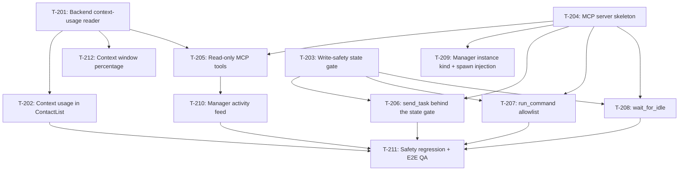

# Kanban: Manager Agent

**Generated:** 2026-09-02
**PRD Version:** 1.0
**Total Tasks:** 12
**Milestones:** M1 (See who's full), M2 (Manager can look), M3 (Manager can dispatch), M4 (Handoff + safety regression)

## Task Overview

**Critical path:** T-204 → T-205 → T-210 → T-211 (MCP skeleton gates every manager
capability, and it carries the only undecided technical question — Q6, whether to take an
MCP SDK dependency or hand-roll JSON-RPC. Nothing the manager does can be demoed until
T-204 lands, so start it early even though M1 doesn't need it.)

**Three roots, all startable immediately, all in different files:**
- **T-201** — `backends/` (context usage reader)
- **T-203** — `process-manager.ts` (write-safety gate)
- **T-204** — new `manager-mcp/` directory (server skeleton)

**Only looks parallel, actually sequenced:** T-206, T-207 and T-208 all wrap the same
gate from T-203 and register into the same server from T-204. Do T-203 and T-204 first,
then these three can genuinely run in parallel — they touch separate tool modules.

**Safety ordering, non-negotiable.** T-203 must be done and tested before T-206 or T-207
merges. Measured 2026-09-02: a PTY write to a session parked on a plan-approval dialog
approved the plan, granted auto mode, and let the session edit a real file. See the PRD's
[Verification log](prd.md#verification-log). A write tool shipped without the gate is a
path for the manager to grant edit authority the user never gave.

---

## Milestone 1: See who's full

By the end of M1: the contact list shows each instance's context usage, so the user can
tell at a glance which session is close to full — today that information exists nowhere in
the UI. No manager involved, nothing writes to any terminal.

### T-201: Backend context-usage reader
- **Type:** data
- **Status:** done (2026-09-15 — `readContextUsage` on both backends, 22 tests)
- **Requirement:** `prd.md#r7--context-usage-in-the-ui`
- **Knowledge:** `../../knowledge/tech-conventions.md#multi-backend-pattern-added-2026-05-18`
- **Code:** `workspace/app/src/main/backends/`
- **Description:** Add `readContextUsage(sessionId): ContextUsage | null` to the `Backend`
  interface in `backends/types.ts`, implemented in both `claude.ts` and `opencode.ts`.
  `ContextUsage` goes in `shared/types.ts` as `{ inputTokens: number; updatedAt: number }`,
  where `inputTokens` is the **input side only** — it represents how full the window is, so
  output tokens are excluded on both backends to keep the number comparable.
  - **Claude:** read the session JSONL, take the newest record with
    `type === "assistant"` and a `message.usage`, and sum
    `input_tokens + cache_creation_input_tokens + cache_read_input_tokens`. Verified shape:
    a live session showed `cache_read_input_tokens: 452559`.
  - **OpenCode:** read the newest `message` row for the session whose `data` JSON has
    `role === "assistant"` and a `tokens` object, and sum
    `tokens.input + tokens.cache.read + tokens.cache.write`. The JSON also carries a
    pre-summed `tokens.total`, but that **includes output**, so don't use it directly.
  - **Do not** use OpenCode's `session` table `tokens_*` columns. They are lifetime totals
    (one real session showed `tokens_cache_read` of 17.1M against a 200k–1M window) and are
    meaningless as a fullness signal. That table's `cost` column is genuinely useful but is
    a separate feature; leave it out of this task.
  Return `null` when the session has no assistant message yet, rather than `0` — the UI must
  distinguish "unknown" from "empty".
- **Acceptance:**
  - Unit tests in `backends/` cover both backends using fixtures under `__fixtures__/`,
    including the no-assistant-message case returning `null`
  - No `if (backend === ...)` branch appears outside `backends/` — the caller asks the
    registry, per the multi-backend convention
  - `pnpm type`, `pnpm lint`, `pnpm test` pass
- **Blocks:** T-202, T-205 · **Blocked by:** none · **Parallel with:** T-203, T-204
- **Notes:**
  - `readTranscript` right next to it is the model to copy for structure: read-only, returns
    empty/null on any failure rather than throwing, since a locked sqlite or a
    mid-write JSONL is normal.
  - OpenCode's db must be opened read-only, the way `openDb` already does it in
    `opencode.ts` — never take a write lock on a db the CLI owns.
- **Outcome (2026-09-15):** `Backend.readContextUsage(sessionId)` with
  `readClaudeContextUsage(jsonlPath)` and `readOpencodeContextUsage(sessionId, dbPath?)`
  behind it; `ContextUsage` in `shared/types.ts`. 22 tests in
  `backends/contextUsage.test.ts`.
  **`ContextUsage` also carries `model?: string`**, beyond what this task specified —
  the window size is in neither transcript, so T-202 needs the model name to map to
  one, and it sits in the record this reader already parses. Both readers walk
  backwards to the newest assistant turn that reported non-zero usage, skipping
  the trailing user message (opencode) and errored all-zero turns (both).

---

### T-202: Context usage in ContactList
- **Type:** feature
- **Status:** done (2026-09-15 — count shipped, percentage split out to T-212; visual acceptance unverified, see below)
- **Requirement:** `prd.md#r7--context-usage-in-the-ui`
- **Code:** `workspace/app/src/renderer/components/ContactList.tsx`, `workspace/app/src/main/ipc-handlers.ts`, `workspace/app/src/main/preload.ts`, `workspace/app/src/shared/types.ts`
- **Description:** Surface T-201's number per contact. Add `contextUsage?: ContextUsage` to
  `Instance`, populate it in `ProcessManager.toInfo`, and render it in the contact row.
  Poll rather than watch — the number changes only when a turn completes, so refreshing on
  the existing instance-activity event plus a slow interval (30s) is enough; do not add a
  file watcher.
  Display is compact per the QQ aesthetic: the token count abbreviated (`452k`), and a
  percentage only when the window size is known. **The window size is not in the
  transcript** — keep a small model→window map in the main process, and show the bare count
  with no percentage for an unrecognised model rather than guessing a denominator.
- **Acceptance:**
  - A running claude instance and a running opencode instance both show a usage figure
  - An instance with no assistant turn yet shows nothing, not `0`
  - An unrecognised model shows the count without a percentage
  - The row stays single-line at the current contact-list width
  - `pnpm type`, `pnpm lint` pass
- **Blocks:** T-211 · **Blocked by:** T-201 · **Parallel with:** T-203, T-204
- **Notes:** This is the one M1 deliverable the user sees, and it is useful on its own
  regardless of whether the manager ships.
- **Outcome (2026-09-15):** `Instance.contextUsage` populated from a cache on
  `ManagedInstance`, refreshed in `listInstances()` behind a 20s TTL and immediately
  on the `waiting` activity. Rendered right-aligned on the contact row via
  `formatTokens`, with the exact figure, model and age in the tooltip.
  **The percentage was split out to T-212**: the window size is in neither
  transcript, and the two backends expose it in completely different places (see
  that task). A wrong denominator is worse than none.
  **Two acceptance criteria are unverified** — both backends showing a figure, and
  the row staying single-line. The user's Multi-Code was running and holding port
  6768, so a second instance would have contended for it and for `contacts.json`.
  Verified instead: the compiled reader against the four largest real transcripts
  on this machine (8–10.8MB) returned 413k–719k tokens with the correct model in
  18–24ms each. **Confirm the two visual criteria on the next app restart.**

---

### T-212: Context window percentage
- **Type:** feature
- **Status:** backlog
- **Requirement:** `prd.md#r7--context-usage-in-the-ui`
- **Code:** `workspace/app/src/main/`, `workspace/app/src/renderer/components/ContactList.tsx`
- **Description:** Turn T-202's absolute count into "how full is it", which is the
  question the user actually has. Needs a window size, which **neither CLI records in
  its transcript**, and the two backends keep it in different places:
  - **OpenCode: exact and reliable.** `~/.config/opencode/opencode.json` has
    `provider.<providerID>.models.<modelID>.limit.context` (observed 1000000 for the
    Bedrock 1M models). `ContextUsage.model` from T-201 is the `modelID`; the
    `providerID` is in the same transcript record if needed to disambiguate.
  - **Claude: inferred, and fragile.** The transcript records the family name only
    (`claude-opus-5`). The window shows up via the `[1m]` suffix on
    `env.ANTHROPIC_DEFAULT_<FAMILY>_MODEL` in `~/.claude/settings.json` — observed
    `au.anthropic.claude-opus-5[1m]` on this machine. That goes stale if the user
    switches model with `/model` mid-session, so the mapping must be able to say
    "don't know".
  Show a percentage only where the window is known. Where it isn't, keep T-202's
  bare count — do not fall back to a default window. Showing 45% for a session
  actually at 226% is worse than showing no percentage at all.
- **Acceptance:**
  - An OpenCode instance whose model is in `opencode.json` shows a percentage
    matching `limit.context`
  - A claude instance on a `[1m]` model shows a percentage against 1M, not 200k
  - A model absent from both sources shows the bare count, no percentage
  - The row still fits on one line with the percentage present
  - Unit tests cover both lookups plus the unknown case
- **Blocks:** none · **Blocked by:** T-201 (done) · **Parallel with:** everything in M2/M3
- **Notes:** Optional polish on M1, not a prerequisite for the manager. Do it when
  the absolute number proves not to be enough in daily use.

---

## Milestone 2: Manager can look

By the end of M2: the user can create a manager instance, talk to it, and ask it what the
other sessions are doing — "how far did MSK get on that thing?" — and get an answer without
the target session spending a token or losing a turn. The manager can only read. Nothing in
this milestone writes to another session's terminal.

### T-204: MCP server skeleton
- **Type:** setup
- **Status:** done (2026-09-02 — hand-rolled, no MCP SDK; 42 tests; verified end-to-end against the real CLI)
- **Requirement:** `prd.md#r4--a-manager-mcp-server-scoped-to-the-manager-alone`
- **Code:** `workspace/app/src/main/manager-mcp/`
- **Description:** Stand up the local MCP server the manager connects to, with no tools yet
  beyond a trivial health tool, plus the tool-registration seam T-205 to T-208 plug into.
  - Transport HTTP, bound to `127.0.0.1` on an ephemeral port. **Not** port 6768: that one
    is reachable over Tailscale for the phone, and these tools drive work in every one of
    the user's repos.
  - Require a per-run bearer token in an `Authorization` header, generated at startup and
    passed to the manager instance through its `--mcp-config`. `claude mcp add
    --transport http` documents header support, so the config can carry it.
  - Resolve **Q6**: either add `@modelcontextprotocol/sdk` or hand-roll JSON-RPC over
    the HTTP transport. The project currently has no MCP dependency (`ws` is present,
    nothing from `@modelcontextprotocol`). Write the decision and its reason into the PRD's
    open-questions section as part of this task.
  - Follow `remote/ws-server.ts` for lifecycle: start/stop, the busy-port handling that
    already exists there, and injecting what it needs from the rest of the app rather than
    importing `processManager` directly.
- **Acceptance:**
  - Server starts on app launch only when a manager instance exists, and stops with the app
  - A request without the bearer token is rejected
  - A request from a non-loopback address cannot connect (verify the bind, not just a check)
  - `claude` launched with the generated `--mcp-config` lists the health tool
  - Unit tests cover token rejection and the tool-registration seam
- **Blocks:** T-205, T-206, T-207, T-208, T-209 · **Blocked by:** none · **Parallel with:** T-201, T-203
- **Notes:** On the critical path and it carries the only open technical decision — start it
  first even though M1 ships without it.
- **Outcome (2026-09-02):** `manager-mcp/{server,config,index}.ts` plus 42 tests.
  **Q6 resolved: hand-rolled, no SDK dependency added** — see `prd.md#still-open` for
  the reasoning. Shipped surface: `registerTool()`, `ensureManagerMcpStarted()`,
  `getManagerMcpInfo()`, `shutdownManagerMcp()` (wired into `before-quit` in
  `main/index.ts`). Startup is lazy rather than at app launch, because the spawn
  needs the OS-assigned port to write its `--mcp-config`. Verified against the real
  CLI: connect → `tools/list` → `tools/call` → handler ran.

---

### T-205: Read-only MCP tools — `list_sessions`, `read_session`
- **Type:** feature
- **Status:** done (2026-09-15 — 33 tests, verified end-to-end against a real CLI on real data)
- **Requirement:** `prd.md#requirements` (R1)
- **Code:** `workspace/app/src/main/manager-mcp/`
- **Description:** The manager's two read tools.
  - `list_sessions()` → per instance: `alias`, `cwd`, `backend`, `status`
    (`idle` | `busy` | `blocked` | `stopped`), `contextUsage` from T-201, and
    `lastActivityAt`. This is the roster; it is also how the manager re-derives state after
    a restart, so it must be complete enough to stand alone.
  - `read_session(alias, limit = 50)` → transcript tail from `Backend.readTranscript`,
    newest last. Default `limit` is 50 because a 50-entry tail measured ~3–5k tokens across
    three real sessions, and 100 measured ~4–9.5k; the manager reads several sessions per
    question, so the default matters. Cap `limit` at 200.
  - Address instances by `alias`, not internal id — the manager talks about sessions the way
    the user does. Ambiguous or unknown alias returns a listing of valid ones rather than
    guessing.
- **Acceptance:**
  - Manager asked "what is each session working on" answers from these two tools alone
  - A stopped instance appears in `list_sessions` with `status: "stopped"` and is refused by
    `read_session` with a message naming the state
  - Reading a session leaves no trace in that session: no new turn, no token spend, no
    change to its transcript
  - Unknown alias returns valid aliases
- **Blocks:** T-210, T-211 · **Blocked by:** T-201, T-204 · **Parallel with:** T-209
- **Notes:** `readTranscript` drops tool results and keeps a one-line summary per tool,
  which is why reading is cheap. Don't "improve" it by including tool output.
- **Outcome (2026-09-15):** `manager-mcp/read-tools.ts` (`buildReadTools(host)` plus
  exported formatters), registered in `manager-mcp/index.ts`. 33 tests.
  **This task's `status` spec could not be met: `idle | busy | blocked` is T-203's
  output and does not exist yet** — T-205's Blocked-by omitted T-203. Rather than
  build half of the safety-critical state tracking here, `list_sessions` reports the
  real `running | stopped` and its output ends with a line telling the model that
  status does not distinguish mid-task from finished-and-waiting. Added
  `lastActivityAt` (from the detector, excluding `prompt-cleared`) as an interim
  staleness signal. **T-203 should upgrade the field and delete that caveat line.**
  Verified end-to-end: a real `claude` process, given the user's actual 18 contacts
  and their real transcripts, called `list_sessions` then
  `read_session {"name":"multi-code","limit":30}` unprompted, picked the highest-usage
  session out of 18, and described its current work correctly from the transcript.
  Also corrected `CLAUDE.md`, which claimed `contacts.json` lives at
  `~/.config/Multi-Code/` — it is in Electron's userData dir
  (`~/Library/Application Support/multi-code/`), and `~/.config/Multi-Code/` does not
  exist.

---

### T-209: Manager instance kind + spawn injection
- **Type:** feature
- **Status:** backlog
- **Requirement:** `prd.md#r6--the-manager-instance`
- **Code:** `workspace/app/src/main/store.ts`, `workspace/app/src/main/process-manager.ts`, `workspace/app/src/main/backends/claude.ts`, `workspace/app/src/renderer/components/ContactList.tsx`
- **Description:** Make the manager a real contact with the extra spawn wiring.
  - Add `isManager?: boolean` to `SavedContact` and `Instance`. At most one per app; the
    "new instance" path refuses a second.
  - Default `cwd` to `~/.config/Multi-Code/manager/`, created on first use, with a seeded
    `CLAUDE.md` carrying the role guidance (coordinator, doesn't write code, dispatches and
    collects). Seed it only when absent — never overwrite, since the user edits it.
  - Spawn additions for a manager instance: `--mcp-config` from T-204, and `--add-dir` for
    each other contact's `cwd` so it can read code when a transcript isn't enough.
  - Manager gets a distinct visual treatment in the contact list and sorts first.
  - **Pre-allow the MCP tools, or the manager can't coordinate anything.** Measured
    during T-204: with the config alone, the CLI answered `Claude requested
    permissions to use mcp__multi-code__manager_health, but you haven't granted it
    yet.` and the handler never ran. Adding `--allowedTools
    mcp__multi-code__<tool>` made it work. Tool names are
    `mcp__multi-code__<tool>` (the prefix comes from `MCP_SERVER_NAME`). Enumerate
    the tools explicitly rather than passing a wildcard — the write tools are
    exactly the thing that should need a deliberate line of code to permit.
- **Acceptance:**
  - Creating a manager seeds the directory and `CLAUDE.md`; a second attempt is refused
  - An existing `CLAUDE.md` is left untouched on restart
  - `--add-dir` reflects the current contact list at spawn time
  - Manager sorts first and is visually distinguishable
  - Non-manager instances get no `--mcp-config` — verified by inspecting spawn args
- **Blocks:** T-211 · **Blocked by:** T-204 · **Parallel with:** T-205
- **Notes:** Role guidance goes in `CLAUDE.md`, deliberately not
  `--append-system-prompt`: user-editable, survives releases, loaded automatically.

---

### T-210: Manager activity feed
- **Type:** feature
- **Status:** backlog
- **Requirement:** `prd.md#r5--safety-boundary`
- **Code:** `workspace/app/src/renderer/components/`, `workspace/app/src/main/manager-mcp/`
- **Description:** Every manager tool call, visible. A Toolbox section listing, newest
  first: timestamp, tool, target alias, and a one-line payload preview expandable to full
  text. Refusals appear too, with the reason — a blocked write the user can't see is the
  failure mode this section exists to prevent.
  The user authorised the manager to act without per-action approval **on the condition that
  nothing is invisible**, so this is a requirement, not polish.
- **Acceptance:**
  - Every tool call from T-205 appears within a second of firing
  - A refused call shows the refusal and the reason
  - The feed survives a renderer reload (kept in main, not renderer state)
  - Full payload is reachable for an entry whose preview is truncated
- **Blocks:** T-211 · **Blocked by:** T-205 · **Parallel with:** none
- **Notes:** Land this before M3's write tools, so the first dispatch the manager ever makes
  is already observable.

---

## Milestone 3: Manager can dispatch

By the end of M3: the user says one sentence — "get portal-backend reviewed and give the
findings to whoever's working on it" — and the manager runs the whole chain: dispatch,
wait, read the result, forward it. Writes are gated on target state.

### T-203: Write-safety state gate
- **Type:** feature
- **Status:** ready
- **Requirement:** `prd.md#r5--safety-boundary`
- **Code:** `workspace/app/src/main/process-manager.ts`, `workspace/app/src/main/backends/`
- **Description:** A single authoritative answer to "is it safe to write to this instance
  right now", which every write tool must consult. Nothing else in the codebase tracks this
  today: the detector emits `prompt` / `prompt-cleared` / `waiting` as events, and
  `ManagedInstance` keeps none of it.
  - Track a per-instance state derived from those events: `idle`, `busy`, `blocked`.
    `prompt` → `blocked`; `prompt-cleared` → back to `busy`/`idle`; `waiting` → `idle`.
    **T-205 is waiting on this.** It ships `status: running | stopped` plus a caveat
    line in `list_sessions`' output saying status can't tell mid-task from
    finished-and-waiting. When this lands, upgrade that field and delete the caveat.
  - Expose `canAcceptWrite(id): { ok: true } | { ok: false; reason: string }`. Refuse when
    `blocked` or `stopped`, with a reason naming the state so a tool can pass it up.
  - **Address Q7.** Claude's blocked detection is threshold-based
    (`PROMPT_PENDING_MS = 1500`, `PTY_IDLE_MS = 800` in `claude.ts:107`), so there is a
    window where a session is already on a dialog but not yet reported as one. Add a second
    guard for that window and document what it does and does not cover. A candidate: refuse
    when an unpaired tool_use exists at all, without waiting for the threshold. Whatever is
    chosen, the residual window must be written down, not left implied.
  - Consider surfacing an authoritative alternative for claude: `~/.claude/sessions/<pid>.json`
    carries a CLI-maintained `status: idle | busy`, matchable by the pty child pid. Worth
    evaluating here, but the `blocked` distinction still has to come from the detector — the
    registry does not model it.
- **Acceptance:**
  - Unit tests drive the detector's event sequences and assert each resulting state
  - A test reproduces the measured hazard: with the instance in `blocked`,
    `canAcceptWrite` returns `ok: false` and no bytes reach the pty
  - The residual detection window from Q7 is documented in the PRD with what closes it and
    what doesn't
  - `pnpm type`, `pnpm lint`, `pnpm test` pass
- **Blocks:** T-206, T-207, T-208 · **Blocked by:** none · **Parallel with:** T-201, T-204
- **Notes:** This is the highest-risk task in the epic and the reason M3 can't start
  earlier. Do not let a write tool merge before it. The hazard is not hypothetical — see the
  PRD verification log for the reproduction and the file it modified.
  **Settle `prd.md#still-open` Q8 before starting.** OpenCode exposes pending
  permission and question requests over HTTP, which would make the gate exact for
  those instances instead of inferred, and would remove the PTY hazard for them
  entirely. That changes what this task has to cover, so it is a prerequisite
  decision, not a follow-up.

---

### T-206: `send_task` behind the state gate
- **Type:** feature
- **Status:** backlog
- **Requirement:** `prd.md#requirements` (R2), `prd.md#r5--safety-boundary`
- **Code:** `workspace/app/src/main/manager-mcp/`, `workspace/app/src/main/process-manager.ts`
- **Description:** `send_task(alias, text)` — hand a session work. Consults
  `canAcceptWrite` from T-203 first and refuses without writing when the target is blocked
  or stopped, returning the reason so the manager can tell the user instead of retrying.
  On a permitted write it reuses `sendPrompt`'s bracketed-paste + single `\r`; a plain task
  needs one carriage return, unlike a slash command.
  Writing to a **busy** target is allowed and correct: measured 2026-09-02, the CLI queues
  it — the screen shows `queued`, the current tool is not interrupted, and the task runs when
  the turn ends. Don't add a queue of our own on top.
  Refuse self-dispatch: the manager cannot target its own instance.
- **Acceptance:**
  - Blocked target → refused, reason returned, zero bytes written to that pty
  - Busy target → accepted, and the task runs after the current turn completes
  - Idle target → runs promptly
  - Self-dispatch refused
  - Every call, accepted or refused, appears in T-210's feed
- **Blocks:** T-211 · **Blocked by:** T-203, T-204 · **Parallel with:** T-207, T-208
- **Notes:** Resist adding retry-on-blocked. The right response to a blocked target is to
  tell the user, because whatever it's blocked on is a decision only they can make.

---

### T-208: `wait_for_idle`
- **Type:** feature
- **Status:** backlog
- **Requirement:** `prd.md#requirements` (R2)
- **Code:** `workspace/app/src/main/manager-mcp/`
- **Description:** `wait_for_idle(alias, timeoutMs = 600000)` resolves when the target's
  turn ends, so the manager can dispatch and then collect instead of polling. Resolves on
  the detector's `waiting`; resolves early with a distinct result when the target becomes
  `blocked` (it needs the user, not more waiting) or exits; rejects on timeout with how long
  it waited.
  Reliability differs by backend and the tool should not pretend otherwise: OpenCode reads
  the sqlite `message` row's `finish` field and treats only `finish === "stop"` as done
  (`opencode.ts:418-421`) — structured and trustworthy. Claude infers completion from JSONL
  pairing plus PTY silence thresholds, which is the weaker signal. Return which backend
  answered so the manager can weigh it.
- **Acceptance:**
  - Resolves on turn end for both a claude and an opencode instance
  - A target that becomes blocked mid-wait resolves early, flagged as blocked
  - Timeout rejects with elapsed time, and does not leave a listener attached
  - No busy-polling of the transcript
- **Blocks:** T-211 · **Blocked by:** T-203, T-204 · **Parallel with:** T-206, T-207
- **Notes:** The `blocked` early-resolve matters more than the happy path: without it the
  manager waits ten minutes on a session that has been sitting on a dialog the whole time.

---

## Milestone 4: Handoff + safety regression

By the end of M4: the manager can hand off a session that's filling up, and the measured
escalation is covered by a test that fails if the gate ever regresses.

### T-207: `run_command` with allowlist and double carriage return
- **Type:** feature
- **Status:** backlog
- **Requirement:** `prd.md#requirements` (R3), `prd.md#r5--safety-boundary`
- **Code:** `workspace/app/src/main/manager-mcp/`, `workspace/app/src/main/process-manager.ts`
- **Description:** `run_command(alias, command)` — drive one allowlisted slash command,
  which is the only way to trigger `/handoff`, since a command delivered as message text is
  never executed by the CLI.
  - Allowlist for v1: `/handoff`, `/compact`, `/context`. Anything else refused.
    **`/clear` is excluded on purpose**: it discards context irreversibly and writes nothing
    down first, where `/handoff` lands the work before handing over.
  - **Send two carriage returns.** A leading `/` opens the autocomplete menu, which
    swallows the first `\r`; only the second submits. Verified 2026-09-02 with `/context`,
    which rendered its usage grid only after the second.
  - Same `canAcceptWrite` gate as T-206, checked before any byte goes out. The allowlist is
    the second line of defence, not the first: the payload that caused the measured
    escalation was plain prose, not a command, so an allowlist alone would not have stopped
    it.
- **Acceptance:**
  - `/context` on an idle instance renders its grid — i.e. the double `\r` works
  - `/clear` and an arbitrary string are both refused, naming the allowlist
  - Blocked target → refused before any write
  - `/handoff` on a real session starts the handoff
  - Every call appears in T-210's feed
- **Blocks:** T-211 · **Blocked by:** T-203, T-204 · **Parallel with:** T-206, T-208
- **Notes:** Keep the allowlist a plain constant in one place, not a config surface. Adding
  a command should be a code change someone reviews.

---

### T-211: Safety regression + end-to-end QA
- **Type:** qa
- **Status:** backlog
- **Requirement:** `prd.md#r5--safety-boundary`, `prd.md#verification-log`
- **Code:** `workspace/app/src/main/`
- **Description:** Two parts.
  **1 — Automated safety regression.** Turn the measured escalation into a test that fails
  if the gate regresses: an instance in `blocked` must cause every write tool to refuse with
  zero bytes reaching the pty. Assert at the pty boundary (bytes written), not at the tool's
  return value, so a future refactor that bypasses the gate is caught.
  **2 — Manual end-to-end pass**, since the payoff is a chain no unit test covers:
  - Ask the manager what every session is doing; confirm the targets show no new turn
  - Full review chain: dispatch a review, wait, read the result, forward it to another
    session, all from one instruction
  - Ask the manager which session is closest to full, then have it hand that one off
  - Park a session on a plan-approval dialog by hand, then ask the manager to send it
    something; confirm it refuses, reports why, and the plan is **not** approved
  - Restart the app and confirm the manager re-derives state from `list_sessions` +
    transcripts with no persisted task file
- **Acceptance:**
  - Safety regression test passes, and fails when the gate is deliberately stubbed out
  - All five manual scenarios pass, recorded in this file with the date
  - `pnpm build`, `pnpm type`, `pnpm lint`, `pnpm test` all pass
- **Blocks:** none · **Blocked by:** T-202, T-206, T-207, T-208, T-210 · **Parallel with:** none
- **Notes:** The fourth manual scenario is the one that matters. Everything else is
  features working; that one is the difference between this feature and a security hole.
