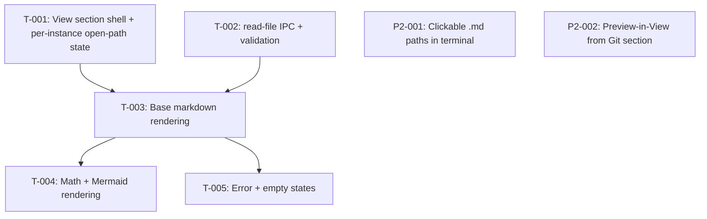

# Kanban: Markdown View

**Generated:** 2026-07-09
**Source:** 2026-07-09 markdown-view ideation (no separate PRD — aligned via /omt:interview, decisions in timeline + decisions.md)
**Total Tasks:** 5 (MVP, ✅ done) + phase 2: P2-001 ✅, P2-002 ✅, P2-003 ✅ — **all done**
**Milestones:** M1 (Markdown View MVP) — ✅ complete 2026-07-10 (T-001..T-005 all done). Phase 2 — ✅ complete 2026-07-10 (P2-001/002/003).

## Task Overview



**Critical path:** T-001 / T-002 (parallel) → T-003 → T-004 (longest chain — full rendering depends on shell + IPC + base render).

**Parallelizable:**
- T-001 (renderer shell) and T-002 (main-process IPC) have no dependency — do them in parallel.
- After T-003 lands: T-004 (math/mermaid) and T-005 (error/empty states) are independent.

## Milestone 1: Markdown View MVP

### T-001: View section shell + per-instance open-path state
- **Type:** feature
- **Status:** done
- **Description:** Add a fourth accordion section "View" to the Toolbox. In `workspace/app/src/renderer/components/Toolbox.tsx`, add a `<ToolboxSection id="view" title="View" ...>` block after the Terminal section, rendering a new `MarkdownSection` component (pass `instance` and `active={isExpanded("view")}`). Create `MarkdownSection` in `workspace/app/src/renderer/components/` with: a top bar containing a path `<input>` (placeholder e.g. "Paste a .md path, Enter to open") and a "Refresh" button, and a body area below (empty for now — rendering lands in T-003). Wire per-instance open-path state: add a `Map<instanceId, string>` (open path per instance) in `App.tsx` alongside the existing `expandedByInstance`, with a setter mirroring `handleExpandSection`. Pass the current instance's open path + an `onOpenPath(path)` setter down through `Toolbox` to `MarkdownSection`. Submitting the input (Enter) or clicking Refresh calls `onOpenPath`. Switching instances shows the new instance's open path (which may be empty). Follow the `active` early-return pattern (`if (!active) return null;`).
- **Acceptance:**
  - A fourth "View" section header appears in the toolbox, below Terminal
  - Expanding it shows the path input + Refresh button; collapsing hides the body
  - Typing a path and pressing Enter stores it as this instance's open path (verify via state; rendering comes in T-003)
  - Switching to another instance clears/changes the shown path to that instance's own open path; switching back restores it
  - No crash when nothing is open
- **Blocks:** T-003
- **Blocked by:** none
- **Parallel with:** T-002
- **Notes:** Mirror the existing `expandedByInstance` machinery in `App.tsx` exactly (a second `useState<Map<string,string>>` + a `useCallback` setter keyed on `selectedId`). Keep styling compact (QQ aesthetic); reuse existing toolbox/section CSS classes where possible, add a `markdown-section` block to `workspace/app/src/renderer/styles/`. Do NOT wire rendering here — this task is shell + state only.

---

### T-002: read-file IPC handler + validation
- **Type:** feature
- **Status:** done
- **Description:** Add a `read-file` IPC handler in `workspace/app/src/main/ipc-handlers.ts` (inside `registerIpcHandlers()`). Signature: takes `(instanceId, rawPath)`. Behavior: (1) resolve the path — if `rawPath` is absolute (`/…`, or Windows `X:\`), use as-is; if it starts with `~`, expand against home (`os.homedir()`); otherwise resolve against the instance's `cwd` (look up via `processManager`, same way `get-git-status` does). (2) Reject if the resolved extension is not `.md` or `.markdown` → return `{ ok: false, error: "unsupported", path }`. (3) `stat` the file — if missing/unreadable → `{ ok: false, error: "not-found", path }`; if size > 2 MB → `{ ok: false, error: "too-large", path }`; if it's a directory → `{ ok: false, error: "unsupported", path }`. (4) Otherwise read as UTF-8 and return `{ ok: true, path: <resolved absolute path>, content }`. Wrap everything so no throw escapes to crash main. Expose via `preload.ts` as `window.electronAPI.readFile(instanceId, path)`. Add a `ReadFileResult` type + the method signature to `ElectronAPI` in `workspace/app/src/shared/types.ts`.
- **Acceptance:**
  - `readFile(id, "notes.md")` on a git-style relative path resolves against that instance's cwd and returns `{ ok: true, content }`
  - Absolute path and `~/…` path both resolve correctly
  - `.txt` / `.json` / no-extension / a directory → `{ ok: false, error: "unsupported" }`
  - Nonexistent path → `{ ok: false, error: "not-found" }`
  - A >2MB `.md` → `{ ok: false, error: "too-large" }`
  - No input can crash the main process (all fs ops guarded)
- **Blocks:** T-003
- **Blocked by:** none
- **Parallel with:** T-001
- **Notes:** `ipc-handlers.ts` already imports `resolve`/`dirname`/`basename` from `path`; add `extname` and `statSync`/`readFileSync` as needed (`fs` helpers already partially imported at top). Look at how `get-git-status` resolves the instance cwd via `processManager` and copy that lookup. Return a discriminated union (`ok: true | false`) so the renderer can switch on `error` cleanly. Extension check is case-insensitive.

---

### T-003: Base markdown rendering (react-markdown + remark-gfm)
- **Type:** feature
- **Status:** done
- **Description:** Add the markdown rendering pipeline to `MarkdownSection`. Install deps: `react-markdown`, `remark-gfm`. On open-path change or Refresh, call `window.electronAPI.readFile(instanceId, path)`; on `{ ok: true }`, render `content` through `<ReactMarkdown remarkPlugins={[remarkGfm]}>`. Do NOT enable `rehype-raw` — raw HTML stays inert. Style the rendered output (headings, lists, tables, code blocks, links, blockquotes) to be readable and compact within the narrow column; add a `markdown-body` CSS block. Links should open externally (via existing `openInVSCode`/shell-open pattern or `target=_blank` guarded) rather than navigate the renderer — pick the simplest safe option and note it. Loading state while reading.
- **Acceptance:**
  - Opening a real `.md` renders headings, lists, **bold**/*italic*, tables (gfm), fenced code blocks, links, blockquotes
  - Raw `<script>`/HTML in the markdown is NOT executed (renders inert or escaped)
  - Rendered content is readable in the narrow toolbox column (no horizontal overflow breaking layout — long code lines scroll within their block)
  - Refresh re-reads the file and re-renders updated content
  - Clicking a link does not blow away the app's renderer view
- **Blocks:** T-004, T-005
- **Blocked by:** T-001, T-002
- **Parallel with:** none
- **Notes:** This is the first task that adds renderer dependencies — confirm rspack bundles react-markdown cleanly (it's ESM, should be fine). Keep the component's data flow simple: `useEffect` keyed on `[instanceId, openPath, refreshNonce]` that calls `readFile` and sets local state. A `refreshNonce` counter bumped by the Refresh button is the cleanest way to force a re-read of the same path.

---

### T-004: Math (KaTeX) + Mermaid rendering
- **Type:** feature
- **Status:** done
- **Description:** Extend the pipeline with math and diagrams. **Math:** install `remark-math` + `rehype-katex` + `katex`; add them to the ReactMarkdown plugin lists and import KaTeX's CSS. Inline (`$…$`) and block (`$$…$$`) math should render. **Mermaid:** install `mermaid`. Provide a custom code-block renderer to ReactMarkdown (`components={{ code: ... }}`) that detects language `mermaid`, and for those blocks calls `mermaid.render()` (async) to produce an SVG, rendering the SVG into the block. Initialize mermaid once (`mermaid.initialize({ startOnLoad: false })`). **Failure handling:** if `mermaid.render()` throws (bad syntax), catch it and fall back to rendering the block as a plain fenced code block showing the raw mermaid source (optionally a small "diagram failed to render" note). A mermaid failure must never crash the document or the app. Non-mermaid code blocks render as normal fenced code (from T-003).
- **Acceptance:**
  - A doc with `$E = mc^2$` inline and a `$$…$$` block renders formatted math (KaTeX)
  - A valid ```` ```mermaid ```` block renders as an SVG diagram
  - A ```` ```mermaid ```` block with broken syntax degrades to a raw code block showing the source — rest of the document still renders, app does not crash
  - KaTeX CSS is loaded (math is styled, not raw TeX)
  - Switching between two `.md` files with different mermaid blocks doesn't leak stale SVGs
- **Blocks:** none
- **Blocked by:** T-003
- **Parallel with:** T-005
- **Notes:** Mermaid in Electron renderer: it needs a DOM to measure/render into — running in the renderer process is fine. `mermaid.render(id, code)` returns a promise resolving to `{ svg }`; each block needs a unique id (use a counter or the block index — remember `Math.random`/`Date.now` are fine in app code, this constraint is only for workflow scripts). Watch bundle size — mermaid is large; confirm rspack build still succeeds and note the size delta. Consider dynamic `import()` of mermaid so it's only loaded when a mermaid block is actually encountered, if bundle size becomes a concern.

---

### T-005: Error states + empty state
- **Type:** feature
- **Status:** done
- **Description:** Render the non-happy states in `MarkdownSection` based on the `read-file` result. Map each `error` kind to a plain, compact inline message in the body area (no dialogs, no crash): `not-found` → "⚠ File not found: <path>"; `unsupported` → "⚠ Only .md files can be viewed: <path>"; `too-large` → "⚠ File too large to preview (>2MB): <path>". Empty state (no path opened yet for this instance) → a hint like "Paste a .md path above and press Enter." Ensure a stale render from a previous file is cleared when a new open fails (don't leave old content showing under an error).
- **Acceptance:**
  - Opening a nonexistent path shows the not-found message, no crash, no dialog
  - Opening a `.txt` (or directory) shows the unsupported-type message
  - Opening a >2MB `.md` shows the too-large message
  - With nothing opened, the empty-state hint shows
  - After a successful render, then opening a bad path, the old rendered content is replaced by the error (not shown underneath)
- **Blocks:** none
- **Blocked by:** T-003
- **Parallel with:** T-004
- **Notes:** The error kinds come straight from T-002's discriminated union — just switch on `result.error`. Keep messages one line, muted styling (reuse the `git-section-placeholder` styling idea). This task is small; it mainly makes the failure paths from T-002 visible and pleasant.

---

## Phase 2 (deferred — see gaps.md G-001, G-002)

### P2-001: Clickable `.md` paths in terminal output
- **Type:** feature
- **Status:** done
- **Description:** Register an xterm.js link provider on the claude terminal (and/or the shell terminal) that matches `*.md` file paths in the output and renders them as clickable links. Clicking: resolve the path, expand the View section for that instance, and load the file (reuse T-001's `onOpenPath`). Needs a bridge from the terminal component up to the toolbox open-path setter.
- **Blocked by:** T-001..T-005 (MVP complete)
- **Notes:** Deferred during ideation — heavier than manual input (link provider + regex tuning for path detection + cross-component wiring). Revisit after MVP is in use.

### P2-002: "Preview in View" entry on changed `.md` files in Git section
- **Type:** feature
- **Status:** done
- **Description:** In `GitSection`'s `FileRow`, for entries whose path ends in `.md`/`.markdown`, add a secondary action (e.g. a small "View" affordance next to the existing VS Code click) that opens the file in the View section instead of VS Code. Reuses T-001's open-path mechanism.
- **Blocked by:** T-001..T-005 (MVP complete)
- **Notes:** Lighter than P2-001 (Git already lists the files and has cwd). Deferred with P2-001. **Done 2026-07-10.**

### P2-003: Render images referenced in markdown
- **Type:** feature
- **Status:** done
- **Description:** Make `` images actually display in the Markdown View. Two cases: (a) **remote** `http(s)://` images — believed to already work through react-markdown's default ``; verify and add a loading/broken-image fallback. (b) **local** images (relative like `./img/diagram.png` or absolute) — these do NOT load today because the renderer runs from a `file://` bundle origin with `webSecurity` on and no custom protocol, and relative `src` resolves against the bundled renderer path, not the opened `.md` file's directory. Fix requires: resolve the image path relative to the **directory of the currently open `.md` file** (main process knows the resolved absolute `.md` path from the `read-file` result), and serve the bytes to the renderer via either (i) a registered custom protocol (e.g. `mdimg://`) mapping to on-disk files under an allowed root, or (ii) an IPC that reads the image and returns a `data:` URL. Gate by image extension + size cap (mirror the `.md` 2MB guard) and confine reads to the open file's directory subtree so an arbitrary `../../etc/...` src can't exfiltrate files. Provide a custom `img` renderer in `MarkdownSection` that rewrites local `src` to the chosen scheme; leave remote `src` untouched. Broken/oversized/missing image → inert alt text or a small "⚠ image" placeholder, never a crash.
- **Acceptance:**
  - A `.md` with a remote `https://…` image renders the image
  - A `.md` with a relative-path local image (``) renders it, resolved against that `.md` file's directory
  - An absolute-path local image renders (if within the allowed root)
  - A missing / oversized / non-image `src` degrades to alt text or a placeholder, no crash
  - A `src` pointing outside the open file's directory subtree is refused (not read)
  - No raw-HTML `` execution is introduced (still no `rehype-raw`)
- **Blocks:** none
- **Blocked by:** T-001..T-005 (MVP complete)
- **Parallel with:** P2-001
- **Notes:** Requested by builder 2026-07-10. Approach decided (G-003): a custom `mdimg://` protocol scoped to the open `.md` file's directory subtree — same pattern as VSCode's `asWebviewUri` and Obsidian's `app://`, not data URLs. The security boundary is the crux: confine reads to that subtree, extension-gate, size-cap. Watch: SVG can carry script — serve via `` (won't execute embedded script) or skip SVG in v1.

---

## Legend

- **Blocks:** This task must complete before the listed tasks can start
- **Blocked by:** This task cannot start until the listed tasks complete
- **Parallel with:** These tasks have no dependency and can be worked simultaneously
- **Status values:** `backlog` → `ready` → `in-progress` → `done` (or `blocked`)

## Changelog

- 2026-07-10: P2-001 done — **Markdown View phase 2 complete.** `.md`/`.markdown` paths in the claude terminal's output are now clickable and open in the Markdown View. `TerminalView` registers an xterm `registerLinkProvider` that scans each buffer line via a new `mdPathMatch.ts` (`findMdPaths`) — regex isolates path tokens ending in `.md`/`.markdown`, excludes surrounding delimiters (quotes/parens/brackets/backticks/colon/comma/angles), and a `(?![.\w])` tail rejects `foo.mdx` and backup files like `readme.md.bak`. Clicking dispatches a `md-open` CustomEvent `{ id, path }` (mirrors the existing `compose-open` bridge); `App.tsx` listens and calls the shared `handlePreviewInView` (sets open-path + expands View), guarded to the event's own instance. Path resolution stays main-side in the read-file IPC, so the raw matched text is passed through. Only the claude terminal for now (shell terminal `TerminalSection` not wired — noted, revisit if wanted). Known limitation: link hover-range can be off on lines containing wide/CJK chars before the path (string index ≠ cell column); the clicked `text` is always correct. New test `mdPathMatch.test.ts` (10, incl. multi-match, punctuation, extension edge cases, stateful-regex reset) → 57 total. type/main-build/lint/test/renderer-build green; matcher unit-verified, GUI click needs eyeballing in the running app.
- 2026-07-10: P2-003 done — **local + remote images render.** Local images load through a new `mdimg://` custom protocol (same pattern as VSCode's `asWebviewUri` / Obsidian's `app://`, not data URLs). Renderer: a custom `img` component in `MarkdownSection` calls `resolveImageSrc` (new `markdownImages.ts`) — remote/`data:` srcs pass through untouched, local srcs are rewritten to `mdimg://img/?base=<open .md dir>&src=<raw src>` (base comes from the read-file result's resolved `path`), empty/protocol-relative → alt text. Main: `mdimg-protocol.ts` registers the scheme privileged pre-ready + `protocol.handle` post-ready; pure sandbox logic in `mdimgResolve.ts` (electron-free) resolves src against base, **refuses anything escaping the base subtree** (path traversal), gates to an image extension allow-list (SVG excluded — can carry script), 20 MB cap; bytes served via `net.fetch(file://)` with a MIME override. No `rehype-raw` (unchanged). Wired into `index.ts`. New tests: `mdimgResolve.test.ts` (13, incl. traversal/sibling-prefix/absolute-outside/svg-refusal) + `markdownImages.test.ts` (5) → 47 total. type/main-build/lint/test/renderer-build green; **verified end-to-end in a real Electron main**: in-base png → 200 + bytes + image/png, `../secret.png` → 403, svg → 403, missing → 404. `.markdown-body img { max-width:100% }` (from T-003) already contains sizing. P2-001 (clickable `.md` in terminal) is the only remaining deferred item.
- 2026-07-09: Initial breakdown from ideation. 5 MVP tasks (T-001..T-005) + 2 deferred phase-2 tasks. T-001 and T-002 ready and parallelizable; T-003 blocked on both; T-004/T-005 blocked on T-003.
- 2026-07-09: T-001 + T-002 done (implemented in parallel). View section shell + per-instance open-path state wired through App→Toolbox→MarkdownSection; `read-file` IPC handler + `ReadFileResult` union added and exposed via preload. `pnpm type` / oxlint / eslint all green. T-003 now unblocked (ready).
- 2026-07-09: T-003 done. `MarkdownSection` now reads the open file (`useEffect` keyed on `[instance.id, openPath, refreshNonce]`, stale-response guarded) and renders via react-markdown + remark-gfm. Added `open-external` IPC (`shell.openExternal`, guarded to http/https/mailto) + `openExternal` in preload/types; links routed there via a custom `a` renderer + `shouldOpenExternally` helper (relative/exotic links stay inert). No rehype-raw — raw HTML stays escaped. Added `.markdown-body` CSS (compact, theme-aware, long code scrolls in-block). Deps: react-markdown@10, remark-gfm@4. New unit test `markdownLinks.test.ts` (6 tests). type/lint/build/test green; render verified through the real pipeline. T-004 + T-005 now unblocked (ready).
- 2026-07-09: T-005 done. Error/empty states in `MarkdownSection`: `read-file` error union mapped to one-line inline messages (not-found / unsupported / too-large) via a new `readFileErrorMessage` helper; empty state ("Paste a .md path above and press Enter.") shown when no path is open; the `.markdown-body` container now always renders and branches on empty/loading/ok/error so a failed open replaces old content (Loading branch beats stale result). New unit test `markdownErrors.test.ts` (4 tests). type/lint/test green (23 total); verified end-to-end against real bad files on disk. Only T-004 (math/mermaid) remains in the MVP.
- 2026-07-10: P2-002 done. Git section's `FileRow` now renders a compact "View" affordance for `.md`/`.markdown` entries (case-insensitive, `role="button"` span — nested `<button>` would be invalid HTML). Clicking it opens the file in the Markdown View and expands the View section in one action via a new `handlePreviewInView` in `App.tsx` (sets both `openPathByInstance` and `expandedByInstance["view"]`), threaded App→Toolbox→GitSection→FileGroup→FileRow. Uses the absolute `${cwd}/${path}`, which the existing `read-file` IPC accepts; `stopPropagation` keeps it from also firing the row's open-in-VS-Code click. Added `.git-file-view` CSS (light + dark). type/lint/test green (29 tests). P2-001 (clickable `.md` in terminal) remains the only deferred item.
- 2026-07-10: T-004 done — **Markdown View MVP complete.** Math via remark-math + rehype-katex + `katex/dist/katex.min.css` (inline `$…$` and block `$$…$$`). Mermaid via a static `mermaid` import (builder chose static over dynamic): a custom `pre` renderer detects `language-mermaid` (extracted by `mermaidExtract.extractMermaid`) and hands it to a new `MermaidBlock` component that `mermaid.render()`s to SVG, initialized once, with a `cancelled` guard so switching files can't leak a stale SVG. `render()` failure is caught → degrades to a raw code block ("⚠ Diagram failed to render"), never crashes. Added `.mermaid-block` CSS. Deps: remark-math@6, rehype-katex@7, katex@0.17, mermaid@11. New unit test `mermaidExtract.test.ts` (6 tests, 29 total). type/lint/test/build green; static pipeline (math→KaTeX, mermaid routing) verified via react-dom/server, and math/valid-mermaid/broken-mermaid-degradation/no-stale-SVG confirmed by builder in a running Electron app. Bundle: main ~1.67MB + two async mermaid chunks (~420KB, ~650KB). Remaining: only the 2 deferred phase-2 items (P2-001, P2-002).
