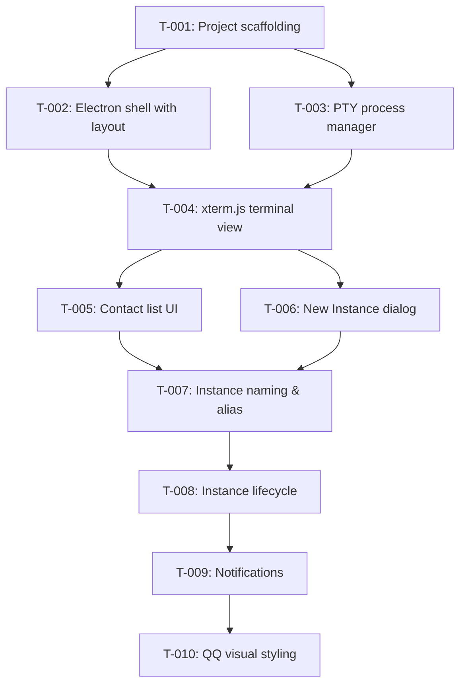

# Kanban: Multi-Code MVP

**Generated:** 2026-05-15
**PRD Version:** 2.0
**Total Tasks:** 10
**Milestones:** M1 (Skeleton), M2 (Core), M3 (Polish)

## Task Overview

**Critical path:** T-001 → T-003 → T-004 → T-005 → T-007 → T-008 → T-009 → T-010

## Milestone 1: Skeleton (App boots and shows a terminal)

### T-001: Project scaffolding
- **Type:** setup
- **Status:** done
- **Story:** Prerequisite for all stories
- **Description:** Initialize the monorepo structure with pnpm workspace. Set up Electron + React + TypeScript boilerplate under `workspace/app/`. Configure: tsconfig (strict, es2024, ESM), eslint + oxlint, vitest, rspack for renderer bundling. Install core dependencies: electron, react, xterm, node-pty. Add dev scripts: `start` (dev mode with hot reload), `build`, `lint`, `type`, `test`.
- **Acceptance:**
  - `pnpm install` succeeds
  - `pnpm start` launches an empty Electron window
  - `pnpm lint` and `pnpm type` pass
- **Blocks:** T-002, T-003
- **Blocked by:** none
- **Parallel with:** none
- **Notes:** Follow conventions from `apra-amcos-admin-msk`: pnpm workspace, ESM, oxlint + eslint, rspack. Electron main process in `workspace/app/src/main/`, renderer in `workspace/app/src/renderer/`.

### T-002: Electron shell with left-right layout
- **Type:** feature
- **Status:** done
- **Story:** Story 3 (QQ-style contact list UI)
- **Description:** Create the basic Electron window with a two-panel layout: left sidebar (fixed width ~200px) and right content area. Left panel is empty for now (placeholder "No instances"). Right panel shows placeholder text. Basic window chrome: title bar, min/max/close. Set a reasonable default window size (1200x800).
- **Acceptance:**
  - App launches with visible left/right split
  - Window is resizable, left panel width is fixed
  - No functionality yet — just the layout shell
- **Blocks:** T-004, T-005, T-006
- **Blocked by:** T-001
- **Parallel with:** T-003
- **Notes:** Keep styling minimal for now — just structural CSS. QQ styling comes in T-010.

### T-003: PTY process manager (main process)
- **Type:** feature
- **Status:** done
- **Story:** Story 1 (Create new instance)
- **Description:** Implement a `ProcessManager` class in the Electron main process that can: spawn a `claude` CLI process using `node-pty` with a given `cwd`, track all running instances (Map of id → {pty, cwd, status, alias}), pipe PTY data to the renderer via IPC (`pty-output` channel), receive stdin from renderer via IPC (`pty-input` channel), detect process exit and emit status change. Expose via Electron IPC: `create-instance`, `write-to-instance`, `kill-instance`, `list-instances`.
- **Acceptance:**
  - Can spawn a `claude` process programmatically in a specified directory
  - PTY output is forwarded to renderer process via IPC
  - Renderer can send keystrokes back to the PTY
  - Process exit is detected and reported
- **Blocks:** T-004
- **Blocked by:** T-001
- **Parallel with:** T-002
- **Notes:** Use `node-pty` with `spawn('claude', [], { cwd, env: process.env })`. Keep IPC protocol simple: binary data chunks for terminal I/O, JSON messages for control.

## Milestone 2: Core (Fully functional multi-instance management)

### T-004: xterm.js terminal view in renderer
- **Type:** feature
- **Status:** done
- **Story:** Story 4 (Terminal view with full fidelity)
- **Description:** Integrate xterm.js in the right panel of the renderer. Create a `TerminalView` React component that: initializes an xterm.js Terminal instance, connects to main process IPC for a specific instance (receives `pty-output`, sends `pty-input`), handles terminal resize (notify PTY of new dimensions), fits terminal to available space (use xterm-addon-fit). When user selects an instance, show its terminal. When no instance selected, show empty state.
- **Acceptance:**
  - Selecting an instance shows a real working terminal
  - Can type into it and see Claude Code respond
  - Terminal supports full ANSI colors, cursor movement
  - Clickable links work
  - Resizing the window resizes the terminal
- **Blocks:** T-005, T-006
- **Blocked by:** T-002, T-003
- **Parallel with:** none
- **Notes:** Install `xterm`, `@xterm/addon-fit`, `@xterm/addon-web-links`. Terminal instances should persist in memory when switching between contacts (don't destroy/recreate — just hide/show or keep buffer).

### T-005: Contact list component
- **Type:** feature
- **Status:** done
- **Story:** Story 3 (Classic QQ-style contact list)
- **Description:** Create a `ContactList` React component in the left panel that: displays all instances as list items (icon + name + status indicator), highlights the currently selected instance, sorts by running first then by last activity, clicking an item switches the terminal view to that instance. Each item shows: a colored dot (green=running, grey=stopped), the instance name (alias or directory name), subtle last-activity timestamp.
- **Acceptance:**
  - All managed instances appear in the left panel
  - Clicking an instance switches the right panel to its terminal
  - Currently selected item is visually highlighted
  - Running/stopped status is visible
- **Blocks:** T-007
- **Blocked by:** T-004
- **Parallel with:** T-006
- **Notes:** Use simple HTML/CSS list for now. QQ styling comes in T-010.

### T-006: New Instance dialog
- **Type:** feature
- **Status:** done
- **Story:** Story 1 (Create new instance)
- **Description:** Add a "+" button above or in the contact list that opens a dialog. Dialog has: a text input for project path (with a "Browse" button that opens macOS native folder picker via `dialog.showOpenDialog`), an optional alias input field, a "Create" button. On submit: validates path exists, calls main process `create-instance` IPC, closes dialog, selects the new instance in the list.
- **Acceptance:**
  - "+" button visible in the UI
  - Clicking it opens a dialog with path input + folder picker
  - Entering a valid path and clicking Create spawns a new Claude Code instance
  - Invalid path shows an error message
  - New instance appears in contact list and is auto-selected
- **Blocks:** T-007
- **Blocked by:** T-004
- **Parallel with:** T-005
- **Notes:** Use Electron's native `dialog.showOpenDialog({ properties: ['openDirectory'] })` for the folder picker.

### T-007: Instance naming and alias enforcement
- **Type:** feature
- **Status:** done
- **Story:** Story 2 (Instance naming and alias)
- **Description:** Implement naming logic: default name = last segment of project path (e.g., `/Users/x/code/admin-msk` → `admin-msk`). Double-click on a name in the contact list to edit (inline rename). In the New Instance dialog: if the entered path already has a running instance, show a warning and make the alias field mandatory. Store alias in the instance state.
- **Acceptance:**
  - New instances auto-named from directory
  - Can double-click to rename (inline edit)
  - Creating a duplicate-path instance forces alias input
  - Alias shows in contact list
- **Blocks:** T-008
- **Blocked by:** T-005, T-006
- **Parallel with:** none
- **Notes:** Duplicate detection: check if any running instance has the same `cwd`. If so, block creation until alias is provided.

### T-008: Instance lifecycle (stop/restart/remove)
- **Type:** feature
- **Status:** done
- **Story:** Story 6 (Instance lifecycle)
- **Description:** Handle instance lifecycle events: when a `claude` process exits, update its status to "stopped" (grey out in list, show stopped indicator). Add right-click context menu on contact list items with: "Restart" (re-spawn claude in same cwd), "Remove" (dismiss from list entirely). Show last activity time or uptime on each item.
- **Acceptance:**
  - When Claude Code exits (type `/exit` or process crash), instance shows as stopped
  - Right-click → Restart re-spawns the process
  - Right-click → Remove dismisses it from the list
  - Running instances show uptime
- **Blocks:** T-009
- **Blocked by:** T-007
- **Parallel with:** none
- **Notes:** On restart, create a fresh PTY + xterm instance. Old terminal buffer is discarded.

## Milestone 3: Polish (Notifications + QQ aesthetics)

### T-009: Notifications (flash + sound + system)
- **Type:** feature
- **Status:** done
- **Story:** Story 5 (Notifications on new output)
- **Description:** When a non-selected instance receives PTY output: flash/blink its avatar in the contact list (CSS animation), show an unread dot/badge, play a notification sound (short beep, configurable on/off in a settings menu), send a macOS system notification (Notification API). Clear unread state when user selects that instance.
- **Acceptance:**
  - Non-focused instance with new output: avatar blinks in the list
  - Unread badge appears and clears on selection
  - Sound plays (can be toggled off)
  - macOS notification center shows alert
- **Blocks:** T-010
- **Blocked by:** T-008
- **Parallel with:** none
- **Notes:** Debounce notifications — don't fire for every byte of output. Use a small delay (e.g., 500ms idle after output burst) before triggering notification.

### T-010: Classic QQ visual styling
- **Type:** feature
- **Status:** done
- **Story:** Story 3 (Classic QQ-style contact list)
- **Description:** Apply classic QQ 2003-2005 visual styling to the entire app: compact contact list with small square avatars (can use colored initials or simple icons), QQ-style color scheme (blue header bar, white list background, subtle borders), small font sizes, information-dense layout, QQ-style window frame (optional — or use native). The terminal view on the right keeps its default dark theme.
- **Acceptance:**
  - App visually resembles classic QQ layout
  - Compact, no wasted space
  - Contact list feels like a 2003-era QQ friend list
  - Overall aesthetic is retro but functional
- **Blocks:** none
- **Blocked by:** T-009
- **Parallel with:** none
- **Notes:** Reference images of QQ 2003/2004/2005 for color palette and spacing. Don't over-engineer — CSS is enough, no need for a UI library for this aesthetic.

## Legend

- **Blocks:** This task must complete before the listed tasks can start
- **Blocked by:** This task cannot start until the listed tasks complete
- **Parallel with:** These tasks have no dependency and can be worked simultaneously

## Changelog

- 2026-05-15: Initial kanban generated from PRD v2.0
