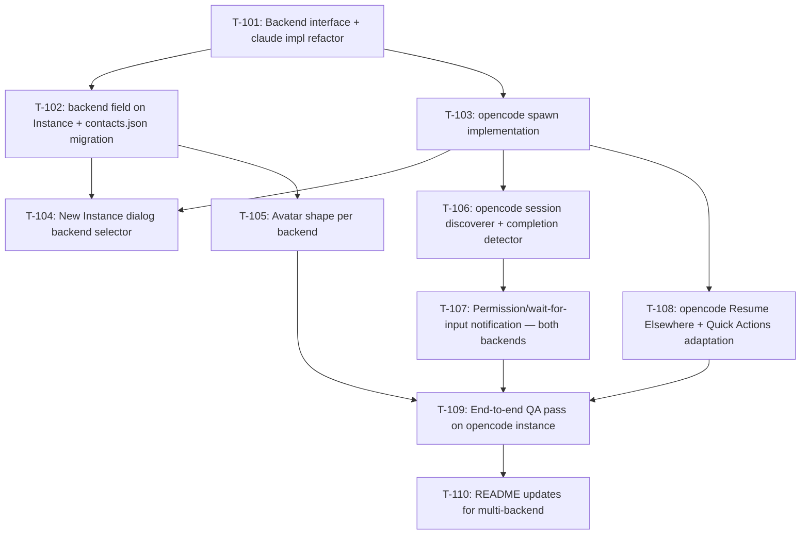

# Kanban: OpenCode Support

**Generated:** 2026-05-18
**PRD Version:** 1.0
**Total Tasks:** 10
**Milestones:** M1 (Backend abstraction + opencode spawn), M2 (Parity — notifications, Quick Actions, polish)

## Task Overview

**Critical path:** T-101 → T-103 → T-106 → T-107 → T-109 → T-110 (longest chain — abstraction must land first, then opencode spawn, then completion detection, then the new wait-for-input feature, then QA, then docs)

**Parallelizable after T-101:**
- T-102 and T-103 are mostly independent (one is shared types/persistence, the other is main-process spawn logic)
- After T-102+T-103 land: T-104, T-105, T-106, T-108 can run in any order

## Milestone 1: Backend abstraction + opencode spawn

By the end of M1: user can create an OpenCode instance, see it in the contact list with the right shape, and interact with the opencode TUI in the terminal column. Notifications and full Quick Actions parity come in M2.

### T-101: Extract Backend interface, refactor claude into an implementation
- **Type:** refactor
- **Status:** done
- **Story:** Story 8 (zero residue) sets the architectural ground; this is the precondition for adding any second backend.
- **Description:** Create `workspace/app/src/main/backends/` with `types.ts` defining a `Backend` interface, plus `claude.ts` that implements it for the existing claude behavior, and `index.ts` that exports a `getBackend(name)` registry. Move all claude-specific logic out of `process-manager.ts` and `session-watcher.ts` into `claude.ts` — the manager files should now be backend-agnostic and call into the `Backend` interface. The `Backend` interface should expose: `spawn(cwd, opts) -> { args, env }`, `discoverSessionId(cwd) -> Promise<string | null>`, `createCompletionDetector(jsonlPath, callbacks) -> { stop }`, and `buildResumeCommand(sessionId) -> string`. **No behavior change** — existing claude flows must work identically after this refactor.
- **Acceptance:**
  - All 7 existing claude tasks (T-001~T-008 from toolbox kanban + MVP tasks) still pass acceptance criteria
  - `process-manager.ts` no longer references `claude` binary directly — it asks the registry
  - `session-watcher.ts` no longer hardcodes `~/.claude/sessions/` paths — it delegates to the backend's `discoverSessionId` and `createCompletionDetector`
  - `pnpm type` and `pnpm lint` pass
  - Manual smoke test: create a claude instance, send a prompt, get the completion notification — all behave as before
- **Blocks:** T-102, T-103
- **Blocked by:** none
- **Parallel with:** none
- **Notes:**
  - This is the highest-risk task — touches core files. Keep the diff focused on **moving** code, not rewriting it. If something feels like a rewrite, stop and split.
  - The completion detector callback shape should match what `App.tsx` already expects via the `instance-activity` IPC.
  - Don't introduce a fancy DI framework — a simple `Map<string, Backend>` registry in `index.ts` is plenty.

---

### T-102: Add `backend` field to Instance type and contacts.json with lazy migration
- **Type:** data
- **Status:** done (folded into T-101 — Instance type, SavedContact, lazy migration all included in the refactor)
- **Story:** Story 1 (backend selection)
- **Description:** Add `backend: "claude" | "opencode"` to the `Instance` interface in `workspace/app/src/shared/types.ts` and to `SavedContact` in `workspace/app/src/main/store.ts`. On load (`loadContacts`), treat any record without `backend` as `backend: "claude"` (lazy migration in memory; the field gets added to the file the next time `saveContacts` runs). Update `processManager.createInstance` to accept `backend` and store it. Update `toInfo` to include it.
- **Acceptance:**
  - Existing `~/.config/Multi-Code/contacts.json` loads without errors and all instances appear with `backend: "claude"` in memory
  - When a new instance is created with `backend: "opencode"`, it persists with that field
  - Restart preserves the backend correctly
  - `pnpm type` passes
- **Blocks:** T-104, T-105
- **Blocked by:** T-101
- **Parallel with:** T-103
- **Notes:**
  - No prompt to the user during migration. Silent. The principle is: existing behavior is unchanged; new instances opt in.

---

### T-103: Implement opencode backend (spawn only)
- **Type:** feature
- **Status:** done
- **Story:** Story 4 (spawn opencode), Story 8 (zero residue — verify spawn doesn't write any config)
- **Description:** Add `workspace/app/src/main/backends/opencode.ts` implementing the `Backend` interface from T-101. **Only the spawn part needs full implementation in this task** — `discoverSessionId` and `createCompletionDetector` can return null/no-op for now (T-106 fills them). The spawn implementation: locate `opencode` binary on PATH (similar `findClaude` pattern from `process-manager.ts`), build args (`opencode` plain on first run for a cwd, `opencode --continue` if a session exists). Use the same node-pty options as claude. Register the implementation in `backends/index.ts` so `getBackend("opencode")` returns it.
- **Acceptance:**
  - With `processManager.createInstance(cwd, alias, "opencode")`, a real opencode TUI process is spawned and its PTY output streams through xterm
  - The opencode TUI is fully interactive (typing works, ctrl+x shortcuts work, /help works)
  - On restart, the instance comes back with `backend: "opencode"` and respawns opencode (not claude)
  - If `opencode` is not on PATH, the instance status becomes `stopped` shortly after creation (same flow as missing claude)
- **Blocks:** T-104, T-106, T-108
- **Blocked by:** T-101
- **Parallel with:** T-102
- **Notes:**
  - For "is there an existing session in this cwd?" detection (the equivalent of the `hasExistingSession` we use for claude — driven by checking `~/.claude/projects/<encoded-cwd>/`), opencode stores sessions in sqlite. A lightweight check: query the sqlite `session` table for any row matching the cwd. If `better-sqlite3` isn't installed yet, defer this and just always use `--continue` (opencode handles "no prior session" gracefully).
  - Don't write any opencode config files. Spawn only.

---

### T-104: New Instance dialog backend selector
- **Type:** feature
- **Status:** done
- **Story:** Story 1 (backend selection), Story 2 (same cwd different backends), Story 4 (PATH warning)
- **Description:** Update `workspace/app/src/renderer/components/NewInstanceDialog.tsx` to add a backend selector (radio buttons: Claude Code / OpenCode). Default to the most recently used backend, persisted in `localStorage` under key `multicode.lastBackend`. On first ever launch, default to claude. Update the dialog's submit flow to pass `backend` to `electronAPI.createInstance`. Update the duplicate-cwd check to allow same cwd if backend differs (currently `hasRunningInstanceAt` only checks cwd — extend it to check cwd + backend). Add a soft inline warning when the user selects OpenCode and the binary is missing (use a new IPC like `electronAPI.checkBackendAvailable("opencode") -> boolean`).
- **Acceptance:**
  - Dialog shows two radio options, default selection matches `localStorage` (or claude if first time)
  - Selecting OpenCode and submitting creates an opencode instance
  - Selecting OpenCode when `opencode` is not on PATH shows a soft warning below the option (non-blocking — the user can still create)
  - Same cwd, different backend: dialog allows the create with no warning
  - Same cwd, same backend: existing duplicate warning still shows
- **Blocks:** none (just UX)
- **Blocked by:** T-102, T-103
- **Parallel with:** T-105, T-106, T-108
- **Notes:**
  - For the PATH check, the simplest implementation is `which opencode` via `child_process.exec` returning exit 0/non-zero. Don't do anything fancier.
  - The duplicate-cwd check probably needs a new method on `processManager`, e.g., `hasInstanceAt(cwd, backend)`.

---

### T-105: Avatar shape per backend
- **Type:** feature
- **Status:** done
- **Story:** Story 3 (visible backend indicator)
- **Description:** Update `workspace/app/src/renderer/components/Avatar.tsx` to accept a `backend: "claude" | "opencode"` prop. Render circular for claude (current `border-radius: 50%`) and square for opencode (small radius like 4-6px to match QQ aesthetic — not razor-sharp corners). Update all `<Avatar>` call sites (currently in `ContactList.tsx`) to pass the new prop, sourced from `instance.backend`.
- **Acceptance:**
  - Claude instances render with circular avatars (no visual change from before)
  - OpenCode instances render with rounded-square avatars (~4-6px radius)
  - The shape is visible in: contact list, blink/unread states, online/offline states
  - Avatar internal layout (initials, color) is unchanged across backends
- **Blocks:** none
- **Blocked by:** T-102
- **Parallel with:** T-104, T-106, T-108
- **Notes:**
  - Don't introduce a backend → color mapping. Backend doesn't affect color.
  - If the existing `.avatar` CSS uses `border-radius: 50%`, the cleanest change is to add a `.avatar.square` modifier with a different radius and toggle the class from the React component.

---

### T-106: opencode session discoverer + completion detector
- **Type:** feature
- **Status:** done
- **Story:** Story 5 (completion notification on both backends)
- **Description:** Fill in the `discoverSessionId` and `createCompletionDetector` methods in `backends/opencode.ts`. **discoverSessionId**: open `~/.local/share/opencode/opencode.db` read-only via `better-sqlite3` (add to deps if not present), query `SELECT id FROM session WHERE directory = ? ORDER BY time_created DESC LIMIT 1` (poll every 1s for up to 30s, mirroring the claude discoverer). **createCompletionDetector**: poll the `message` table for the discovered sessionId every 500ms; for each new row (track by `time_created`), parse `data` as JSON; treat `finish === "stop"` as completion (analog to claude's `end_turn`); ignore `finish === "tool-calls"` and others. When a real user message (`role === "user"` with string content) is seen, cancel any pending notification (mirrors the claude behavior we already have). Schedule the notification with the same 2s debounce as claude.
- **Acceptance:**
  - Send a prompt to an opencode instance, wait for it to complete → notification fires (sound + flash + dock bounce) within ~2-3s of the agent finishing
  - Tool calls in the middle of a turn do not trigger spurious notifications
  - Sending a follow-up user message before notification fires cancels the pending notification (no spam)
  - Multi-instance: two opencode instances on different cwds get notifications independently
  - SQLite db locked / inaccessible → silent retry next tick, instance keeps working
  - `pnpm type` passes
- **Blocks:** T-107, T-109
- **Blocked by:** T-103
- **Parallel with:** T-104, T-105, T-108
- **Notes:**
  - Use `better-sqlite3` with `{ readonly: true, fileMustExist: true }` to avoid locking opencode's writers.
  - The 500ms cadence for both discovery and message polling matches the existing claude implementation. Don't make it configurable.
  - Reuse the existing `instance-activity` IPC end-to-end — the renderer side already handles ping → sound → bounce. Don't add a new event channel.

---

### T-107: Permission/wait-for-input notification — both backends
- **Type:** feature
- **Status:** backlog
- **Story:** Story 6 (notification when waiting for user input)
- **Description:** Extend the `CompletionDetector` event vocabulary. Currently it emits one event ("turn complete"). Add a second event ("waiting for input") that fires when the agent has stopped to ask the user something — permission request, multi-choice prompt, etc. **Probe required**: inspect a few real jsonl entries (claude) and message rows (opencode) to identify the schema for "waiting for input". For claude, this likely means a specific message type or a particular `stop_reason`. For opencode, check the `permission` table or look for specific finish reasons. Wire the new event through the same `instance-activity` IPC (no new channel) — the renderer's existing handler already fires the same sound/flash/bounce, which is what we want (per PRD: same sound for complete and wait-for-input). Important: only fire when the prompt **first appears**; do NOT fire again if the user is mid-decision (mirrors current "selected instance auto-clear after 1.5s").
- **Acceptance:**
  - When claude pauses for permission (Bash command, file write), the notification fires
  - When opencode pauses for any user input prompt, the notification fires
  - Same sound, same animation as completion
  - User responding to the prompt does NOT trigger another notification
  - Tool calls and other intermediate states do NOT trigger
  - Add a comment in the code documenting the exact jsonl/sqlite signal we look for, so future maintainers can verify it
- **Blocks:** T-109
- **Blocked by:** T-106
- **Parallel with:** T-108
- **Notes:**
  - **This task starts with a probe step.** Open a real claude session, trigger a Bash permission, look at the jsonl. Same for opencode. Decide signals based on observation, document in code.
  - If probing reveals the signals are unstable / version-dependent, fall back to "MVP just does completion; wait-for-input is v1.1" — flag this back to the builder before changing scope.
  - Don't add new sounds; reuse the existing message sound.

---

### T-108: opencode Resume Elsewhere + Quick Actions adaptation
- **Type:** feature
- **Status:** backlog
- **Story:** Story 7 (Quick Actions parity)
- **Description:** Wire up the Quick Actions section's per-backend behavior. (a) `Resume Elsewhere`: in `QuickActionsSection.tsx`, when `instance.backend === "opencode"`, copy `opencode --session <id>` instead of `claude --resume <id>`. (b) `Show Cost`: when backend is opencode, render the button as **disabled** with tooltip "OpenCode does not have an inline cost command". (c) `Clear` and `Compact`: no change — both backends accept these same slash commands. (d) `Go to Code Base`: no change — backend-agnostic. The session-id flow is already in place (Instance.sessionId is populated by the backend's discoverer); just consume it.
- **Acceptance:**
  - On a claude instance, all 5 buttons behave as before (regression check)
  - On an opencode instance: Go to Code Base opens VS Code; Show Cost is disabled with tooltip; Clear sends `/clear` (opencode interprets as `/new`); Compact sends `/compact`; Resume Elsewhere copies `opencode --session <id>`
  - The disabled tooltip shows the explanation text
  - Both backends' `Resume Elsewhere` button is disabled until sessionId is known (existing behavior unchanged)
- **Blocks:** T-109
- **Blocked by:** T-103
- **Parallel with:** T-104, T-105, T-106, T-107
- **Notes:**
  - Use the `Backend` interface's `buildResumeCommand(sessionId)` method (defined in T-101) — don't put backend conditionals in the renderer. The renderer should ask "what's this instance's resume command?" and the backend module answers.
  - The Show Cost disabling is the only place the renderer actually needs to know about backend identity (because the underlying behavior is fundamentally different — disabled vs sending a slash command). It's OK to have one backend-aware conditional here.

---

## Milestone 2: QA + Documentation

### T-109: End-to-end QA pass on opencode instance
- **Type:** qa
- **Status:** backlog
- **Story:** All 8 stories
- **Description:** Manual QA covering all 8 PRD stories on a real opencode instance. Use the same test scenarios that were used for the toolbox MVP. Specifically: (1) create opencode instance via dialog, see square avatar; (2) send a few prompts, get completion notifications; (3) trigger a tool that needs permission, get the wait-for-input notification; (4) test all 5 Quick Actions buttons; (5) Resume Elsewhere copies the right command; (6) restart app, verify instance persists with correct backend; (7) create same cwd with both backends, verify both run independently; (8) uninstall sanity: verify Multi-Code did not write any files under `~/.claude/`, `~/.config/opencode/`, or any `.claude` / `.opencode` subdirectories of project cwds. Document any bugs found and fix them.
- **Acceptance:**
  - All 8 PRD acceptance-criteria sets pass on opencode
  - Regression: existing claude flows still work (run a claude instance through the same checklist)
  - Zero residue check: no Multi-Code-written files exist in claude/opencode config locations
  - Any bugs found during QA are filed as new tasks (T-111+) or fixed inline if trivial
- **Blocks:** T-110
- **Blocked by:** T-105, T-107, T-108
- **Parallel with:** none
- **Notes:**
  - The "zero residue" check is just `find ~/.claude ~/.config/opencode -newer <multicode-install-time>` and verifying the only new files are claude/opencode's own session writes — Multi-Code shouldn't have left anything.

---

### T-110: README updates for multi-backend
- **Type:** feature
- **Status:** backlog
- **Story:** All — communicates the new capability to users
- **Description:** Update both `README.md` and `README.zh-CN.md` to document multi-backend support. Specifically: (1) Features section: add OpenCode as a supported backend; (2) Installing the .dmg section: add OpenCode CLI as an *optional* prerequisite (only needed if user wants to create OpenCode instances); (3) Usage Guide: explain the backend selector in "Creating an instance" and the avatar shape difference; (4) Note the zero-residue principle prominently. Keep both READMEs in sync.
- **Acceptance:**
  - English and Chinese READMEs both have the multi-backend information
  - The cross-link between them still works
  - The "Installing the .dmg" prerequisite section makes clear claude is required for claude instances, opencode for opencode instances, neither is mandatory if the user only wants the other
- **Blocks:** none
- **Blocked by:** T-109
- **Parallel with:** none
- **Notes:**
  - Don't replace the existing claude-centric content — extend it. Anyone reading from scratch should still understand claude is the primary path until/unless they want opencode.

---

## Legend

- **Blocks:** This task must complete before the listed tasks can start
- **Blocked by:** This task cannot start until the listed tasks complete
- **Parallel with:** These tasks have no dependency and can be worked simultaneously
- **Status values:** `backlog` → `ready` → `in-progress` → `done` (or `blocked`)

## Changelog

- 2026-05-18: Initial breakdown from PRD v1.0
- 2026-05-18: T-101 done. Created `src/main/backends/{types,claude,index}.ts`, deleted `session-watcher.ts` (logic moved into `claude.ts`), refactored `process-manager.ts` to call into the backend abstraction. T-102 (Instance type + lazy migration) was naturally folded into the same diff — `Instance`, `SavedContact`, and `BackendName` all updated. T-103 and T-105 are now `ready`. Type + lint pass; manual smoke test pending.
- 2026-05-19: T-103 done. Added `backends/opencode.ts` with spawn (binary discovery via `command -v` first, fallback to known paths; `--continue` flag always passed since opencode handles "no prior session" gracefully). Registry now includes opencode. Added `isBackendAvailable()` for dialog availability check. `discoverSessionId` and `createCompletionDetector` are no-op placeholders for T-106. ProcessManager.createInstance and hasRunningInstanceAt now accept optional `backend` parameter (defaults to claude for backward compat).
- 2026-05-19: T-104 done. NewInstanceDialog has Claude/OpenCode radio selector. Default selection is persisted in localStorage (`multicode.lastBackend`); first-launch falls back to claude. Inline soft warning shows when opencode is selected and not on PATH. Duplicate-cwd check is now backend-aware (same cwd different backend = no warning). Removed obsolete `duplicateWarning` prop from the dialog API.
- 2026-05-19: T-105 done. Avatar accepts `backend` prop; opencode renders square (5px radius), claude stays circle. CSS split into `.avatar-circle` / `.avatar-square` modifiers, base `.avatar` no longer has hardcoded radius.
- 2026-05-20: T-106 done. Added `better-sqlite3` (with `@electron/rebuild` to handle ABI mismatch — `pnpm rebuild-native` script + auto-run via root `postinstall`). Implemented `OpencodeSessionDiscovery` (1s polling sqlite for `session.directory = cwd`, 30 attempt limit) and `OpencodeCompletionDetector` (500ms polling `message` table by `session_id` + `time_created` cursor, parses `data` JSON, fires on `role: "assistant"` + `finish: "stop"`, ignores `tool-calls`/streaming, cancels pending notify on real user message — same 2s debounce semantics as claude). Smoke tested in Electron: discovery completes within 1s, no false fires when session is idle. Type + lint pass. T-107 is now `ready`.
