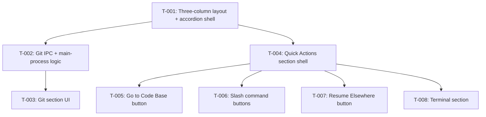

# Kanban: Toolbox

**Generated:** 2026-05-16
**PRD Version:** 1.0
**Total Tasks:** 8
**Milestones:** M1 (Toolbox MVP)

## Task Overview

**Critical path:** T-001 → T-002 → T-003 (longest chain — git rendering depends on layout + IPC)

**Parallelizable after T-001:**
- T-002 (Git backend) and T-004 (Quick Actions shell) can run in parallel
- After T-004 lands: T-005, T-006, T-007 are fully independent and parallelizable

## Milestone 1: Toolbox MVP

### T-001: Three-column layout with accordion shell
- **Type:** feature
- **Status:** done
- **Story:** Story 1 (three-column layout) + Story 2 (accordion sections)
- **Description:** Add a third column "toolbox" to the right of the terminal in `App.tsx`. Width should be approximately 50% of the terminal column (use flex ratios — terminal `flex: 2`, toolbox `flex: 1`, or similar). Inside the toolbox, build an accordion component (`Toolbox` + `ToolboxSection` in `workspace/app/src/renderer/components/`) that supports: multiple sections, only one expanded at a time, expanded section fills available vertical space, header always visible. Wire two empty placeholder sections — "Git" and "Quick Actions" — with Git expanded by default. Per-instance accordion state (which section is expanded) tracked in `App.tsx` state, keyed by instanceId. Hide toolbox when no instance is selected (matches existing empty-state behavior).
- **Acceptance:**
  - Three columns visible when an instance is selected
  - Toolbox column is roughly half the terminal column width
  - Two placeholder sections render with collapsible headers
  - Clicking a section header expands it; previously expanded one collapses
  - Git is expanded by default the first time an instance is selected
  - Switching instances preserves each instance's expanded-section state
- **Blocks:** T-002, T-004
- **Blocked by:** none
- **Parallel with:** none
- **Notes:** Match QQ aesthetic — keep styling compact, no fancy animations. Add styles to existing CSS files in `workspace/app/src/renderer/styles/`. Don't introduce a new component library for the accordion; build it with plain React + CSS.

---

### T-002: Git status IPC + main-process logic
- **Type:** feature
- **Status:** done
- **Story:** Story 3 (Git section state)
- **Description:** In the Electron main process, add a `git-status` IPC handler in `workspace/app/src/main/ipc-handlers.ts` that takes an instanceId, looks up the instance's `cwd` via `processManager`, and returns git status info: current branch, untracked count, unstaged count, staged count, ahead, behind. Implementation: shell out to `git` CLI via `child_process.exec` (or `execFile`). Use `git -C <cwd> rev-parse --is-inside-work-tree` to check; **strict cwd check** — only consider a repo if `<cwd>/.git` exists directly (do NOT search parent directories). If not a git repo or git not available, return `{ available: false }`. Otherwise return `{ available: true, branch, untracked, unstaged, staged, ahead, behind }`. Expose via preload bridge (`workspace/app/src/main/preload.ts`) as `window.electronAPI.getGitStatus(instanceId)`. Add the type to `workspace/app/src/shared/types.ts`.
- **Acceptance:**
  - `getGitStatus(id)` returns correct values for a git project
  - Returns `{ available: false }` for non-git cwd
  - Returns `{ available: false }` when `cwd/.git` does not exist directly (subdirectory of git repo case)
  - Failure of git command does not crash main process — returns `{ available: false }` gracefully
  - All git commands use `git -C <cwd>` (do not change process cwd)
- **Blocks:** T-003
- **Blocked by:** T-001
- **Parallel with:** T-004
- **Notes:** Counts can be derived from `git status --porcelain` (lines starting with `??` = untracked, ` M` = unstaged, `M ` = staged, etc.). Ahead/behind from `git rev-list --left-right --count HEAD...@{u}` (handle case where no upstream is set — return 0/0).

---

### T-003: Git section UI with 5-second polling
- **Type:** feature
- **Status:** done
- **Story:** Story 3 (Git section display + polling)
- **Description:** Implement the Git section's contents inside the accordion shell from T-001. Component: `GitSection` in `workspace/app/src/renderer/components/`. When the section is expanded AND an instance is selected, call `window.electronAPI.getGitStatus(instanceId)` immediately, then poll every 5 seconds. Stop polling when section is collapsed or instance changes. On instance change, immediately fetch (don't wait 5s). Render: branch name, file counts (`new: N · modified: N · staged: N`), remote status (`↑ahead ↓behind`). If `available: false`, render "Not a git repository". Style consistent with QQ aesthetic.
- **Acceptance:**
  - Selecting a git project's instance shows branch + counts within ~1s
  - Status updates within 5s when files change in the project
  - Switching instances shows the new instance's git state immediately
  - Collapsing the Git section stops polling (verify via no extra IPC calls)
  - Non-git project shows "Not a git repository" message
- **Blocks:** none
- **Blocked by:** T-002
- **Parallel with:** T-004, T-005, T-006, T-007
- **Notes:** Use a `useEffect` keyed on `[instanceId, isExpanded]` to manage the polling lifecycle. Clear interval in cleanup. No need for Redux/Zustand — local component state is fine.

---

### T-004: Quick Actions section shell
- **Type:** feature
- **Status:** done
- **Story:** Story 4 (Quick Actions section container)
- **Description:** Implement the Quick Actions section's container inside the accordion from T-001. Component: `QuickActionsSection` in `workspace/app/src/renderer/components/`. Layout: vertical stack of full-width buttons. The section receives the selected instanceId as prop. The actual buttons are added in T-005, T-006, T-007 — this task creates the container and a button-row visual style only. Add a small button helper component (`QuickActionButton` or just a styled `<button>`) that other tasks will reuse.
- **Acceptance:**
  - Quick Actions section renders when expanded
  - Empty state OK (no buttons yet) — visual stack ready to receive children
  - Button styling matches QQ aesthetic: full-width, compact, hover state
- **Blocks:** T-005, T-006, T-007
- **Blocked by:** T-001
- **Parallel with:** T-002
- **Notes:** Keep the button helper minimal — props: label, onClick, disabled, optional title (for tooltip).

---

### T-005: "Go to Code Base" button
- **Type:** feature
- **Status:** done
- **Story:** Story 5
- **Description:** Add an "Open in VS Code" IPC handler in main process: `open-in-vscode` taking a `cwd`, runs `code <cwd>` via `child_process.spawn` (detached, ignore stdio). Expose via preload as `window.electronAPI.openInVSCode(cwd)`. In `QuickActionsSection`, render the first button "Go to Code Base" — always enabled when an instance is selected. On click, call `openInVSCode(instance.cwd)`. If the spawn fails (ENOENT — `code` not found), surface a renderer-side toast/inline message: "VS Code not found. Install `code` command from VS Code menu (Cmd+Shift+P → 'Shell Command: Install code in PATH')." Don't block other UI on failure.
- **Acceptance:**
  - Clicking the button opens VS Code on the project (`code <cwd>` invoked)
  - VS Code with the project already open: clicking activates the existing window (rely on VS Code's natural behavior)
  - VS Code not installed: button click shows the install hint message; app does not crash
- **Blocks:** none
- **Blocked by:** T-004
- **Parallel with:** T-006, T-007
- **Notes:** Use `spawn('code', [cwd], { detached: true, stdio: 'ignore' })` and `unref()` so the child doesn't keep the Electron process alive. Listen to `error` event on the child for ENOENT detection.

---

### T-006: Slash command buttons (Show Cost / Clear / Compact)
- **Type:** feature
- **Status:** done
- **Story:** Story 6
- **Description:** In `QuickActionsSection`, render three buttons after "Go to Code Base": "Show Cost", "Clear", "Compact". Each button writes a slash command + carriage return to the instance's terminal via the existing `writeToInstance` IPC: `/cost\r`, `/clear\r`, `/compact\r` respectively. Buttons are **disabled when the instance is stopped** (status !== "running"). No app-level confirmation dialog — claude CLI handles its own confirmation. After clicking, the terminal should retain visual focus (so the user sees the result — likely already the case since clicks don't steal focus from xterm).
- **Acceptance:**
  - Clicking each button types the corresponding slash command into the terminal and submits it (newline included)
  - Buttons are disabled (visually grayed) when the selected instance is stopped
  - No confirmation prompt before sending
  - Existing `writeToInstance` IPC is reused — no new channel
- **Blocks:** none
- **Blocked by:** T-004
- **Parallel with:** T-005, T-007
- **Notes:** Consider a small abstraction: a `slashCommandButton(label, command)` helper that takes the slash command string and produces the full button. Reduces duplication.

---

### T-007: "Resume Elsewhere" button + session-id exposure
- **Type:** feature
- **Status:** done
- **Story:** Story 7
- **Description:** Two parts. **(a)** Make the session-id available to the renderer. Currently `session-watcher.ts` discovers the sessionId via `findJsonlByCwd` but doesn't expose it. Modify the watcher (or `process-manager.ts`) so that when a session is matched for an instance, the sessionId is stored on the `ManagedInstance` and emitted to the renderer (e.g., via a new `instance-session-id` event, or include in the existing instance-info shape returned by `list-instances`). Update `InstanceInfo` in `workspace/app/src/shared/types.ts` to include optional `sessionId?: string`. **(b)** In `QuickActionsSection`, add the fifth button "Resume Elsewhere". When clicked, copy `claude --resume <sessionId>` to the system clipboard via Electron's `clipboard.writeText` (renderer side via `navigator.clipboard.writeText`, or main-process via Electron's `clipboard` module — pick the renderer side for simplicity). Show transient feedback: change button label to "Copied!" for ~1.5s, then revert. Button is **disabled with tooltip "Session not ready — wait a moment"** when `sessionId` is undefined.
- **Acceptance:**
  - When an instance has matched its session, `instance.sessionId` is populated and visible in the renderer
  - Clicking "Resume Elsewhere" places `claude --resume <sessionId>` on the clipboard
  - Transient "Copied!" feedback shows briefly then reverts
  - When sessionId is not yet known (just-spawned instance), button is disabled with the tooltip
  - Pasting the copied command into a fresh terminal (after `cd` to the project) successfully resumes the session
- **Blocks:** none
- **Blocked by:** T-004
- **Parallel with:** T-005, T-006
- **Notes:** Cleanest path for (a): in `session-watcher.ts`'s `startWatching`, after `this.jsonlPaths.set(...)`, emit an event the main process consumes to update the `ManagedInstance`. Then `processManager` broadcasts an updated `InstanceInfo`. Renderer's `App.tsx` already updates instance state on `list-instances` returns and on `instance-exit` — add a similar listener for `instance-session-id`.

---

### T-008: Terminal section (real shell PTY)
- **Type:** feature
- **Status:** done
- **Story:** (added post-PRD; updates PRD to v1.1)
- **Description:** Add a third toolbox section "Terminal" that hosts a real shell PTY (the user's default shell from `process.env.SHELL`, fallback `/bin/zsh`) running in the instance's `cwd`. Behavior must match opening Terminal.app at that path: full interactivity, ANSI colors, support for `vim`, `git log` paging, Ctrl+C, etc. **Per-instance, lazy-spawn, background-persistent**: shell is created the first time the Terminal section expands for that instance; it keeps running when the section collapses or another instance is selected; it is killed when the instance is removed. Reuse xterm.js for rendering and the same visual styling as the claude terminal. **Main process:** new `ShellManager` (parallel to `ProcessManager` but simpler — no session-watcher integration needed), new IPC channels: `shell-spawn(instanceId)`, `shell-write(instanceId, data)`, `shell-resize(instanceId, cols, rows)`, `shell-output(instanceId, data)` event, `shell-exit(instanceId)` event, `shell-kill(instanceId)`. **Renderer:** new `TerminalSection` component using xterm.js (same setup as `TerminalView`), rendered as the third `ToolboxSection` after Quick Actions. On first expand: spawn + connect; on subsequent expands: just reattach UI. On `shell-exit`: show "Terminal exited" placeholder with a "Restart" link/button.
- **Acceptance:**
  - Expanding the Terminal section the first time spawns a shell in the instance's cwd, prompt visible
  - Typing commands and seeing output works just like Terminal.app (`ls`, `vim`, `git log`, Ctrl+C all functional)
  - Collapsing the section: shell process stays alive (verify with `ps`); commands started before collapsing continue running in background
  - Switching to another instance, then back: same shell session resumes — scrollback preserved (or at minimum, the process is the same and prompt continues)
  - Removing the instance from contact list kills its shell process
  - Typing `exit` in the shell: section shows "Terminal exited" with restart option
  - Shell uses `process.env.SHELL` (or `/bin/zsh` fallback)
  - Visual style matches the claude terminal (same font/colors)
- **Blocks:** none
- **Blocked by:** T-004
- **Parallel with:** T-005, T-006, T-007
- **Notes:**
  - Implementation parallels `process-manager.ts` and `TerminalView.tsx`. Don't try to share code — they have different lifecycles (claude is created on instance create; shell is lazy). Keep them as siblings.
  - Cleanup: hook into existing `removeInstance` flow so shell dies with the instance.
  - `TerminalView`'s scrollback handling and resize handling are good references.
  - Section's body should fill available height and let xterm fit-addon handle sizing — same as the main terminal column.
  - When the user clicks "Restart" after exit: spawn a fresh shell in the same cwd.

---

## Legend

- **Blocks:** This task must complete before the listed tasks can start
- **Blocked by:** This task cannot start until the listed tasks complete
- **Parallel with:** These tasks have no dependency and can be worked simultaneously
- **Status values:** `backlog` → `ready` → `in-progress` → `done` (or `blocked`)

## Changelog

- 2026-05-16: Initial breakdown from PRD v1.0
- 2026-05-16: T-001 done (three-column layout + accordion shell). Unblocks T-002 and T-004 (now `ready`). UI layout aesthetics question (Quick Actions header sitting too low when collapsed) noted but deferred — likely resolves on its own once real content fills sections in T-003 and T-005~T-007.
- 2026-05-16: T-008 added — Terminal section hosting a real shell PTY (per-instance, lazy-spawn, background-persistent). Updates PRD to v1.1; depends on T-004 (toolbox container shell). PRD will be updated in tandem.
- 2026-05-16: T-002 done. Added `git-status.ts` in main + `get-git-status` IPC + `GitStatus` type. Smoke-tested against real cwds (matched git counts exactly, strict cwd check confirmed). Unblocks T-003 (now `ready`).
- 2026-05-16: Layout adjustment — toolbox/terminal width ratio changed from 2:1 to 1:1 (PRD v1.1 → v1.2). CSS-only change; T-001 acceptance updated implicitly (now in PRD Story 1). Reason: Terminal section needs ~80+ columns of room.
- 2026-05-16: T-003 done. New `GitSection` component with 5s polling tied to `[instanceId, active]` effect — polling stops when collapsed or instance deselected. Renders branch / file counts / ahead-behind, falls back to "Not a git repository" or "Loading…".
- 2026-05-16: T-004 done. New `QuickActionsSection` container + `QuickActionButton` helper. Toolbox now passes full `Instance` (not just id) so children can read `cwd`, `status`, `sessionId`.
- 2026-05-16: T-005 done. `open-in-vscode` IPC handler in main; spawn `code <cwd>` detached, capture ENOENT → renderer shows install hint. Hint reverts on next click attempt.
- 2026-05-16: T-006 done. Three slash-command buttons reusing existing `writeToInstance` IPC. Disabled when instance.status !== "running".
- 2026-05-16: T-007 done. `session-watcher.watchProcess` now takes optional `onSessionMatched` callback; `process-manager` stores sessionId on `ManagedInstance`, broadcasts new `instance-session-id` event. `Instance.sessionId` added to shared types. Resume button disabled until sessionId known; copies `claude --resume <id>` to clipboard with transient "Copied!" feedback.
- 2026-05-16: T-008 done. New `ShellManager` (parallel to `ProcessManager`, simpler — no session integration). New IPC: `shell-spawn` / `shell-kill` / `shell-input` / `shell-resize` / `shell-output` event / `shell-exit` event. `TerminalSection` mirrors `TerminalView` but uses lazy spawn (first expand triggers `spawnShell`). Shell stays alive across collapses and instance switches; killed when instance is removed (`processManager.removeInstance` calls `shellManager.kill`). Exit shows "Terminal exited" + Restart button.
- 2026-05-16: All 8 toolbox tasks done. Awaiting human UI verification.
