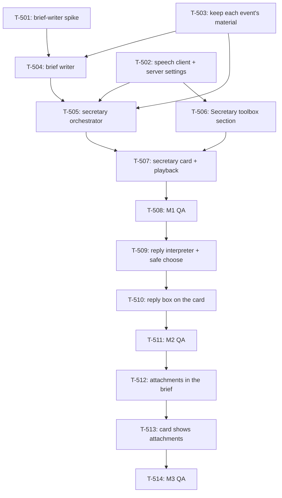

# Kanban: Voice Secretary

**Generated:** 2026-10-07
**Source:** `docs/specs/voice-secretary/prd.md` v1.2 · `docs/specs/voice-secretary/gaps.md` (nothing open)
**Evidence:** `docs/timeline/2026-10-07_voice-secretary-ideation.md` · `docs/timeline/2026-10-07_voice-engine-hosting.md`
**Speech server:** `deploy/tts-server/README.md`
**Total Tasks:** 25 (T-501..T-514, follow-ups T-515..T-519, OpenCode T-520..T-523, T-524, T-525)
**Milestones:** M1 (hear the brief) · M2 (answer in words) · M3 (originals when words aren't enough)

Task ids start at T-501, after attention-alerts' T-4xx. Only M1 is committed; M2 and M3 are
re-planned when M1 ships. Work happens on the `voice-secretary` branch, merged into `master`
when the epic is done. Tasks can be taken one at a time in the order below, or in parallel
along the [lanes](#parallel-lanes). T-501..T-519 are Claude Code only; OpenCode joined M1 with T-520..T-523 (PRD v1.6). The
manager gets no secretary (PRD Story 2).

## Task Overview

**Order:** T-501 → T-503 → T-504 → T-502 → T-505 → T-506 → T-507 → T-508.

**Critical path:** T-501 → T-504 → T-505 → T-507 → T-508. The spike fixes the brief writer's
input and output; the orchestrator can only be written against that output; the card can
only render what the orchestrator emits.

### Parallel lanes

Added 2026-10-07 at the builder's request. Each round's tasks touch different files and can
run in separate sessions at once; a round starts when everything it is blocked by has merged.

| Round | In parallel | Why they don't collide |
|---|---|---|
| 1 | **T-501**, **T-503**, **T-502** | T-501 is a spike that writes only a `docs/timeline/` record. T-503 stays in `process-manager.ts`, `claudeHooks.ts`, `run-state.ts`. T-502 owns settings, the new `secretary/speech.ts`, and the IPC files |
| 2 | **T-504**, **T-506** | T-504 is a new main-process module. T-506 is renderer only (`Toolbox.tsx`, new `SecretarySection.tsx`) on T-502's merged IPC |
| 3 | T-505 | Needs T-502, T-503 and T-504 |
| 4 | T-507 | Needs T-505 and T-506 |
| 5 | T-508 | M1 QA |
| 6 | **T-509**, **T-512** | Both main process. They meet in the brief writer: T-509 runs a second prompt through the same CLI, T-512 extends the brief's contract. Parallel only if T-504 puts the CLI spawn in its own module (`secretary/cli.ts`); otherwise take T-509 first |
| 7 | T-510, then T-513 | Both edit `SecretaryCard.tsx`: sequence them |
| 8 | T-511 and T-514 | QA; can be one pass when both milestones land together |

To run a round in parallel, give each task its own worktree and branch off
`voice-secretary`, e.g. `git worktree add ../multi-code-t503 -b vs/t-503 voice-secretary`,
one session per worktree, and merge each back into `voice-secretary` when its task is done.
Sessions sharing one working tree overwrite each other.

**Shared files to watch:** T-502, T-505, T-506, T-509 all add to `workspace/app/src/main/ipc-handlers.ts`, `workspace/app/src/main/preload.ts` and `workspace/app/src/shared/types.ts`. T-506 and T-507 both edit `workspace/app/src/renderer/App.tsx`. T-503 and T-509 both read the per-instance event record in `workspace/app/src/main/process-manager.ts`.

---

## Milestone 1: Hear the brief

**Goal:** with Secretary Mode on, the builder clicks a red-dot contact and hears that session's
brief in Serena's voice, in the language they last wrote in; with the speech server off, they
read it instead.

**Tasks:** T-501, T-503, T-504, T-502, T-505, T-506, T-507, T-508

**Done when:**
- With Secretary Mode off, nothing differs from today and no model or speech server is called
- A session finishes; the builder clicks its red dot and hears a brief that opens with the session's name and retells what was done
- A session asks for a Bash permission; the click plays a brief saying what the command does in plain words, then asks
- A session whose last message from the builder was pure English gets an English brief; a Chinese or mixed one gets Chinese
- Two sessions waiting: each click plays only that session's brief and stops the other
- With the speech server stopped, the same clicks show the brief as text with a "voice unavailable" note, and nothing else in the app changes
- Answering in the terminal before clicking drops the brief: the click opens nothing

---

### T-501: Brief-writer spike on the real CLI

- **Type:** setup
- **Status:** done
- **Requirement:** `docs/specs/voice-secretary/prd.md#story-4-what-the-secretary-says`
- **Knowledge:** `docs/specs/voice-secretary/prd.md#technical-constraints`
- **Code:** `workspace/app/src/main/backends/instance-env.ts`, `workspace/app/src/main/process-manager.ts` (`readTranscript`)
- **Description:** Settle how Multi-Code calls the brief writer before anything is built on it. From Electron's main process (not a shell), run `claude -p --bare --no-session-persistence --model global.anthropic.claude-sonnet-5-5 --output-format json` with the prompt on stdin, and answer: (1) Does it reach Bedrock when Multi-Code is launched from the Dock, where the shell's `AWS_PROFILE` is absent? It should pick it up from `~/.claude/settings.json` `env`; confirm `--bare` doesn't skip that. (2) Does it write anything under `~/.claude/projects/`? Diff the directory before and after. (3) How long does it take with a realistic input: a real turn from a session JSONL, 5–20k tokens? (4) Can it reliably return a strict JSON object `{ "language": "Chinese" | "English", "brief": string }`? Draft the system prompt that the PRD's Story 4 rules imply (opens with the session name; Finished vs Needs-you content; no mid-turn narration; language of the builder's latest message; written for the ear, acronyms spelled as spoken) and try it on three real turns: a finish, a Bash permission, an AskUserQuestion, one of them in English.
- **Acceptance:** A spike record in `docs/timeline/` with the exact command, the env it needs, timings, the no-residue check, the prompt text, and the three sample inputs and outputs. The three briefs read correctly when spoken (check with `deploy/tts-server/smoke-test.sh`-style calls).
- **Blocks:** T-504 · **Blocked by:** none · **Parallel with:** T-502, T-503
- **Notes:** Measured from a terminal on 2026-10-07: 3.3 s for a one-line prompt. If (1) fails, pass the Bedrock env explicitly the way instance spawns already do in `instance-env.ts`, rather than adding an SDK. `pnpm start` launches Electron from a shell and inherits its env, so it can't answer (1): test with the packaged app opened from Finder or with `open -a`.
- **Done 2026-10-08:** `docs/timeline/2026-10-08_brief-writer-spike.md`. From a Dock-like launch (launchd, no `AWS_*`) the CLI still reaches Bedrock, because `--bare` keeps the `env` block of `~/.claude/settings.json`. Nothing persists; the CLI's registry and plugin markers exist only during the call, and SIGKILL leaves the plugin markers, so stop with SIGTERM first. 3.6 / 4.6 / 8.9 s min / median / max. Prompt-only JSON parsed on 142 of 142 runs; `--json-schema` was slower and got the language wrong. Extra flags: `--setting-sources user --tools "" --system-prompt`. The builder's messages must be read from the raw JSONL, not `readTranscript`. Briefs run 33–51 s spoken and take 12–21 s to synthesize, so the speech timeout went to 30 s (PRD v1.3).

### T-503: Keep each instance's latest event and its material in main

- **Type:** data
- **Status:** done
- **Requirement:** `docs/specs/voice-secretary/prd.md#story-2-the-brief-is-ready-before-the-click`
- **Knowledge:** `docs/specs/attention-alerts/prd.md` (the Finished and Needs-you events)
- **Code:** `workspace/app/src/main/process-manager.ts` (`onActivity`, `handleAlertDelivery`), `workspace/app/src/main/backends/claudeHooks.ts` (`permissionDetail`, `raisePrompt`), `workspace/app/src/main/run-state.ts` (`onWrite`)
- **Description:** Today the dialog's decoded options live only in the phone server (`ws-server.ts` `activePrompts`), and the raw tool input is thrown away after `extractPromptDetail`. The secretary needs both, in main, per instance. Add to each managed instance a `secretaryEvent?: { kind: "finished" | "needs-you"; seq: number; at: number; prompt?: { detail: PromptDetail; toolName: string; toolInput: unknown } }`. Set it on `waiting` (kind finished) and `prompt` (kind needs-you, carrying the delivery's `toolName` and `toolInput` alongside the detail; extend the `raisePrompt` path to pass them). `seq` increments per instance on every new event. Clear it on `prompt-cleared` for a needs-you, and on any write to the instance (`onWrite`) for a finished, since either means the builder already dealt with it. Expose a small subscription (`onSecretaryEvent(listener)`, firing on set and on clear) for T-505. Manager and OpenCode instances never get one.
- **Acceptance:** Unit tests: a `waiting` sets a finished event; a `prompt` from a Bash `PermissionRequest` sets needs-you with the exact command in `toolInput`; `prompt-cleared` clears needs-you; a write clears finished; a newer event bumps `seq`; a manager or OpenCode instance never sets one. Existing alert and phone-link tests still pass.
- **Blocks:** T-504, T-505, T-509 · **Blocked by:** none · **Parallel with:** T-501, T-502
- **Done 2026-10-08:** API on `processManager`: `onSecretaryEvent(listener)` (fires with the event on set, `null` on clear, returns unsubscribe), `secretaryEventOf(id)`, `liveSecretaryEvents()`. **A write clears a needs-you too, not only a finished:** the CLI reports nothing after a denied dialog (fixtures `permission-denied-no`, `permission-denied-esc`), so the keystroke is the only sign. Focus reports (`ESC[I`/`ESC[O`) don't count as a write. One `seq` counter across all instances, so a restart can't reuse a number. The raw tool call travels beside `PromptDetail`, never inside it, so it can't reach the phone. OpenCode is excluded through `Backend.keepsSecretaryEvents`, the manager by `isManager`. For T-509: choosing Other is itself a write, so check `seq` once before both writes. For T-507: a manager dispatch can clear the event while the red dot stays, so the card needs a "nothing live" state. 851 tests green.

### T-504: Brief writer: one event in, one spoken-style brief out

- **Type:** feature
- **Status:** done
- **Requirement:** `docs/specs/voice-secretary/prd.md#story-4-what-the-secretary-says`
- **Knowledge:** `docs/knowledge/business-overview.md#secretary-mode-planned-2026-10-07`
- **Code:** new `workspace/app/src/main/secretary/briefWriter.ts`; reads `ProcessManager.readTranscript`
- **Description:** `writeBrief(input): Promise<Brief>` where input is the session alias, the event from T-503, the builder's latest message in the session, and the turn's transcript entries since that message (from `readTranscript`). Spawns the CLI exactly as T-501 settled, with T-501's prompt, and parses `{ language, brief }`. Returns `{ ok: true, language: "Chinese" | "English", text: string }` or `{ ok: false, reason: string }` on timeout, non-zero exit or unparseable output. One CLI process per call, killed on timeout (60 s). Truncate the transcript to a fixed token budget from the end, keeping the builder's latest message.
- **Acceptance:** Unit tests with the CLI faked: the JSON contract, bad JSON, timeout, non-zero exit, and truncation that keeps the latest user message. A live test (skipped in CI) on T-501's three samples.
- **Blocks:** T-505 · **Blocked by:** T-501, T-503
- **Notes:** The language rule lives in the prompt, not in code: the model sees the builder's latest message and reports the language it wrote in. Put the CLI spawn (args, stdin, timeout, kill, JSON parse) in its own `workspace/app/src/main/secretary/cli.ts`: T-509 reuses it for a second prompt, and that separation is what lets T-509 and T-512 run in parallel.
- **Done 2026-10-08:** `secretary/briefWriter.ts` (`writeBriefFor`, pure core `buildBriefInput` / `writeBrief`), `secretary/cli.ts` (`runJsonPrompt`, reusable by T-509), `secretary/turn.ts` (the builder's messages and the turn from the raw JSONL, as the spike prescribes). Every call passes `--settings '{"awsAuthRefresh":"false"}'`: measured in a fake HOME, `-p --bare` otherwise runs the builder's `aws sso login` when the token has expired, opening a browser nobody is watching (spike record, T-504 addendum). `ProcessManager.secretarySource(id)` re-checks the live session before reading. Live: the six spike samples in 3.9–6.1 s, language right on all six. End to end on the real orchestrator: finished → text +3.3 s → audio +6.7 s; an AskUserQuestion needs-you in Chinese → +3.6 s → +8.0 s. A Bash permission was not exercised (auto mode). 961 tests green, 6 live tests skipped in CI.

### T-502: Speech client and speech-server settings in main

- **Type:** feature
- **Status:** done
- **Requirement:** `docs/specs/voice-secretary/prd.md#story-8-connect-a-speech-server`, `docs/specs/voice-secretary/prd.md#story-7-no-voice-still-a-secretary`
- **Knowledge:** `deploy/tts-server/README.md#using-it`
- **Code:** `workspace/app/src/main/settings-store.ts`, new `workspace/app/src/main/secretary/speech.ts`, `workspace/app/src/main/ipc-handlers.ts`, `workspace/app/src/main/preload.ts`, `workspace/app/src/shared/types.ts`
- **Description:** Add `secretaryMode: boolean` (default false) and `speechServerUrl: string` (default `""`, meaning text only) to `Settings`. Store the key in its own file, `<userData>/speech-key`, written `0600`, never in `settings.json`, never logged, never sent to the renderer: the renderer only learns whether a key is set. `synthesize(text, language): Promise<{ ok: true; wav: Buffer } | { ok: false; reason: string }>` posts `{ input, voice: "serena", language, instructions, response_format: "wav" }` to `<url>/v1/audio/speech` with `Authorization: Bearer <key>`, 30 s timeout (15 s originally; raised after T-501, PRD v1.3); `instructions` is the casual-briefing tone in the brief's language (the Chinese and English strings in `deploy/tts-server/voice-samples.sh`). `testServer()` checks `/health`, then a one-sentence synthesis, and returns which step failed and why (unreachable, 401, timeout, not audio). IPC: `secretary:get-settings`, `secretary:set-mode`, `secretary:set-server` (url, key or unchanged), `secretary:test-server`.
- **Acceptance:** Unit tests with `fetch` faked: success, 401, timeout, non-audio body, empty URL meaning "no server" without any request. The key file is `0600` and absent from `settings.json`. A manual `testServer()` against `https://tts.jasenpan.com` passes.
- **Blocks:** T-505, T-506 · **Blocked by:** none · **Parallel with:** T-501, T-503
- **Notes:** Add `speech-key` to the Data Storage list in `CLAUDE.md`.
- **Done 2026-10-08:** `secretary/speech.ts` takes the server as an argument, `synthesize(server, text, language)` and `testServer(server)`, so it imports nothing from electron; `settings-store.ts` `loadSpeechServer()` reads the address and key fresh per call, so T-505 wires `(text, lang) => synthesize(loadSpeechServer(), text, lang)`. A key change is `SpeechKeyChange` (`unchanged` / `set` / `clear`). WAV is checked by its RIFF header. Live: Test OK in 3.6 s; 6.6 s of Chinese audio in 3.1 s, 9.6 s of English in 4.3 s; wrong key gives "key rejected (HTTP 401)". 821 tests green.

### T-505: Secretary orchestrator

- **Type:** integration
- **Status:** done
- **Requirement:** `docs/specs/voice-secretary/prd.md#story-2-the-brief-is-ready-before-the-click`, `docs/specs/voice-secretary/prd.md#story-1-secretary-mode-switch`, `docs/specs/voice-secretary/prd.md#story-7-no-voice-still-a-secretary`
- **Knowledge:** `docs/knowledge/decisions.md` (2026-10-07 entries)
- **Code:** new `workspace/app/src/main/secretary/index.ts`, wired in `workspace/app/src/main/index.ts`
- **Description:** Subscribes to T-503's events. While `secretaryMode` is on: on a new event, write the brief (T-504), then, if a server is set, synthesize it (T-502); keep one `BriefState` per instance in memory only: `{ seq, status: "preparing" } | { seq, status: "ready", text, language, wav?: Buffer, voiceUnavailable: boolean } | { seq, status: "failed", reason }`. A result for an older `seq` than the instance's current event is discarded. When T-503 clears the event, drop the brief. Turning the mode on prepares briefs for every instance whose event is still live; turning it off drops all briefs. Send `secretary-brief` (instanceId, state without the wav) to the renderer on every change, and serve the audio on request (`secretary:get-audio` returning the wav bytes) so large buffers don't ride every update. While off, nothing is spawned or called.
- **Acceptance:** Unit tests with writer and speech faked: mode off spawns nothing; a new event goes preparing → ready; speech failure gives ready with `voiceUnavailable`; writer failure gives failed; a newer event discards the older result; a clear drops the brief; mode on with two live events prepares both. Nothing is written to disk.
- **Blocks:** T-507, T-509 · **Blocked by:** T-502, T-503, T-504
- **Done 2026-10-08:** built before T-504 against a fixed contract: `briefWriter.ts` exports `Brief` and `writeBriefFor(instanceId, event, signal?)`; T-505 committed a stub that T-504 replaces. `createSecretary(deps)` in `secretary/index.ts`, started from `main/index.ts`. State per instance: `preparing` → `ready` with `audio: pending → ready | unavailable` (text first) or `failed`. A newer event, a clear or mode off aborts the writer and the speech request. Renderer API: push `secretary-brief` (id, state | null) and `secretary-mode` (boolean); `getSecretaryBriefs()`, `getSecretaryAudio(id, seq)` (null when stale). `synthesize` gained an abort signal. 876 tests green.

### T-506: Secretary toolbox section

- **Type:** feature
- **Status:** done
- **Requirement:** `docs/specs/voice-secretary/prd.md#story-1-secretary-mode-switch`, `docs/specs/voice-secretary/prd.md#story-8-connect-a-speech-server`
- **Knowledge:** `docs/knowledge/business-overview.md#ui-layout-current--planned`
- **Code:** new `workspace/app/src/renderer/components/SecretarySection.tsx`, `workspace/app/src/renderer/components/Toolbox.tsx`
- **Description:** A compact toolbox section like `PhoneSection`: the Secretary Mode switch; the speech server address; a key field that shows only "set" or "not set" and accepts a new key; a Test button that shows T-502's result in one line. Empty address reads "text only". The switch is global, not per instance.
- **Acceptance:** Toggling the switch survives a restart. A saved key never reappears in the field. Test against the live server says OK; against a wrong key says the key was rejected; with no address says text only.
- **Blocks:** T-507 · **Blocked by:** T-502
- **Done 2026-10-08:** `SecretarySection.tsx` between Phone and Manager. Test saves pending edits first ("Save & test"); an empty key field sends `unchanged`; Clear removes the key at once. Verified over CDP on an isolated instance: no address says text only, the live server says "OK in 3.5 s", a wrong key says "Speech: key rejected (HTTP 401)", the switch and the key survive a restart, the key is never in the DOM. For T-507: App has to load the mode on mount and hear when it changes (the section can be collapsed); the switch is reachable only with a running contact selected.

### T-507: Secretary card and playback

- **Type:** feature
- **Status:** done
- **Requirement:** `docs/specs/voice-secretary/prd.md#story-3-click-a-red-dot-hear-the-brief`, `docs/specs/voice-secretary/prd.md#story-7-no-voice-still-a-secretary`
- **Knowledge:** `docs/specs/attention-alerts/prd.md` (chat-app alert rules, which stay as they are)
- **Code:** new `workspace/app/src/renderer/components/SecretaryCard.tsx`, `workspace/app/src/renderer/App.tsx` (contact select, `unreadIds`), `workspace/app/src/renderer/audio/`
- **Description:** With Secretary Mode on, selecting a contact that is in `unreadIds` at the moment of the click also opens its card over the top of the terminal area and plays its brief: fetch the wav with `secretary:get-audio` and play it through one shared audio element, so starting a brief stops any other. A contact not in `unreadIds` opens nothing. The card shows the brief text marked as the secretary's, a replay and a stop button, "preparing" until the state is ready (then plays, unless another contact has been selected meanwhile), a one-line note when `voiceUnavailable`, and one line when the brief failed. Turning the mode off stops playback and closes the card. The red dot, chime and Dock bounce behave exactly as today.
- **Acceptance:** Manual on the running app: the Milestone 1 "done when" list, plus clicking a non-red contact opens nothing and a brief clicked while preparing plays when ready.
- **Blocks:** T-508, T-510 · **Blocked by:** T-505, T-506
- **Done 2026-10-08:** built against the stub writer, then checked live on the real writer and speech server. `SecretaryCard.tsx` sits top right of the terminal area (at most 560 px by 45%), so the prompt and any dialog stay visible; its buttons never take focus. Pure rules in `secretaryBrief.ts` (`cardOnSelect`, `openCardBrief`, …), one shared `<audio>` in `audio/briefPlayer.ts`. A card belongs to one contact and one `seq` and closes when that stops being the shown contact's live brief; a newer event never auto-plays. The CSP gained `media-src 'self' blob:`, without which every brief was silent. Verified over CDP with a faked writer and speech client in `dist/`: play when ready, replay and stop, two contacts, typing closes it, answered-before-click opens nothing. Live pass: play when ready about 10 s after the event, replay and stop, two contacts, typing stops it, answered-before-click opens nothing, and a Bash-permission needs-you ("t507-c is waiting on your permission …", 23 s) that dropped when denied. **Bug found live and fixed in main:** the CLI turns on any-motion mouse tracking (`?1003h ?1006h`), so the pointer crossing the terminal sent input and dropped the brief; `carriesInput` now ignores SGR motion and wheel reports (a click still counts). 963 tests green.

### T-508: M1 QA pass

- **Type:** qa
- **Status:** done
- **Requirement:** `docs/specs/voice-secretary/prd.md#success-metrics`
- **Code:** —
- **Description:** Run M1's "done when" list on a real build with two Claude sessions, once with the speech server running and once stopped. Check the no-residue rule: nothing new under `~/.claude/projects/` from brief writing, nothing in files the user owns. Record results and bugs in a `test-plan.md` beside this file.
- **Acceptance:** Every M1 item passes, or has a bug task filed.
- **Blocks:** T-509 · **Blocked by:** T-507
- **Done 2026-10-08:** `docs/specs/voice-secretary/test-plan.md`. **Milestone 1 complete.** On the packaged app launched the way the Dock launches it (launchd env, no `AWS_*`), every M1 "done when" item passes: 36 briefs, all in the right language, one writer per brief and none left behind, exactly one speech attempt per brief on a dead address, voice back without a restart. Text 3.1–5.4 s and audio 9.1–17.4 s after the event; click to playing 14–64 ms. The T-507 "restarted from 0" sighting did not recur in 10 plays. Low-severity follow-ups are T-515..T-519 below.

---

## After Milestone 1: follow-ups

Found in T-508 and along the way (`.omt/voice-secretary-decisions.md`). None blocks M2.

### T-515: Briefs play at a normal loudness

- **Type:** feature · **Status:** done · **Blocked by:** none
- **Code:** `workspace/app/src/main/secretary/index.ts` (where the wav is kept) or `workspace/app/src/renderer/audio/briefPlayer.ts`
- **Description:** The speech server's audio is quiet: measured RMS −26 to −28 dBFS with peaks at −7 to −10 dBFS, 7–9 dB under ordinary speech loudness; the builder had to turn the Mac to full volume (2026-10-08, with the QA instance at 1% volume, but the files themselves are quiet). Normalize each brief to a target loudness (about −18 dBFS RMS) with the gain capped so peaks stay below clipping. Supervisor's call, from two options (automatic normalization vs a volume slider); a slider can follow if wanted.
- **Acceptance:** each brief's measured RMS lands near the target, no sample clips, and a brief at the Mac's normal volume is as loud as other apps' speech.
- **Done 2026-10-08:** `secretary/loudness.ts` (`normalizeLoudness`), applied in `index.ts` as the wav is kept. A plain gain couldn't do it: the server's speech has an 18–22 dB crest factor, so the gain to −18 would push its peaks to +3 dBFS. So one gain to −18 dBFS (RMS over 50 ms blocks above −50 dBFS, so pauses don't count; at most +20 dB), then a limiter with a −1 dBFS ceiling (moving minimum of the needed gain, smoothed by a moving average of the same 5 ms half-width, which can't clip by construction; 80 ms release). Anything not 16-bit PCM WAV passes through. On the 22 spike briefs: −22.7..−29.4 → −17.6..−18.0, every peak ≤ −1.0 dBFS; the limiter cuts more than 1 dB on under 1% of 10 ms blocks, at most 4 dB. A fresh brief from `tts.jasenpan.com`: −26.8 → −18.1; macOS `say` measures −17.4. 20–35 ms per brief, once, in main; past 3 minutes' worth of samples (24 kHz mono) the audio plays as it came, and an extensible header counts only with the PCM SubFormat (both from GPT review). Target raised to −16.5 dBFS (about 20% louder) after the builder listened at normal volume and found −18 still a little quiet (2026-10-09); the spike briefs then land at −16.2..−16.6, peaks ≤ −1.0, the limiter cutting more than 1 dB on about 1% of 10 ms blocks, at most 5.5 dB.

### T-516: Friendlier speech errors and an http warning at save time

- **Type:** bug (low) · **Status:** ready · **Blocked by:** none
- **Code:** `workspace/app/src/main/secretary/speech.ts` (`failureReason`), `workspace/app/src/renderer/components/SecretarySection.tsx`
- **Description:** (B-1) An unreachable host fails after ~10 s with undici's own code, "unreachable (UND_ERR_CONNECT_TIMEOUT)": map undici's codes to plain words. (B-2) A non-local `http://` address saves silently; the refusal shows only on Test or as each brief's note. Say so when saving (or refuse the save). (O-1) The section re-reads settings only when expanded; listen to `onSecretaryMode` so its switch label can't go stale.

### T-517: Brief wording: numbers and screen-only details

- **Type:** prompt (low) · **Status:** backlog · **Blocked by:** none
- **Code:** `workspace/app/src/main/secretary/briefWriter.ts` (`SYSTEM_PROMPT`, its hash test)
- **Description:** (B-3) Some briefs carry details meant for the eye: "permissions to 600" read as "six hundred", a sentence on the `@` in an `ls -l` listing, Chinese briefs keeping "hello.txt" as written. Tighten the prompt and re-run the spike's samples.

### T-518: Mouse motion and focus reports count as writes outside the secretary

- **Type:** bug (pre-existing) · **Status:** backlog · **Blocked by:** none
- **Code:** `workspace/app/src/main/process-manager.ts` (`writeToInstance`, `noteWrite`), `workspace/app/src/main/run-state.ts`, `workspace/app/src/main/remote/ws-server.ts`
- **Description:** The CLI turns on mouse tracking and focus reporting, so the pointer crossing a terminal sends input. The secretary ignores those (`carriesInput`), but run state still treats them as a write (the manager's write gate can then refuse `send_task` for a few seconds) and the phone link clears a paired phone's badge and option buttons. Use the same filter there. Read the write-gate convention in tech-conventions first.
- **Also seen 2026-10-09:** the quit dialog listed two idle sessions as "still working". Neither had run a turn; the pointer had crossed their terminals, and `unfinishedInstances` reads the same run state.

### T-519: Several questions in one AskUserQuestion

- **Type:** bug (low, for M2) · **Status:** backlog · **Blocked by:** none
- **Code:** `workspace/app/src/main/remote/promptExtract.ts`
- **Description:** Real dialogs carry two or three questions, but `extractPromptDetail` keeps only the first (T-501). The brief already covers all of them from the raw tool input; T-509's reply mapping will need all of them. Fold into T-509 or do first.

## OpenCode in Milestone 1 (PRD v1.6)

Added 2026-10-08 at the builder's request, before the first release. Same card, same voice,
same brief writer; what differs is where the material comes from. OpenCode's plugin already
reports Finished and Needs-you (attention-alerts T-410/T-411), and `permission.asked` /
`question.asked` already carry the raw request to main; it is dropped after
`permissionDetail`. The builder's messages are in OpenCode's SQLite (`message` and `part`
tables), where text OpenCode adds itself (`<system-reminder>` notes, "Continue if you have
next steps…") is marked `synthetic: true`. Order: T-520 → T-521 → T-522 → T-523.

### T-520: OpenCode dialogs carry their request to the secretary

- **Type:** feature · **Status:** done · **Blocked by:** none
- **Code:** `workspace/app/src/main/backends/opencodeAttention.ts`, `workspace/app/src/main/backends/opencode.ts` (`keepsSecretaryEvents`)
- **Description:** Pass a `PromptToolCall` with every `prompt` the plugin raises, as claudeHooks does: for a permission, `toolName` is its `permission` (`bash`, `edit`, …) and `toolInput` its `patterns` and `metadata` (`{command}` for bash); for a question, `toolName` `question` and `toolInput` `{questions}`. A re-raised dialog keeps its call. Turn `keepsSecretaryEvents` on for OpenCode.
- **Acceptance:** fixture-driven tests: `permission-once` raises needs-you with `touch a.txt` in `toolInput`; `question` carries its questions; a re-raise after another root's finish carries the same call; `permission-reject` clears the event.
- **Done 2026-10-08:** `permissionCall` / `questionCall` in `opencodeAttention.ts`, kept with each open request so a re-raise carries it. `toolInput` is `{patterns, metadata}` or `{questions}`; the raw request still never reaches the phone. Tests on the `permission-once`, `question-multi` and `plain-finish` fixtures plus a re-raise; `process-manager.secretary.test.ts` now checks an OpenCode instance keeps its events like a Claude one.

### T-521: The builder's turn, read per backend

- **Type:** feature · **Status:** done · **Blocked by:** none
- **Code:** `workspace/app/src/main/secretary/turn.ts` (moves to `backends/claudeTurn.ts`), `workspace/app/src/main/backends/types.ts`, `workspace/app/src/main/backends/opencode.ts`, `workspace/app/src/main/secretary/briefWriter.ts` (`writeBriefFor`), `workspace/app/src/main/process-manager.ts` (`secretarySource`)
- **Description:** `Backend.readBuilderTurn(sessionId)` returns the `BuilderTurn` the brief writer reads (latest typed message, up to three before it, the turn since). Claude's is today's JSONL reader, moved behind the interface since its reason to live outside it (only Claude had events) is gone. OpenCode's walks the session's messages newest first: a user message is the builder's when it has a text part not marked `synthetic` or `ignored`; the turn is every later message's parts, as `readOpencodeTranscript` maps them. Bounded scan; the database is several GB.
- **Acceptance:** unit tests on the pure part (rows in, `BuilderTurn` out): synthetic parts never count as the builder's, a message of only synthetic parts is skipped, a file part alongside text keeps the text, the turn holds assistant text and tool lines in order, a pending tool is marked. A live read of a real personal-project OpenCode session.
- **Done 2026-10-08:** `secretary/turn.ts` moved to `backends/claudeTranscript.ts`, together with `claudeTranscriptEntries` from `claude.ts`, so `claude.ts` can call it without an import cycle; `BuilderTurn` now lives in `backends/types.ts`. OpenCode: `opencodeBuilderTurn` (pure, parts fetched lazily so an older assistant message's tool output is never parsed) and `readOpencodeBuilderTurn` (newest 300 messages). `secretarySource` returns the backend; `writeBriefFor` calls `getBackend(...).readBuilderTurn`. Live on three personal sessions: right messages and turn, 13–125 ms, about half of it opening the 7.5 GB database; once per brief, in main, like the phone's transcript read.

### T-522: The brief prompt knows OpenCode's dialogs

- **Type:** prompt · **Status:** done · **Blocked by:** T-520
- **Code:** `workspace/app/src/main/secretary/briefWriter.ts` (`SYSTEM_PROMPT`, its hash test, the live test)
- **Description:** The prompt names Claude's tools: "any toolName except AskUserQuestion and ExitPlanMode" is a permission, so OpenCode's `question` would be briefed as a permission. Treat `question` like AskUserQuestion, and say that permission tool names may be lowercase (`bash`, `edit`). Re-run the six spike samples to check Claude's briefs didn't move, plus an OpenCode finish, bash permission and question.
- **Acceptance:** the live test passes on all nine samples, language right on each.
- **Done 2026-10-08:** prompt v8, four phrases changed (spike record, T-522 addendum). Nine of nine live samples pass, 4.3–7.1 s; the OpenCode question box is briefed question by question without "Type your own answer".

### T-523: OpenCode secretary QA

- **Type:** qa · **Status:** done · **Blocked by:** T-520, T-521, T-522
- **Description:** M1's "done when" list on a real OpenCode instance in a personal project, on the packaged app: a finish, a bash permission (allowed and rejected before the click), a question, both languages. Results into `test-plan.md`.
- **Acceptance:** every item passes, or has a bug task filed.
- **Done 2026-10-08:** `test-plan.md`, "OpenCode in Milestone 1". Every item passes on the packaged app launched the Dock's way. One dialog was approved before the click by the builder, in the test window. Found along the way: T-524.

### T-524: Stopping an instance never escalates past SIGHUP

- **Type:** bug (pre-existing, low) · **Status:** backlog · **Blocked by:** none
- **Code:** `workspace/app/src/main/process-manager.ts` (the three `ptyProcess.kill()` calls: stop, restart, quit)
- **Description:** Seen in T-523: two OpenCode TUIs stuck at start-up (no terminal had answered their capability queries) survived a restart, kept burning ~50% CPU each as children of the app, and ignored SIGTERM too; only SIGKILL ended them. A healthy OpenCode exits within seconds of the same restart. Escalate when the process is still there a few seconds after `kill()`. The stuck state needs an instance spawned without a terminal, which the UI never does, so this is only reachable from a probe today.

### T-525: A lone modifier key clears the shown session's red dot, and with it the card

- **Type:** bug (low) · **Status:** backlog · **Blocked by:** none
- **Code:** `workspace/app/src/renderer/App.tsx` (the capture-phase `acknowledge` listener), `workspace/app/src/renderer/audio/attentionPolicy.ts`
- **Description:** Found 2026-10-09 by the builder on the dev build, Secretary Mode on, no speech server: on the session they were watching, the red dot came and went and no card opened. Any keydown or pointerdown in the shown session's page acknowledges it (attention-alerts Story 4), and the card opens only from a red-dot click, so the brief stays in main with no way to reach it. That much is by design: the builder at the screen saw it happen. But a bare Cmd, Shift, Option or Ctrl counts too, and macOS shortcuts the page never sees whole (Cmd+Shift+4 for a screenshot, Cmd+Tab away) still deliver the modifier's keydown first. Ignore keydowns whose `key` is only a modifier.
- **Alternative the builder may want instead:** with Secretary Mode on, open the card on its own when the shown session's event arrives, rather than waiting for a red-dot click. That changes PRD Story 3's trigger, so it is the builder's call; it would also speak while they watch.

## Milestone 2: Answer in words

**Goal:** the builder answers a permission or a question by dictating into the card, and the
secretary presses the right option or asks back.

**Tasks:** T-509, T-510, T-511

**Done when:**
- "是的" on a Bash permission allows it once; "不行" denies it; "以后都可以" picks don't-ask-again, and nothing else does
- On an AskUserQuestion, naming an option picks it; anything else picks Other and types the text
- "嗯，再说吧" gets a question back and presses nothing; "这个脚本会删什么？" gets an answer and presses nothing
- Answering in the terminal first, then in the card, gets "already answered" and presses nothing

### T-509: Reply interpreter and safe choose

- **Type:** feature
- **Status:** backlog
- **Requirement:** `docs/specs/voice-secretary/prd.md#story-6-answer-a-dialog-in-words`
- **Knowledge:** `workspace/app/src/main/remote/promptExtract.ts` (header: why answering is fragile)
- **Code:** new `workspace/app/src/main/secretary/replyInterpreter.ts`, `workspace/app/src/main/process-manager.ts` (`keystrokeForChoice`), `workspace/app/src/main/remote/ws-server.ts` (`choose`, the refusal to copy)
- **Description:** `secretary:reply(instanceId, text)`. Refuse with "already answered" unless the instance still has a needs-you event with the same `seq` the card was opened for. Otherwise ask the brief writer (same CLI as T-504, a second prompt) to map the reply onto the event's options and return one of `{ action: "choose", optionIndex }`, `{ action: "other", text }`, `{ action: "ask", message }`, `{ action: "answer", message }`. Pick "don't ask again" only when the reply clearly asks for it; enforce that in code too, by the option's label. For choose and other, re-check `seq`, get keys from `keystrokeForChoice` and write them; if it returns null, refuse like the phone does and point to the terminal. For other, type the text after choosing Other. Return the line the card shows ("已经给 MSK 权限了").
- **Acceptance:** Unit tests with the model faked for each action; don't-ask-again is never picked from an ambiguous reply even if the model says so; a stale `seq` or a cleared prompt presses nothing; a null keystroke refuses. A live test on a real Bash permission and a real AskUserQuestion.
- **Blocks:** T-510 · **Blocked by:** T-503, T-505, T-508

### T-510: Reply box on the Needs-you card

- **Type:** feature
- **Status:** backlog
- **Requirement:** `docs/specs/voice-secretary/prd.md#story-6-answer-a-dialog-in-words`
- **Code:** `workspace/app/src/renderer/components/SecretaryCard.tsx`
- **Description:** A Needs-you card gets its own text box and send button (not the compose box): send calls `secretary:reply` and shows the returned line under the brief. Asks and answers stay on the card so the builder can reply again. A Finished card has no box.
- **Acceptance:** M2's "done when" list on the running app.
- **Blocks:** T-511 · **Blocked by:** T-509, T-507

### T-511: M2 QA pass

- **Type:** qa
- **Status:** backlog
- **Requirement:** `docs/specs/voice-secretary/prd.md#story-6-answer-a-dialog-in-words`
- **Description:** M2's "done when" list on a real build, including a plan approval (`ExitPlanMode`) and a dialog answered on the phone first. Results into `test-plan.md`.
- **Acceptance:** Every M2 item passes, or has a bug task filed.
- **Blocks:** T-512 · **Blocked by:** T-510

---

## Milestone 3: Originals when words aren't enough

**Goal:** when the brief can't carry a detail the builder needs, the card shows the original
unaltered, such as the reviewer-flagged function with its risky lines highlighted.

**Tasks:** T-512, T-513, T-514

**Done when:**
- A finish whose brief covers everything has no attachment
- A review that flags a function attaches that function read from disk, with path, line numbers and the flagged lines highlighted
- A permission for a long or risky command attaches the command exactly as the agent wrote it
- An image the agent produced in the turn can be attached; nothing else is screenshotted

### T-512: Attachments in the brief

- **Type:** feature
- **Status:** backlog
- **Requirement:** `docs/specs/voice-secretary/prd.md#story-5-show-the-original-only-when-words-arent-enough`
- **Knowledge:** `docs/knowledge/decisions.md` ("Attachments only when the brief can't carry it")
- **Code:** `workspace/app/src/main/secretary/briefWriter.ts`, new `workspace/app/src/main/secretary/attachments.ts`
- **Description:** Extend the brief writer's contract with `attachments`, each a reference the model picks, never content it writes: `{ type: "command" }` (the event's `toolInput` command), `{ type: "question" }` (question and options from the prompt detail), `{ type: "final-reply" }` (Claude's last message), `{ type: "quote", entryIndex }` (a transcript entry word for word), `{ type: "code", path, startLine, endLine, highlight: [line, …] }`, `{ type: "image", path }` (only paths produced in that turn). Main resolves each reference to the original: code read from disk relative to the instance's cwd, refused outside it; a file that can't be read becomes a "couldn't read" item. The prompt says attach only when words can't carry it or the builder needs the exact detail.
- **Acceptance:** Unit tests: each type resolves to original content; a path outside cwd is refused; an unreadable file gives the "couldn't read" item; an image path not from that turn is dropped. The live samples from T-501 produce no attachment on a plain finish.
- **Blocks:** T-513 · **Blocked by:** T-511

### T-513: Card shows attachments

- **Type:** feature
- **Status:** backlog
- **Requirement:** `docs/specs/voice-secretary/prd.md#story-5-show-the-original-only-when-words-arent-enough`
- **Code:** `workspace/app/src/renderer/components/SecretaryCard.tsx`; the diff view's line rendering in `workspace/app/src/renderer/components/DiffWindow.tsx` is the nearest existing pattern
- **Description:** Render each resolved attachment under the brief: code as monospace text with path and line numbers and the flagged lines marked with a background, commands and quotes verbatim in monospace, the question with its options, images scaled to the card. Compact; long code scrolls inside the card. The app has no syntax highlighter today (the diff view doesn't use one); "highlighted" in the PRD means the flagged lines stand out, and syntax colouring is not required.
- **Acceptance:** M3's "done when" list on the running app.
- **Blocks:** T-514 · **Blocked by:** T-512

### T-514: M3 QA pass

- **Type:** qa
- **Status:** backlog
- **Requirement:** `docs/specs/voice-secretary/prd.md#story-5-show-the-original-only-when-words-arent-enough`
- **Description:** M3's "done when" list on a real build, plus the PRD's success metrics over one real working session away from the screen. Results into `test-plan.md`.
- **Acceptance:** Every item passes, or has a bug task filed.
- **Blocked by:** T-513
