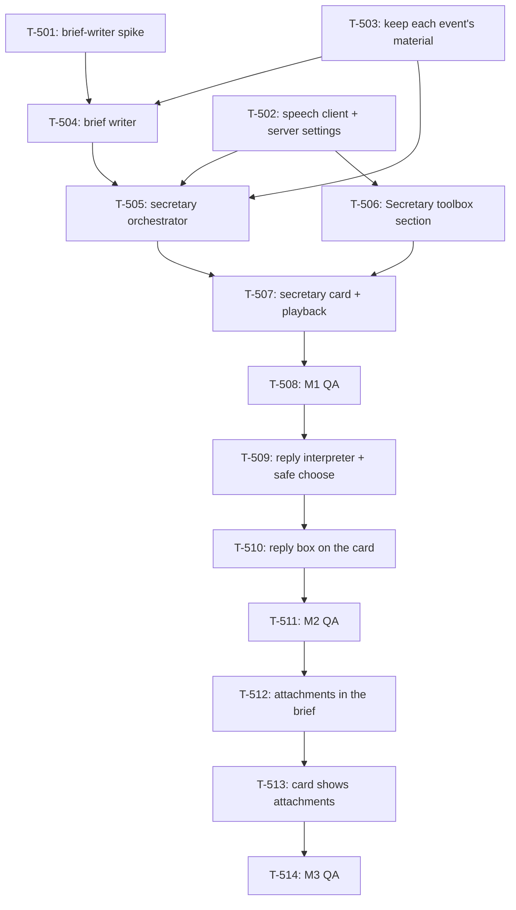

# Kanban: Voice Secretary

**Generated:** 2026-10-07
**Source:** `docs/specs/voice-secretary/prd.md` v1.2 · `docs/specs/voice-secretary/gaps.md` (nothing open)
**Evidence:** `docs/timeline/2026-10-07_voice-secretary-ideation.md` · `docs/timeline/2026-10-07_voice-engine-hosting.md`
**Speech server:** `deploy/tts-server/README.md`
**Total Tasks:** 14 (T-501..T-514)
**Milestones:** M1 (hear the brief) · M2 (answer in words) · M3 (originals when words aren't enough)

Task ids start at T-501, after attention-alerts' T-4xx. Only M1 is committed; M2 and M3 are
re-planned when M1 ships. Work happens on the `voice-secretary` branch, merged into `master`
when the epic is done. Tasks can be taken one at a time in the order below, or in parallel
along the [lanes](#parallel-lanes). Every task is Claude Code only: OpenCode instances and the
manager get no secretary (PRD Story 2).

## Task Overview

**Order:** T-501 → T-503 → T-504 → T-502 → T-505 → T-506 → T-507 → T-508.

**Critical path:** T-501 → T-504 → T-505 → T-507 → T-508. The spike fixes the brief writer's
input and output; the orchestrator can only be written against that output; the card can
only render what the orchestrator emits.

### Parallel lanes

Added 2026-10-07 at the builder's request. Each round's tasks touch different files and can
run in separate sessions at once; a round starts when everything it is blocked by has merged.

| Round | In parallel | Why they don't collide |
|---|---|---|
| 1 | **T-501**, **T-503**, **T-502** | T-501 is a spike that writes only a `docs/timeline/` record. T-503 stays in `process-manager.ts`, `claudeHooks.ts`, `run-state.ts`. T-502 owns settings, the new `secretary/speech.ts`, and the IPC files |
| 2 | **T-504**, **T-506** | T-504 is a new main-process module. T-506 is renderer only (`Toolbox.tsx`, new `SecretarySection.tsx`) on T-502's merged IPC |
| 3 | T-505 | Needs T-502, T-503 and T-504 |
| 4 | T-507 | Needs T-505 and T-506 |
| 5 | T-508 | M1 QA |
| 6 | **T-509**, **T-512** | Both main process. They meet in the brief writer: T-509 runs a second prompt through the same CLI, T-512 extends the brief's contract. Parallel only if T-504 puts the CLI spawn in its own module (`secretary/cli.ts`); otherwise take T-509 first |
| 7 | T-510, then T-513 | Both edit `SecretaryCard.tsx`: sequence them |
| 8 | T-511 and T-514 | QA; can be one pass when both milestones land together |

To run a round in parallel, give each task its own worktree and branch off
`voice-secretary`, e.g. `git worktree add ../multi-code-t503 -b vs/t-503 voice-secretary`,
one session per worktree, and merge each back into `voice-secretary` when its task is done.
Sessions sharing one working tree overwrite each other.

**Shared files to watch:** T-502, T-505, T-506, T-509 all add to `workspace/app/src/main/ipc-handlers.ts`, `workspace/app/src/main/preload.ts` and `workspace/app/src/shared/types.ts`. T-506 and T-507 both edit `workspace/app/src/renderer/App.tsx`. T-503 and T-509 both read the per-instance event record in `workspace/app/src/main/process-manager.ts`.

---

## Milestone 1: Hear the brief

**Goal:** with Secretary Mode on, the builder clicks a red-dot contact and hears that session's
brief in Serena's voice, in the language they last wrote in; with the speech server off, they
read it instead.

**Tasks:** T-501, T-503, T-504, T-502, T-505, T-506, T-507, T-508

**Done when:**
- With Secretary Mode off, nothing differs from today and no model or speech server is called
- A session finishes; the builder clicks its red dot and hears a brief that opens with the session's name and retells what was done
- A session asks for a Bash permission; the click plays a brief saying what the command does in plain words, then asks
- A session whose last message from the builder was pure English gets an English brief; a Chinese or mixed one gets Chinese
- Two sessions waiting: each click plays only that session's brief and stops the other
- With the speech server stopped, the same clicks show the brief as text with a "voice unavailable" note, and nothing else in the app changes
- Answering in the terminal before clicking drops the brief: the click opens nothing

---

### T-501: Brief-writer spike on the real CLI

- **Type:** setup
- **Status:** ready
- **Requirement:** `docs/specs/voice-secretary/prd.md#story-4-what-the-secretary-says`
- **Knowledge:** `docs/specs/voice-secretary/prd.md#technical-constraints`
- **Code:** `workspace/app/src/main/backends/instance-env.ts`, `workspace/app/src/main/process-manager.ts` (`readTranscript`)
- **Description:** Settle how Multi-Code calls the brief writer before anything is built on it. From Electron's main process (not a shell), run `claude -p --bare --no-session-persistence --model global.anthropic.claude-sonnet-5-5 --output-format json` with the prompt on stdin, and answer: (1) Does it reach Bedrock when Multi-Code is launched from the Dock, where the shell's `AWS_PROFILE` is absent? It should pick it up from `~/.claude/settings.json` `env`; confirm `--bare` doesn't skip that. (2) Does it write anything under `~/.claude/projects/`? Diff the directory before and after. (3) How long does it take with a realistic input: a real turn from a session JSONL, 5–20k tokens? (4) Can it reliably return a strict JSON object `{ "language": "Chinese" | "English", "brief": string }`? Draft the system prompt that the PRD's Story 4 rules imply (opens with the session name; Finished vs Needs-you content; no mid-turn narration; language of the builder's latest message; written for the ear, acronyms spelled as spoken) and try it on three real turns: a finish, a Bash permission, an AskUserQuestion, one of them in English.
- **Acceptance:** A spike record in `docs/timeline/` with the exact command, the env it needs, timings, the no-residue check, the prompt text, and the three sample inputs and outputs. The three briefs read correctly when spoken (check with `deploy/tts-server/smoke-test.sh`-style calls).
- **Blocks:** T-504 · **Blocked by:** none · **Parallel with:** T-502, T-503
- **Notes:** Measured from a terminal on 2026-10-07: 3.3 s for a one-line prompt. If (1) fails, pass the Bedrock env explicitly the way instance spawns already do in `instance-env.ts`, rather than adding an SDK. `pnpm start` launches Electron from a shell and inherits its env, so it can't answer (1): test with the packaged app opened from Finder or with `open -a`.

### T-503: Keep each instance's latest event and its material in main

- **Type:** data
- **Status:** backlog
- **Requirement:** `docs/specs/voice-secretary/prd.md#story-2-the-brief-is-ready-before-the-click`
- **Knowledge:** `docs/specs/attention-alerts/prd.md` (the Finished and Needs-you events)
- **Code:** `workspace/app/src/main/process-manager.ts` (`onActivity`, `handleAlertDelivery`), `workspace/app/src/main/backends/claudeHooks.ts` (`permissionDetail`, `raisePrompt`), `workspace/app/src/main/run-state.ts` (`onWrite`)
- **Description:** Today the dialog's decoded options live only in the phone server (`ws-server.ts` `activePrompts`), and the raw tool input is thrown away after `extractPromptDetail`. The secretary needs both, in main, per instance. Add to each managed instance a `secretaryEvent?: { kind: "finished" | "needs-you"; seq: number; at: number; prompt?: { detail: PromptDetail; toolName: string; toolInput: unknown } }`. Set it on `waiting` (kind finished) and `prompt` (kind needs-you, carrying the delivery's `toolName` and `toolInput` alongside the detail; extend the `raisePrompt` path to pass them). `seq` increments per instance on every new event. Clear it on `prompt-cleared` for a needs-you, and on any write to the instance (`onWrite`) for a finished, since either means the builder already dealt with it. Expose a small subscription (`onSecretaryEvent(listener)`, firing on set and on clear) for T-505. Manager and OpenCode instances never get one.
- **Acceptance:** Unit tests: a `waiting` sets a finished event; a `prompt` from a Bash `PermissionRequest` sets needs-you with the exact command in `toolInput`; `prompt-cleared` clears needs-you; a write clears finished; a newer event bumps `seq`; a manager or OpenCode instance never sets one. Existing alert and phone-link tests still pass.
- **Blocks:** T-504, T-505, T-509 · **Blocked by:** none · **Parallel with:** T-501, T-502

### T-504: Brief writer: one event in, one spoken-style brief out

- **Type:** feature
- **Status:** backlog
- **Requirement:** `docs/specs/voice-secretary/prd.md#story-4-what-the-secretary-says`
- **Knowledge:** `docs/knowledge/business-overview.md#secretary-mode-planned-2026-10-07`
- **Code:** new `workspace/app/src/main/secretary/briefWriter.ts`; reads `ProcessManager.readTranscript`
- **Description:** `writeBrief(input): Promise<Brief>` where input is the session alias, the event from T-503, the builder's latest message in the session, and the turn's transcript entries since that message (from `readTranscript`). Spawns the CLI exactly as T-501 settled, with T-501's prompt, and parses `{ language, brief }`. Returns `{ ok: true, language: "Chinese" | "English", text: string }` or `{ ok: false, reason: string }` on timeout, non-zero exit or unparseable output. One CLI process per call, killed on timeout (60 s). Truncate the transcript to a fixed token budget from the end, keeping the builder's latest message.
- **Acceptance:** Unit tests with the CLI faked: the JSON contract, bad JSON, timeout, non-zero exit, and truncation that keeps the latest user message. A live test (skipped in CI) on T-501's three samples.
- **Blocks:** T-505 · **Blocked by:** T-501, T-503
- **Notes:** The language rule lives in the prompt, not in code: the model sees the builder's latest message and reports the language it wrote in. Put the CLI spawn (args, stdin, timeout, kill, JSON parse) in its own `workspace/app/src/main/secretary/cli.ts`: T-509 reuses it for a second prompt, and that separation is what lets T-509 and T-512 run in parallel.

### T-502: Speech client and speech-server settings in main

- **Type:** feature
- **Status:** backlog
- **Requirement:** `docs/specs/voice-secretary/prd.md#story-8-connect-a-speech-server`, `docs/specs/voice-secretary/prd.md#story-7-no-voice-still-a-secretary`
- **Knowledge:** `deploy/tts-server/README.md#using-it`
- **Code:** `workspace/app/src/main/settings-store.ts`, new `workspace/app/src/main/secretary/speech.ts`, `workspace/app/src/main/ipc-handlers.ts`, `workspace/app/src/main/preload.ts`, `workspace/app/src/shared/types.ts`
- **Description:** Add `secretaryMode: boolean` (default false) and `speechServerUrl: string` (default `""`, meaning text only) to `Settings`. Store the key in its own file, `<userData>/speech-key`, written `0600`, never in `settings.json`, never logged, never sent to the renderer: the renderer only learns whether a key is set. `synthesize(text, language): Promise<{ ok: true; wav: Buffer } | { ok: false; reason: string }>` posts `{ input, voice: "serena", language, instructions, response_format: "wav" }` to `<url>/v1/audio/speech` with `Authorization: Bearer <key>`, 15 s timeout; `instructions` is the casual-briefing tone in the brief's language (the Chinese and English strings in `deploy/tts-server/voice-samples.sh`). `testServer()` checks `/health`, then a one-sentence synthesis, and returns which step failed and why (unreachable, 401, timeout, not audio). IPC: `secretary:get-settings`, `secretary:set-mode`, `secretary:set-server` (url, key or unchanged), `secretary:test-server`.
- **Acceptance:** Unit tests with `fetch` faked: success, 401, timeout, non-audio body, empty URL meaning "no server" without any request. The key file is `0600` and absent from `settings.json`. A manual `testServer()` against `https://tts.jasenpan.com` passes.
- **Blocks:** T-505, T-506 · **Blocked by:** none · **Parallel with:** T-501, T-503
- **Notes:** Add `speech-key` to the Data Storage list in `CLAUDE.md`.

### T-505: Secretary orchestrator

- **Type:** integration
- **Status:** backlog
- **Requirement:** `docs/specs/voice-secretary/prd.md#story-2-the-brief-is-ready-before-the-click`, `docs/specs/voice-secretary/prd.md#story-1-secretary-mode-switch`, `docs/specs/voice-secretary/prd.md#story-7-no-voice-still-a-secretary`
- **Knowledge:** `docs/knowledge/decisions.md` (2026-10-07 entries)
- **Code:** new `workspace/app/src/main/secretary/index.ts`, wired in `workspace/app/src/main/index.ts`
- **Description:** Subscribes to T-503's events. While `secretaryMode` is on: on a new event, write the brief (T-504), then, if a server is set, synthesize it (T-502); keep one `BriefState` per instance in memory only: `{ seq, status: "preparing" } | { seq, status: "ready", text, language, wav?: Buffer, voiceUnavailable: boolean } | { seq, status: "failed", reason }`. A result for an older `seq` than the instance's current event is discarded. When T-503 clears the event, drop the brief. Turning the mode on prepares briefs for every instance whose event is still live; turning it off drops all briefs. Send `secretary-brief` (instanceId, state without the wav) to the renderer on every change, and serve the audio on request (`secretary:get-audio` returning the wav bytes) so large buffers don't ride every update. While off, nothing is spawned or called.
- **Acceptance:** Unit tests with writer and speech faked: mode off spawns nothing; a new event goes preparing → ready; speech failure gives ready with `voiceUnavailable`; writer failure gives failed; a newer event discards the older result; a clear drops the brief; mode on with two live events prepares both. Nothing is written to disk.
- **Blocks:** T-507, T-509 · **Blocked by:** T-502, T-503, T-504

### T-506: Secretary toolbox section

- **Type:** feature
- **Status:** backlog
- **Requirement:** `docs/specs/voice-secretary/prd.md#story-1-secretary-mode-switch`, `docs/specs/voice-secretary/prd.md#story-8-connect-a-speech-server`
- **Knowledge:** `docs/knowledge/business-overview.md#ui-layout-current--planned`
- **Code:** new `workspace/app/src/renderer/components/SecretarySection.tsx`, `workspace/app/src/renderer/components/Toolbox.tsx`
- **Description:** A compact toolbox section like `PhoneSection`: the Secretary Mode switch; the speech server address; a key field that shows only "set" or "not set" and accepts a new key; a Test button that shows T-502's result in one line. Empty address reads "text only". The switch is global, not per instance.
- **Acceptance:** Toggling the switch survives a restart. A saved key never reappears in the field. Test against the live server says OK; against a wrong key says the key was rejected; with no address says text only.
- **Blocks:** T-507 · **Blocked by:** T-502

### T-507: Secretary card and playback

- **Type:** feature
- **Status:** backlog
- **Requirement:** `docs/specs/voice-secretary/prd.md#story-3-click-a-red-dot-hear-the-brief`, `docs/specs/voice-secretary/prd.md#story-7-no-voice-still-a-secretary`
- **Knowledge:** `docs/specs/attention-alerts/prd.md` (chat-app alert rules, which stay as they are)
- **Code:** new `workspace/app/src/renderer/components/SecretaryCard.tsx`, `workspace/app/src/renderer/App.tsx` (contact select, `unreadIds`), `workspace/app/src/renderer/audio/`
- **Description:** With Secretary Mode on, selecting a contact that is in `unreadIds` at the moment of the click also opens its card over the top of the terminal area and plays its brief: fetch the wav with `secretary:get-audio` and play it through one shared audio element, so starting a brief stops any other. A contact not in `unreadIds` opens nothing. The card shows the brief text marked as the secretary's, a replay and a stop button, "preparing" until the state is ready (then plays, unless another contact has been selected meanwhile), a one-line note when `voiceUnavailable`, and one line when the brief failed. Turning the mode off stops playback and closes the card. The red dot, chime and Dock bounce behave exactly as today.
- **Acceptance:** Manual on the running app: the Milestone 1 "done when" list, plus clicking a non-red contact opens nothing and a brief clicked while preparing plays when ready.
- **Blocks:** T-508, T-510 · **Blocked by:** T-505, T-506

### T-508: M1 QA pass

- **Type:** qa
- **Status:** backlog
- **Requirement:** `docs/specs/voice-secretary/prd.md#success-metrics`
- **Code:** —
- **Description:** Run M1's "done when" list on a real build with two Claude sessions, once with the speech server running and once stopped. Check the no-residue rule: nothing new under `~/.claude/projects/` from brief writing, nothing in files the user owns. Record results and bugs in a `test-plan.md` beside this file.
- **Acceptance:** Every M1 item passes, or has a bug task filed.
- **Blocks:** T-509 · **Blocked by:** T-507

---

## Milestone 2: Answer in words

**Goal:** the builder answers a permission or a question by dictating into the card, and the
secretary presses the right option or asks back.

**Tasks:** T-509, T-510, T-511

**Done when:**
- "是的" on a Bash permission allows it once; "不行" denies it; "以后都可以" picks don't-ask-again, and nothing else does
- On an AskUserQuestion, naming an option picks it; anything else picks Other and types the text
- "嗯，再说吧" gets a question back and presses nothing; "这个脚本会删什么？" gets an answer and presses nothing
- Answering in the terminal first, then in the card, gets "already answered" and presses nothing

### T-509: Reply interpreter and safe choose

- **Type:** feature
- **Status:** backlog
- **Requirement:** `docs/specs/voice-secretary/prd.md#story-6-answer-a-dialog-in-words`
- **Knowledge:** `workspace/app/src/main/remote/promptExtract.ts` (header: why answering is fragile)
- **Code:** new `workspace/app/src/main/secretary/replyInterpreter.ts`, `workspace/app/src/main/process-manager.ts` (`keystrokeForChoice`), `workspace/app/src/main/remote/ws-server.ts` (`choose`, the refusal to copy)
- **Description:** `secretary:reply(instanceId, text)`. Refuse with "already answered" unless the instance still has a needs-you event with the same `seq` the card was opened for. Otherwise ask the brief writer (same CLI as T-504, a second prompt) to map the reply onto the event's options and return one of `{ action: "choose", optionIndex }`, `{ action: "other", text }`, `{ action: "ask", message }`, `{ action: "answer", message }`. Pick "don't ask again" only when the reply clearly asks for it; enforce that in code too, by the option's label. For choose and other, re-check `seq`, get keys from `keystrokeForChoice` and write them; if it returns null, refuse like the phone does and point to the terminal. For other, type the text after choosing Other. Return the line the card shows ("已经给 MSK 权限了").
- **Acceptance:** Unit tests with the model faked for each action; don't-ask-again is never picked from an ambiguous reply even if the model says so; a stale `seq` or a cleared prompt presses nothing; a null keystroke refuses. A live test on a real Bash permission and a real AskUserQuestion.
- **Blocks:** T-510 · **Blocked by:** T-503, T-505, T-508

### T-510: Reply box on the Needs-you card

- **Type:** feature
- **Status:** backlog
- **Requirement:** `docs/specs/voice-secretary/prd.md#story-6-answer-a-dialog-in-words`
- **Code:** `workspace/app/src/renderer/components/SecretaryCard.tsx`
- **Description:** A Needs-you card gets its own text box and send button (not the compose box): send calls `secretary:reply` and shows the returned line under the brief. Asks and answers stay on the card so the builder can reply again. A Finished card has no box.
- **Acceptance:** M2's "done when" list on the running app.
- **Blocks:** T-511 · **Blocked by:** T-509, T-507

### T-511: M2 QA pass

- **Type:** qa
- **Status:** backlog
- **Requirement:** `docs/specs/voice-secretary/prd.md#story-6-answer-a-dialog-in-words`
- **Description:** M2's "done when" list on a real build, including a plan approval (`ExitPlanMode`) and a dialog answered on the phone first. Results into `test-plan.md`.
- **Acceptance:** Every M2 item passes, or has a bug task filed.
- **Blocks:** T-512 · **Blocked by:** T-510

---

## Milestone 3: Originals when words aren't enough

**Goal:** when the brief can't carry a detail the builder needs, the card shows the original
unaltered, such as the reviewer-flagged function with its risky lines highlighted.

**Tasks:** T-512, T-513, T-514

**Done when:**
- A finish whose brief covers everything has no attachment
- A review that flags a function attaches that function read from disk, with path, line numbers and the flagged lines highlighted
- A permission for a long or risky command attaches the command exactly as the agent wrote it
- An image the agent produced in the turn can be attached; nothing else is screenshotted

### T-512: Attachments in the brief

- **Type:** feature
- **Status:** backlog
- **Requirement:** `docs/specs/voice-secretary/prd.md#story-5-show-the-original-only-when-words-arent-enough`
- **Knowledge:** `docs/knowledge/decisions.md` ("Attachments only when the brief can't carry it")
- **Code:** `workspace/app/src/main/secretary/briefWriter.ts`, new `workspace/app/src/main/secretary/attachments.ts`
- **Description:** Extend the brief writer's contract with `attachments`, each a reference the model picks, never content it writes: `{ type: "command" }` (the event's `toolInput` command), `{ type: "question" }` (question and options from the prompt detail), `{ type: "final-reply" }` (Claude's last message), `{ type: "quote", entryIndex }` (a transcript entry word for word), `{ type: "code", path, startLine, endLine, highlight: [line, …] }`, `{ type: "image", path }` (only paths produced in that turn). Main resolves each reference to the original: code read from disk relative to the instance's cwd, refused outside it; a file that can't be read becomes a "couldn't read" item. The prompt says attach only when words can't carry it or the builder needs the exact detail.
- **Acceptance:** Unit tests: each type resolves to original content; a path outside cwd is refused; an unreadable file gives the "couldn't read" item; an image path not from that turn is dropped. The live samples from T-501 produce no attachment on a plain finish.
- **Blocks:** T-513 · **Blocked by:** T-511

### T-513: Card shows attachments

- **Type:** feature
- **Status:** backlog
- **Requirement:** `docs/specs/voice-secretary/prd.md#story-5-show-the-original-only-when-words-arent-enough`
- **Code:** `workspace/app/src/renderer/components/SecretaryCard.tsx`; the diff view's line rendering in `workspace/app/src/renderer/components/DiffWindow.tsx` is the nearest existing pattern
- **Description:** Render each resolved attachment under the brief: code as monospace text with path and line numbers and the flagged lines marked with a background, commands and quotes verbatim in monospace, the question with its options, images scaled to the card. Compact; long code scrolls inside the card. The app has no syntax highlighter today (the diff view doesn't use one); "highlighted" in the PRD means the flagged lines stand out, and syntax colouring is not required.
- **Acceptance:** M3's "done when" list on the running app.
- **Blocks:** T-514 · **Blocked by:** T-512

### T-514: M3 QA pass

- **Type:** qa
- **Status:** backlog
- **Requirement:** `docs/specs/voice-secretary/prd.md#story-5-show-the-original-only-when-words-arent-enough`
- **Description:** M3's "done when" list on a real build, plus the PRD's success metrics over one real working session away from the screen. Results into `test-plan.md`.
- **Acceptance:** Every item passes, or has a bug task filed.
- **Blocked by:** T-513
